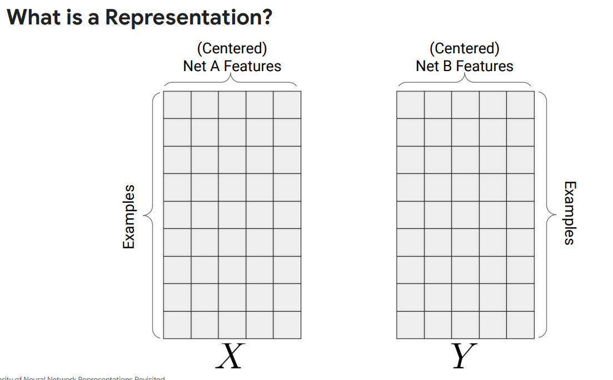
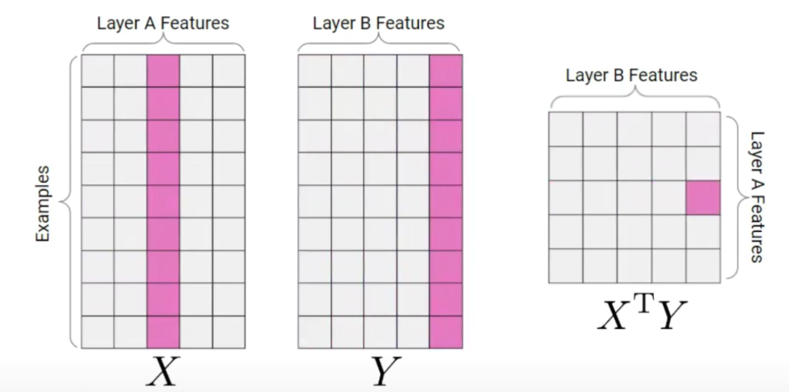
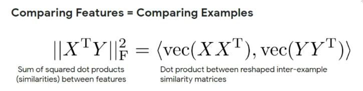
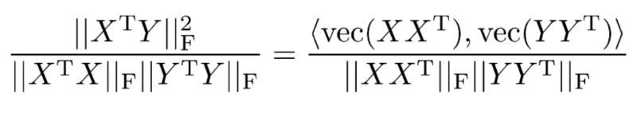
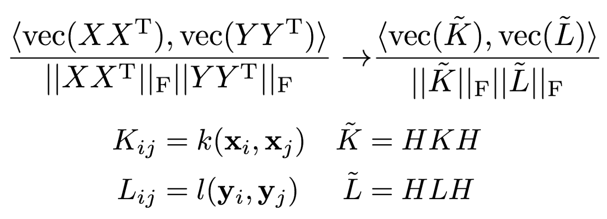
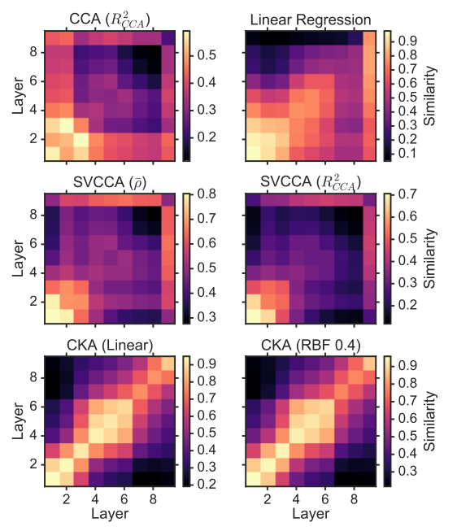
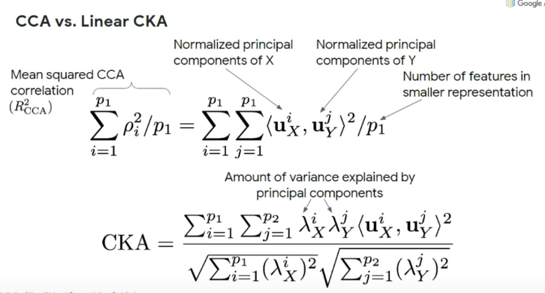
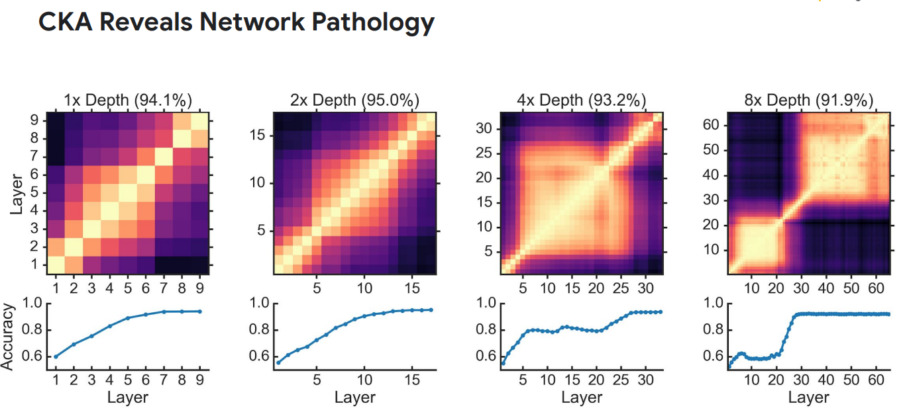

# Similarity of neural network representations revisited

[논문 : Similarity of neural network representations revisited](https://arxiv.org/pdf/1905.00414)

- [Papers 폴더](../../Paper/241028-Similarity-of-Neural-Network-Representations-Revisited/)에 별도 작성

**[Google AI: 발표자료](https://icml.cc/media/icml-2019/Slides/4871.pdf)**

**[Simon Kornblith 의 실제 발표 녹화](https://www.youtube.com/watch?v=TBjdvjdS2KM)**

- aggregate intellect 라는 LLM 중심 머신러닝 연구 단체?모임?

## 동기

"학습된" 신경망 모델을 이해할 수 있는 도구가 필요하다.

딥러닝 모델은 그 구조에 따른 학습 알고리즘 만으로 이해하기 보다는, 그 모델을 학습시키는데 사용된 "데이터" 까지 포함해서 이해되어야 한다. 다시 말해, 똑같은 구조의 신경망도 어떤 데이터를 먹이냐에 따라서 그 내부는 완전히 다를 수 있을 거란 생각이 든다.

따라서, 이미 학습된 모델을 이해할 수 있는 도구가 필요하고, 최근 CKA(Centered Kernel Alignment)가 인기가 있다.

> 반면에 [Reliability of CKA as a Similiarity Measure in Deep Learning](https://arxiv.org/abs/2210.16156)과 같이, 의심을 품고 검증하는 논문도 생겨나고 있다.

## 본문

### representation이란?

각 행은 example(data) 이고, 각 열에 해당하는 것은 각각의 (Centered) Feature 이다.

위 사진과 같이 서로 다른 X 모델과 Y 모델의 Feature 개수는 다를 수 있다. (즉, 열의 개수는 다를 수 있다.) 하지만, 같은 데이터를 학습했다면 행의 크기는 같을 것이다. 아니, 데이터라는 변수를 통제할 것이니까 항상 그 행의 크기는 같다.

즉, $X$ 행렬이 $E * F_x$ 라면, $Y$ 행렬은 $E * F_y$ 이다.

### 두 representation의 유사도

어떤 방법으로 둘을 비교해서 유사도를 측정할 수 있을 것인가?

첫번째 방법은 단순하게, $X$를 transpose 해서 $Y$에 곱하는 것이다.

그러면, $F_x * F_y$ 크기의 행렬을 얻을 수 있고, 이제 이를 가지고 무언가 해볼 수 있을 것이다.

그러나 한가지 방법이 더 있지 않은가? 각각의 행렬 $X$와 $Y$에서 그 크기가 같은 행렬을 뽑아낼 수 있는 방법이 있다. 바로, $XX^T$ 와 $YY^T$ 를 비교하는 것이다.

두 행렬은 모두 $E * E$ 크기를 가진다. 이를 **gram matrix (그람행렬)**이라고 부른다. 신경 과학에서는 representational similiarity matrix 라고 부른다고 한다.

> 종종 서로 다른 학문들이 비슷한 것을 고민하다가 같은 곳에 도착해 다르게 이름을 붙이곤 한다.

그런 다음에, 각각의 그람 행렬을 일렬로 쭉 펴서(reshape) 해서, 내적하면 그건 사실 첫번째 방법인 $X^T \cdot Y$ 의 Frobenius norm 의 제곱이다.

물론 정규화를 해준다.

### Kernel 에서의 일반화

$k$ 와 $l$ 은 kernel 함수이다. 두 벡터 사이의 유사도를 측정하기 위한 metirc을 정의해서 사용하면 되는데, 일반적으로 Linear 와 RBF 커널을 많이 사용한다.

[dodonam의 블로그](https://dodonam.tistory.com/460)

1. 선형 커널 (Linear Kernel) :

$$
K(x,y) = x^T \cdot y
$$

desicion boundary 또한 선형이다.

2. 다항식 커널 (Polynomial Kernel) :

$$
K(x,y) = (\alpha \cdot x^T \cdot y + c)^d
$$

입력 데이터를 고차원 공간으로 매핑하여 비선형 decision boundary를 만듦
(SVM에서 하던 그것)

3. 가우시안 라디언스 커널 :

$$
K(x,y) = exp(-\frac{|x-y|^2}{2\sigma^2})
$$

무한한 고차원 공간으로 매핑하여 매우 복잡한 비선형 decision boundary를 만듦.

4. 시그모이드 커널 :

$$
K(x,y) = tanh(\alpha \cdot x^T \cdot y + c)
$$

고차원 공간으로 매핑하여 비선형 decision boundary를 만듦.

### H (Centering Matrix)

[Centered Kernel Alignment (CKA) 계산, 시각화 및 배경지식](https://velog.io/@thdalwh3867/Centered-Kernel-Alignment-CKA-%EA%B3%84%EC%82%B0-%EC%8B%9C%EA%B0%81%ED%99%94-%EB%B0%8F-%EB%B0%B0%EA%B2%BD%EC%A7%80%EC%8B%9D)

$$
H_n = I_n - \frac{1}{n}J_n
$$

$J_n$ 은 $1 \cdot 1^T$ 로, 모든 성분이 1인 행렬임.

위 링크에서 정확히 설명해주셨는데, $m * n$ 행렬의 왼쪽에 $H_m$ 행렬을 곱함으로써 열의 평균을 0으로 centering 하고, 오른쪽에 $H_n$ 행렬을 곱함으로써 행의 평균을 0으로 centering 한다.

### 그 이후...

앞에서 설명한 것들을 Hilbert-Schmidt Independence Criterion (HISC) 를 이용해 일반화를 진행하고, 다시 정규화를 거치면 드디어 CKA 값을 얻을 수 있다.

$$
HSIC(K, L) = \frac{1}{(n-1)^2}tr(KHLH)
$$

$$
CKA(K, L) = \frac{HSIC(K,L)}{\sqrt{HSIC(K,K)HSIC(L,L)}}
$$

CKA 이전에는 CCA(Canonical Correlation Analysis)를 유사도 측정에 많이 사용헀었다. 둘을 비교해보기 위해 서로 다른 데이터 셋에 대해서 학습된 정확히 똑같은 구조(알고리즘)의 모델을 비교해 보면, CKA 가 CCA 보다 압도적으로 성능이 좋다.

좀 더 자세히 설명하자면, 다음과 같은 그림을 많이 보게 되는데,

X축과 Y축 각각 서로 다른 데이터셋으로 학습된 같은 구조의 모델 둘의 레이어들을 의미한다. 당연히 구조는 동일하기 때문에 특정 레이어를 한쪽 모델에서 골랐을 때 가장 유사한 상대편 레이어는 정확히 같은 번째의 레이어일 것이다. 이걸 그림으로 빗대자면, 대각선이 밝게 표시될 수록 유사한 레이어를 제대로 찾은 것으로 이해할 수 있다.

CKA 가 CCA 보다 성능이 좋은데

위 수식에서 보면, CKA가 원본 representation에서 더 많은 부분을 차지하는 주성분에 대해 더 집중하고 있다고 해석할 수 있다. (~~이 부분은 정확히 이해 안되지만, 일단 넘어간다~~)

추가로, 왜 딥러닝 모델의 깊이를 마구 늘렸을 때 성능이 오히려 떨어지는지를 CKA로 관찰해 볼 수 있다.

