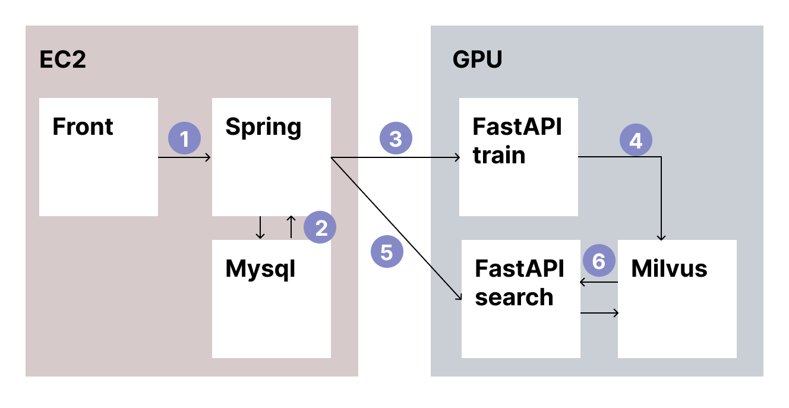

# architecture

> 아키텍쳐는 너무 어려워

사용자 로그인 / 인증 / 인가 관련해서 github Oauth 사용하고 있는데, 해당 서비스는 Java Spring 진영에 있고, 해당 컨테이너는 기본 SSAFY에서 제공하는 EC2에 띄운다. 모델에 대한 스켈레톤 (레이어 구성, 메타 데이터) 정보는 같은 서버의 MySQL DB에 저장한다.(필요한 것은 JSON 파일로)

모델의 학습이 진행되는 GPU 서버에는 모델 학습과 테스트, 검색을 위한 FastAPI가 있다. (그림에서는 test 컨테이너는 제외했다.) 검색을 위해서 Milvus vectordb를 사용할 것이다.

### 1. 프론트엔드 -> Spring

기본적으로 모든 요청은 프론트에서 백으로 먼저 가서 로그인된 사용자인지를 체크한다. (~~사실 이거부터 정답인지 모르겠다~~) 몇몇 그럴 필요 없이 바로 FastAPI에 요청할 만한 API들이 보이기 때문에 변경될 수 있긴 하다.

- 모델 저장
- 모델 학습
- 모델 검색

등이 포함된다.

### 2. Spring -> MySQL

RDBMS에는 모델의 정보를 그 **가중치**만 제외하고 모두 저장한다. 후에 모델의 성능 / 학습 분석 결과를 Result 라는 테이블에 저장할 텐데, 그때도 GPU 서버에서 발생한 결과를 EC2 서버로 가져와서 MySQL에 저장해야 한다.

GPU 서버의 FastAPI(학습, 테스트, 검색) 들에게 EC2-MySQL에 있는 모델의 구성정보가 필요하기 때문에도 1번에서 항상 Spring을 거치는 것이기도 하다. 만약, MySQL에 있는 모델 구성 정보를 따로 떼어서 GPU 서버에도 데이터베이스를 띄운다면 많이 달라질 것 같다. (~~팀원들이랑 상의를 해야 하는데 혼자 생각하기도 복잡하다~~)

### 3. Spring -> 학습

모델 구성정보와 데이터셋을 학습 API로 보내면, 해당 모델을 파이썬 코드로 만들어서 GPU를 이용해 학습을 진행한다.

### 4. 학습 API -> Milvus

학습이 이루어질 때마다 100개의 테스트 데이터셋이 돌아가는데(구체적으로는 미정) 해당 데이터셋으로 추론할 때 모델 레이어마다의 활성도를 이용해 CKA 행렬을 만들 것이다. 이 행렬을 벡터로 길게 늘어뜨린 다음 정규화해서 Milvus에 저장한다.

### 5, 6. 모델 검색

모델 검색 요청을 받으면 단순히 벡터 db에서 내적(Inner Product) metric 으로 레이어를 검색한다. 정확힌 그 레이어가 속한 모델을 결과로 받는다. 그러면 검색 기준이었던 **요청 모델과 검색된 모델의 구조를 ChatGPT에게 보내서 정성적인 비교를 받는다.**(~~이 부분은 서비스, 상품기획적인 면이다.~~) 이 부분에서 다시 모델의 구조가 필요해서 MySQL에 있는 데이터가 필요하다. API를 쏴서 받을 지 그냥 같이 Milvus에 저장할 지 생각해야 한다.
