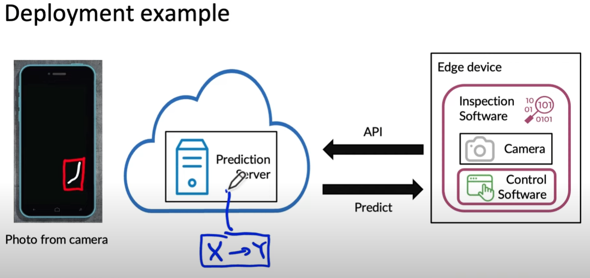
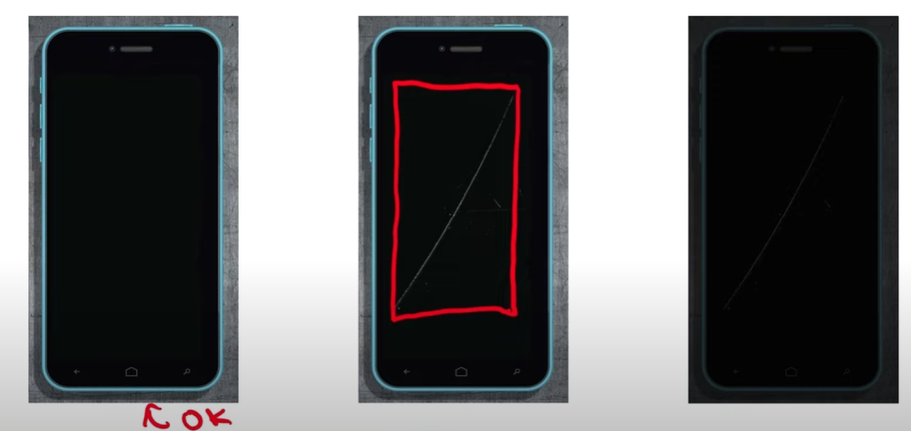
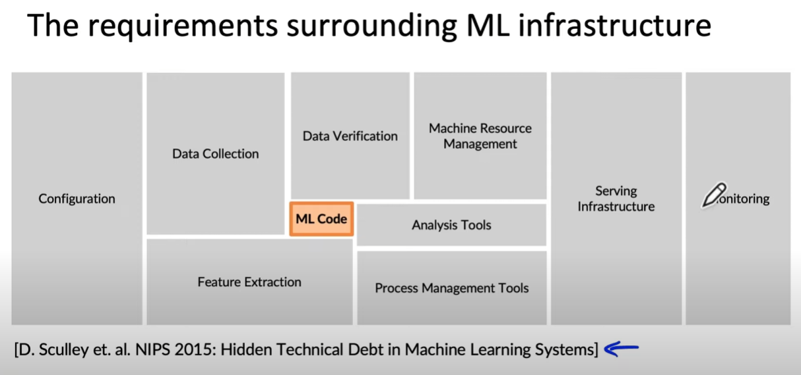

[출처](https://www.youtube.com/watch?v=NgWujOrCZFo&list=PLkDaE6sCZn6GMoA0wbpJLi3t34Gd8l0aK&index=1)

# Welcome

고전적인 머신러닝 모델 개발은 모델을 Jupyter Notebook에서 성공적으로 작동시켰으면 박수치고 끝나는 분위기였다.(?)

그런데 다음과 같은 예시를 생각해보자.

## 핸드폰 액정 결함 탐지

핸드폰 생산라인에서 액정에 흠과 결함이 없는지 확인하는 ML 모델이 있다.  
아키텍처는 다음과 같이 생겼을 것이다.

- 모델은 결함이 있는 부분에 빨간 Bounding Box를 그려 넣어주는 역할을 한다.
- 그러면, 개발자들은 결함이 있는 핸드폰 사진을 여러장 찍어 모델을 학습시킬 것이다.
- 그러면 단말의 검사 소프트웨어는 실시간 생산라인의 핸드폰 사진을 찍어 Prediction 서버로 보낼 것이다. (_API_)
- 모델은 결국 $X -> Y$의 방식을 취하기 때문에 결과를 단말로 전송하고, 이는 제어 소프트웨어를 통해서 제품을 다음 라인으로 정상 진행시키거나, 별도 처리를 통해 빼낼 것이다.

### 그런데...

그런데 만약 실제 사진은 여러가지 변수(?)로 학습 때와 다를 수 있다. 예를 들면, 위와 같이 좀 어둡게 찍힐 수 있는 것이다. 이를 개발자들은 Data drift, Concept drift가 발생했다고 한다.

## 결국...

또 이사진이다.

