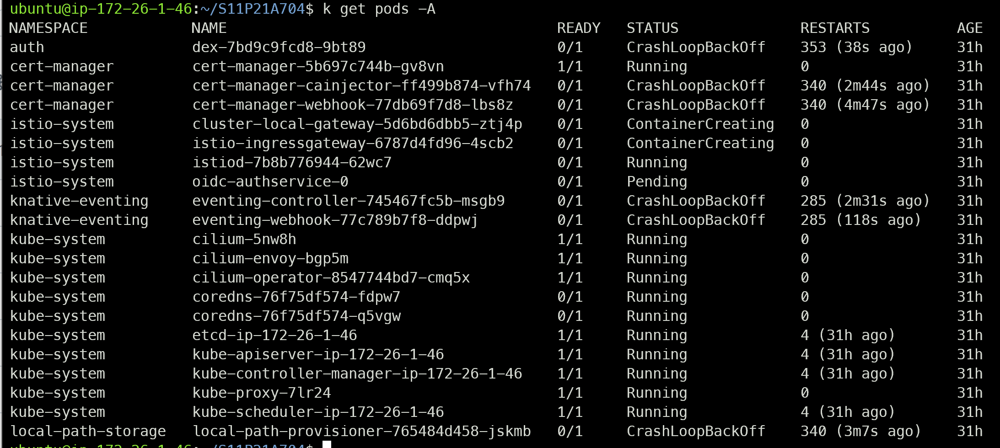

# Trouble Shooting

SSAFY에서 제공하는 GPU 서버에서 sudo 명령어를 쓸 수 없어 직접적인 Kubeflow 설치가 불가능해진 이후, 팀에 주어진 EC2 서버에 Kubeflow를 설치하고, GPU 서버없이 껍데기만 운용하는 방식을 시도한다.

### Kubeadm init

kubernetes 내부의 api 시스템이 제대로 작동하지 않아서, cert-manager 와 local-path-storage pod 등이 제대로 Running 상태가 되지 않는 오류가 있어 해결 중이다.

