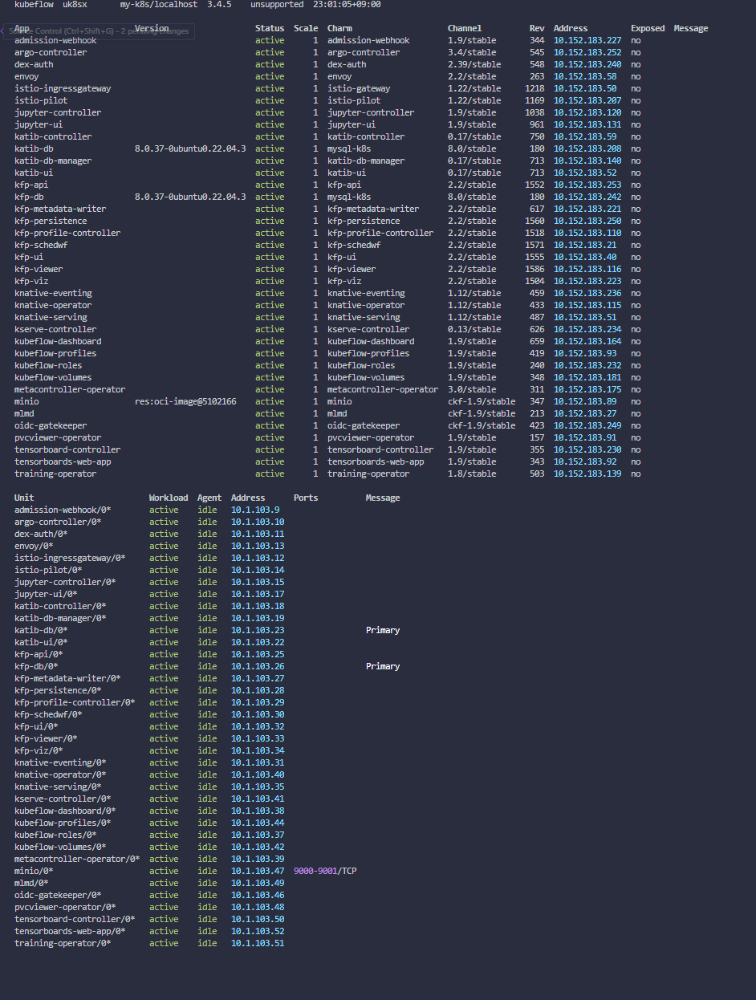

# Canonical 배포판 설치

SSAFY에서 제공하는 AWS EC2, GPU 서버를 모두 받은 날 부터, 로컬 환경이 아닌 클라우드 환경에서의 Kubeflow 설치를 본격적으로 시작했다.

기존의 아키텍처 구상은 GPU 서버에 Kubeflow를 두고, 할당된 GPU로 학습과 함께 ML pipeline을 구성하는 것이었다. 기본 EC2에 Spring Boot를 필두로 한 Backend, FrontEnd, DB 서버가 있고, GPU 서버에서 API 형식으로 AI 서버를 구성해 필요한 데이터를 쏴주는 형식이었다.

(설치된 Pod들을 살펴보면, 막상 mysql도 있어서 자체 DB를 구성하는 것도 가능할 듯 보인다.)

그러나 불운하게도 GPU 서버는 Jupyter hub 계정으로만 접근을 허용하는 매우 제한된 환경임이 뒤늦게 밝혀져 부랴부랴 새로운 아키텍처 구상과, 3주간 준비한 Kubeflow 설치와 적용방법을 EC2에 실험해보았다.

그 과정에서 서로 호환되지 않는 kubeflow 와 Kubernetes 버전, kubeadm init 명령어의 세밀한 ip 설정등을 발견했다. 돌이켜 보면 어떻게 로컬에선 잘 돌아갔던 것인지 의문일 지경이었다.

새로운 CNI (Flannel, Calico) 등의 적용을 뒤늦게 실험해 보고, 정식 튜토리얼 대로 Kind 를 이용한 Cluster 생성등을 시도했다. 결과적으로 잘 되진 않았다. 설치 과정에서 서로 다른 pod 들로의 routing 문제가 빈번히 발생했다.

```r
plugin/kubernetes: pkg/mod/k8s.io/client-go@v0.27.4/tools/cache/reflector.go:231: Failed to watch *v1.Namespace: failed to list *v1.Namespace: Get "https://10.96.0.1:443/api/v1/namespaces?limit=500&resourceVersion=0": dial tcp 10.96.0.1:443: i/o timeout
```

위와 같은 에러를 수도 없이 다시 보며 기다리는 시간이 길어졌다.

#### 결국 Kubeflow manifests 가 아닌 Canonical Kubeflow 설치를 시도했다.

해당 설치는 microk8s, juju 기반으로 작동한다.



감격의 순간이었다. 이렇게 간단하다니...

```r
microk8s kubectl -n kubeflow get svc istio-ingressgateway-workload -o jsonpath='{.status.loadBalancer.ingress[0].ip}'


# 10.64.140.43
```
