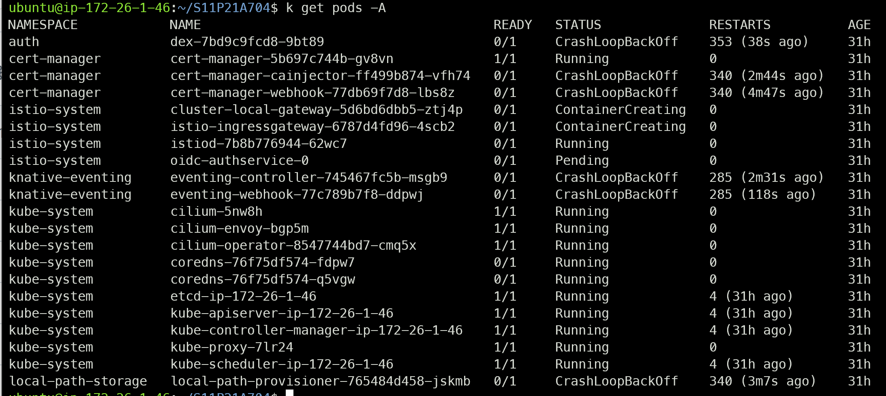
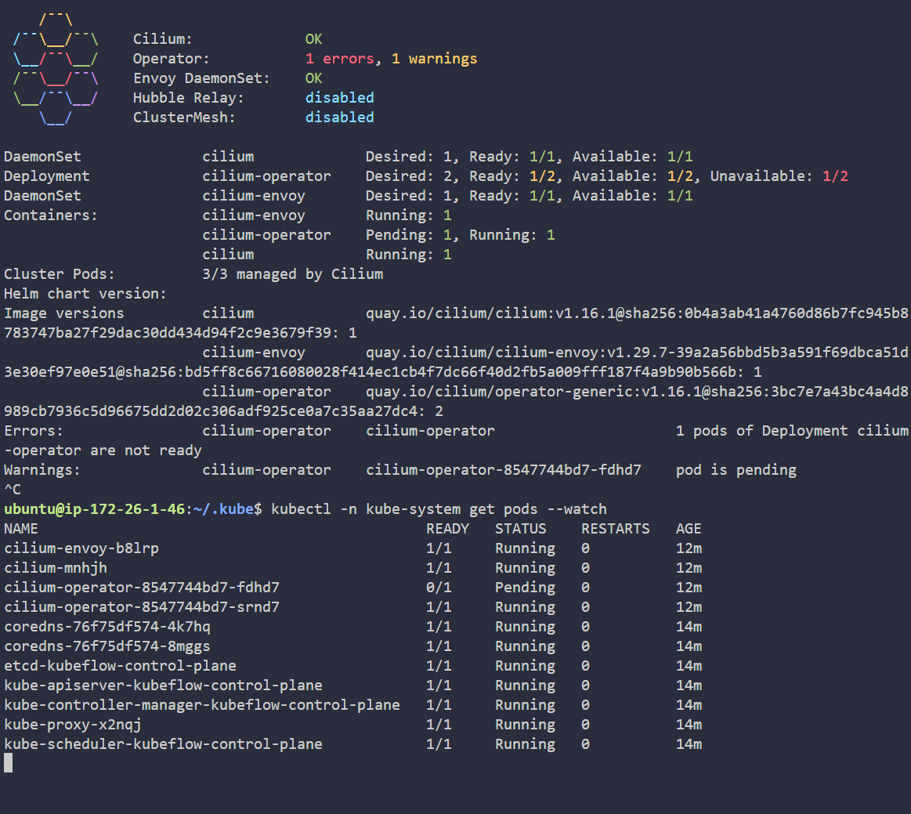
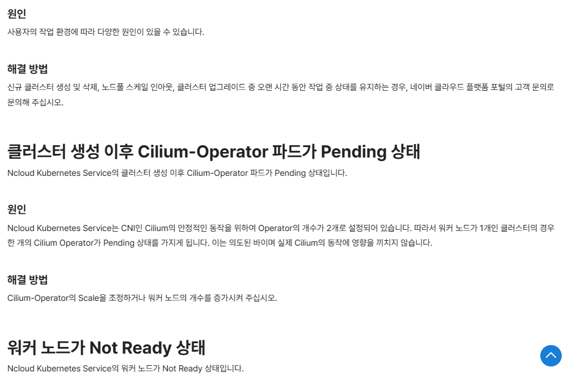

# Trouble Shooting

SSAFY에서 제공하는 GPU 서버에서 sudo 명령어를 쓸 수 없어 직접적인 Kubeflow 설치가 불가능해진 이후, 팀에 주어진 EC2 서버에 Kubeflow를 설치하고, GPU 서버없이 껍데기만 운용하는 방식을 시도한다.

### Kubeadm init

kubernetes 내부의 api 시스템이 제대로 작동하지 않아서, cert-manager 와 local-path-storage pod 등이 제대로 Running 상태가 되지 않는 오류가 있어 해결 중이다.



#### 해결!

클러스터 내부 네트워크 문제인 것 같다는 생각은 들었는데, 역시 맞았다. 다음의 명령어가 문제였다.

```r

sudo kubeadm reset

#만약, unmount dir 어쩌구에서 한참 머물고 있다면,
# sudo systemctl stop containerd
# sudo kubeadm reset
# sudo systemctl start containerd
# sudo kubeadm init
# 위와 같이, containerd를 잠시 꺼놓고 reset한다음 다시 키고 kubeadm init 하면 된다.

# 기본 설정
sudo sysctl -p
sudo swapoff -a

# kubelet 까지만 잘 켜지는지 확인
sudo kubeadm init phase kubelet-start

# cilium 을 쓰냐, calico 혹은 Flannel을 쓰냐에 따라 --pod-network-cidr의 주소가 달랐다.

# before
sudo kubeadm init --pod-network-cidr=10.217.0.0/16

# after (cilium)
sudo kubeadm init --pod-network-cidr=10.1.1.0/24

```

### cilium

```r
cilium status --wait
```

위 명령어로 상태를 지켜보는데 계속해서 operator가 error 이길래 살펴보았다.



[naver cloud platform](https://guide-gov.ncloud-docs.com/docs/k8s-troubleshoot-common)



control-plane 하나이기 때문에 의도된 바라고 한다.
