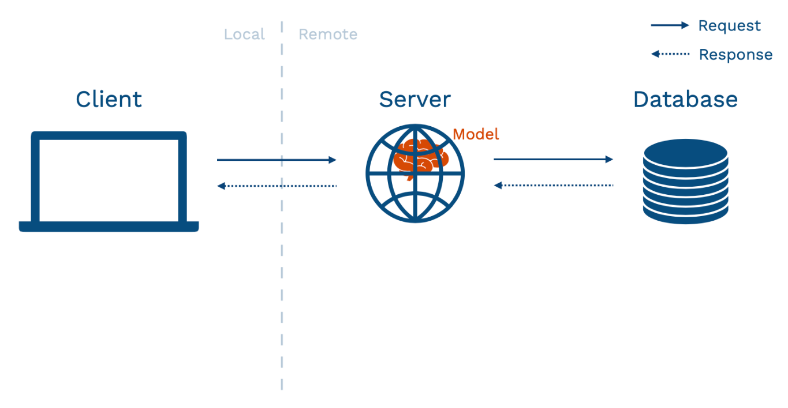
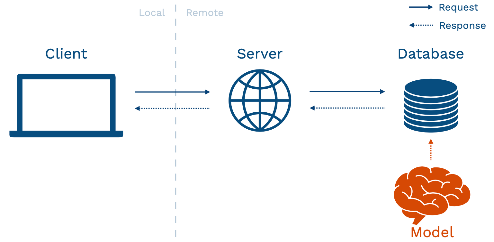
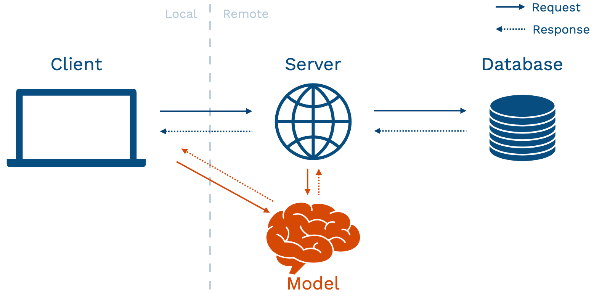
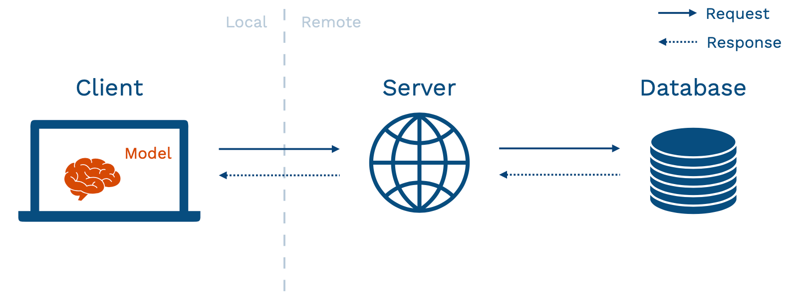

# Model Serving

[MLOps: Overview](<../../Paper/240723-Machine-Learning-Operations(MLOps)-Overview-Definition-And-Architecture/README.md>) 에서 model serving은 REST API의 형식으로 이루어지며, Normal Latency(보통 응답시간) / Batch / Offline store 혹은 Low Latency(빠른 응답시간) / Real-time / Online store 를 사용한다는 언급이 나온 적이 있었다.

이를 더 자세하게 파고들어 ML 모델을 어떻게 어플리케이션에서 사용하는지를 공부해본다. 특히, 제공하고자 하는 서비스가 위의 Low / Normal Latency 두 가지 경우에 대해서 어떤 방식에 더 적합한지를 구분할 수 있도록 하자.

딥러닝 모델의 경우 그 모델의 크기 자체가 Challenge가 된다. 분산 GPU 방식, 클라우드 서비스 등 이름만으로 생소한 것들에 대해 대략적인 감을 잡고, ChatGPT와 같은 거대 언어 모델의 Serving은 어떻게 이루어 지고 있는지 이해하는 것을 목표로 하자.

> 순서대로 다음의 세 자료를 읽고 느낀점을 정리하였습니다.

- [Model-Serving : MadewithML](https://madewithml.com/courses/mlops/serving/)

- [새로운 루다를 지탱하는 모델 서빙 아키텍처 — 3편: 안정적인 LLM 서비스를 위한 서빙 최적화 기법](https://tech.scatterlab.co.kr/serving-architecture-3/)

- [Full-stack-deeplearning : Lecture 5 - Deployment]

  [Full-stack-deeplearning : Lecture 5 - Deployment]: (https://fullstackdeeplearning.com/course/2022/lecture-5-deployment/)

---

## 모델의 요구사항을 이해하자

모델의 성능이 마음에 들고, 이제 이 모델로 어플리케이션을 만들기로 마음 먹었다면, 이제 모델을 어떻게 serving 할 지 결정해야 한다. 우리의 서비스가 방금 들어온 클라이언트의 요청에 대해 실시간으로 반응해 결과를 내놓아야 한다면, 우리의 모델은 **High throughput, Low Latency, Online inference** 를 강요받는다. 반면에, 하루의 끝에 한 번 결과를 내놓아야 한다면, (예를 들어, 하루의 주식 시장을 정리해 다음 날의 동향을 예측한다거나) **Low throughput, Normal Latency, Offline inference** 를 만족하면 된다.

사실, 모델의 Scalability (확장 가능성)과, Flexibility (유연성)는 높을 수록 좋은 것이 당연하다. 하지만, 그 모든 상황에 적응할 수 있는 **모델**을 만드는 것보다는, 우리의 서비스가 제공하는 **AI 기능을 앞에서 언급한 Latency에 따라 구분해 서로 다른 파이프라인을 거치게 하는 것**이 더 쉽고, 현실적인 방법일 수 있다.

이에 따라 각각의 AI 기능을 REST API의 각 자원에 매핑시켜 각각의 요청에 대해 두 가지 파이프라인 중 하나에 들어가도록 설계하는 것이 구체적인 방안이 되겠다.

## Frameworks

어떤 프레임워크를 선택해야 할지 고민할 때 도움이 될 수 있는 몇가지 고려사항을 적었다.

- **Learning Curve** : 모델 서빙을 위해서 새로운 프레임워크를 배워야 하는가? 혹은 배워야 할 정도로 해당 프레임워크가 가치있는가?
- **Framwork agnostic** : Pytorch 든, TensorFLow 든 상관없는 서비스를 만들자.
- **Scale** : 스케일링이 그냥 config 파일을 수정하는 것만큼이나 쉬워야 한다.
- **Composition** : 여러 모델과 비즈니스 로직을 서비스에 적용 가능하다.
- **Integrations** : 인기있는 API 프레임워크와 통합 가능하다. (예시로 FastAPI, LangChain, Kubernetes를 들었다.)

위 사항을 모두 고려해보았을 때 선택할 수 있는 프레임워크는 다음과 같다.

- **Ray Serve** : [madewithml](https://madewithml.com/courses/mlops/serving/)의 선택
- Nvidia Triton
- HuggingFace
- Bento ML

모델을 불러올 때에는 다음과 같은 사항을 고려해야 한다.

- Batch or Real-time
- Batch Size
- Version of Model (run으로 구분했다면 run-id, checkpoint 라고도 함)
- **Custom logic**

## Batching 전략

Batching 자체만 하더라도 많은 최적화 serving 전략들이 있다. 가장 간단하게는 **batch size**(얼만큼 input이 쌓였을 때 처리할지)와 **max_latency**(얼만큼만 기다릴지)를 input의 빈도에 맞추어 설정해주어야 한다. 또한 내부적으로는 배치를 실행할 때, 배치 차원을 제외한 나머지 shape을 맞추어야 하기 때문에(정확히는 seq_len) **버킷팅 전략** (길이가 비슷한 seq 끼리 묶는다.)을 사용할 수도 있고, padding을 통해 seq_len 을 맞추고, 디코더의 마스킹을 통해 이를 공백으로 처리할 수 있다.

### Iteration Batching

나의 짧은 문장이 엄청나게 긴 문장과 묶이는 바람에 한참을 기다린다면 아주 화가 날 것이다.
이를 해소하기 위해 Iteration Batching은 사용자에게 새롭게 수신한 Input이 있다면 Batch에 즉각적으로 포함시켜서 (~~쉽게 말해 막차 태운다~~), 그리고 생성이 끝난 요청이 있을 경우 응답을 즉시 반환함으로서 클라이언트의 대기시간을 최소로 한다. (~~이미 특허등록 된 기술이라고 한다~~)

### 멀티 턴

[HyperClova](https://engineering.clova.ai/posts/2022/03/hyperclova-part-3)가 발견했지만 직접 사용하지는 않은 것으로, 모델이 가용한 범위 내에서 이전에 등장한 토큰들을 모두 참조해 다음 토큰을 계산하게 되는 트랜스포머의 특징을 이용했다. 이전까지 등장한 토큰에 대한 계산결과를 캐싱해놓는데, 이때 조막만한 GPU의 메모리에 저장하는건 불가능하고, DRAM 에 데이터를 저장하는 과정에서 오히려 먼 곳을 찍고 오게 되면서 Trade-off가 발생했다고 한다.

## FasterTransformer

[CLOVA Engineering BLOG](https://engineering.clova.ai/posts/2022/01/hyperclova-part-1)에 따르면, 모델 학습을 위한 프레임워크와 모델 추론(inference)를 위한 프레임워크가 동일한 것에 분명 장점이 있지만, 모델의 크기가 커지면 커질수록 추론에 학습이 필요없다는 점을 최대한 활용해야 할 수도 있어 보인다. 즉, 추론만을 위해 이전과는 다른 프레임워크를 선택하는 것도 고려해야 한다. LLM 모델을 위한 FasterTransformer가 바로 그것이다. FasterTransformer의 가속 원리는 모델을 병렬화 (텐서와 파이프라인에서)하는 것이다. 역시나 python이 아닌 C++/CUDA로 작성됐으며, TensorFlow, Pytorch, Triton Backend API를 제공한다.

[NVIDIA Technical BLOG](https://developer.nvidia.com/ko-kr/blog/increasing-inference-acceleration-of-kogpt-with-fastertransformer/)에서 그 구체적인 가속 방법을 소개한다.

- Layer Fusion : 여러 레이어를 단일 레이어로 결합한다.
- Multi-head attention Acceleration : 시퀀스에서 토큰 간의 관계를 연산하는데에 메모리 복사와 연산이 많이 필요하다. 이를 캐싱과 퓨즈커널로 최소화한다.

  [ScatterLab BLOG](https://tech.scatterlab.co.kr/serving-architecture-3) 에서 Key/Value Caching 에 대한 언급이 나오는데, `.generate(..., use_cache=True)`의 형식으로 간단히 수행하는 것을 보아 목표하고자 하는 바는 비슷했던 것 같다.

- GEMM Kernel autotuning : matmul 연산의 매개변수(Attachment 레이어, 크기 등)을 하드웨어 수준에서 실시간 벤치마크를 통해 최적화한다.

- Lower precision: FP16, BF16, INT8 과 같은 낮은 정밀도의 데이터 타입으로 더 빠른 연산을 할 수 있다.

  그러나 HyperClova 팀은 이것 때문에 오히려 오버플로우로 인한 버그를 겪어서 다시 FP32 자료형으로 돌아갔다고 한다.

## Custom logic

예를 들어, LLM 모델의 overconfident 성질 때문에 우리의 label에 others (기타등등) 을 추가해야 한다고 해보자. 그러면, 지금까지 학습한 모델의 마지막 층 FC layer size를 하나 늘려야 할 수 있다. 그런데, 과연 그게 최선일까? 데이터를 추가로 수집해야 할 수도 있고, 모델을 처음부터 다시 학습시켜야 할 수 있다.

이런 경우, 우리의 Service 영역에서 모델의 softmax class의 값을 확인해 특정 threshold(예를 들어, 0.9)를 넘지 못하면 (즉, 그렇게 overconfident한 LLM이 그다지 confident하지 못했다면.) others로 label을 바꿔 줄 수 있다.

> 최대한 모델과 비즈니스 로직(Product)을 분리하자.

---

# Deployment

모델을 배포할 때가 모델이 제대로 작동하는지 볼 수 있는 가장 좋은 기회이다. 오프라인에서 모델을 테스트 할 때, 이미 배포가 됐을 때는 근본적인 측면에서 모델이 문제를 해결하고 있는지 아닌지 판단하기 쉽지 않다.

## Build a Prototype To Interact With

- 간단한 UI  
  이 단계에서는 모델을 간단하게 사용해보고 피드백을 받는다.
- URL 로 공유  
  클라우드 버전을 사용해보자
- 조금만 하자  
  하루 이상 걸리지 않게 해보자

<p align="center">

</p>

출처 : [Full-stack-deeplearning : Lecture 5 - Deployment]

위와 같이 **model-in-service** 모형은 흔한 유형이지만, 장/단점이 있다.
복잡한 작업을 할 떄에 이미 존재하는 인프라를 재사용하기만 된다는 장점이 있지만,

- 웹 서버는 다른 언어로 쓰여 있을 가능성이 높다.
- 모델 코드는 서버 코드보다 자주 바뀐다.  
  특히 초기에 모델 코드는 계속 바뀌는데, 그럴 때마다 매번 모든 서버를 다시 배포하지 말자.
- 큰 모델은 웹 서버 자원의 대부분을 차지한다.
- 서버 하드웨어는 대부분 ML 작업에 최적화 되어 있지 않다. (~~GPU 있니?~~)
- 모델과 어플리케이션의 확장성이 다르다.

## Seperate your model and UI

### Batch Prediction

#### 모델의 결과를 Database에 저장하자.

<p align="center">

</p>

추천 시스템 초기나 marketing automation 같은 시스템에서 모델을 간헐적으로 돌려서 쓰게 되는데, 모델에 input도 그리 많이 갱신되지 않을 때 사용하기 좋다.

데이터 처리, 모델 로드, 추론, 추론 결과 저장의 모든 과정은 Directed Acyclic Graph workflow of data operations 이므로, `Dagster`, `Airflow`, `metaflow` 등을 쓸 수 있다.

#### 장점

- 구현이 쉽다. (학습 때 쓴거 또 쓰면 되니까)
- 확장이 쉽다. (DB는 그러라고 만들어져서 오랫동안 발전돼왔으니까)
- 많이 썼던 패턴이다.
- DB가 마지막 어플리케이션이기 떄문에 추론결과를 가져오는게 빠르다.

#### 단점

- 복잡한 input 타입에는 확장성이 안좋다.
- 유저가 최신 결과를 얻지 못한다.
- 모델이 자주 고인다. (배치 과정에 문제가 생겨도 알기 어렵다.)

### Model-as-Service

<p align="center">

</p>

모델에게 요청을 던지고, 결과를 받는다. 클라이언트에서 보낼 수도 있고, (Front) 서버에서 보낼 수도 있다. (Back)

- Dependability : 모델의 버그가 웹에 영향을 주지 않는다.
- Scalability : 모델에 적합한 하드웨어를 선택하고, 확장할 수 있다.
- Flexibility : 다양한 application에서 모델을 재사용 할 수 있다.

위의 장점들이 있지만, 요청을 보내야 하기 때문에 latency가 어쨌든 하나 늘어난다. 또, 새롭게 분리된 서비스가 생기기 때문에 인프라의 복잡도도 올라간다.

아직은 형식에 정해진 틀이 없다.

- 구글 클라우드

```JSON
{"instances": [
  {"values":[1,2,3,4], "key" :1},
  {"values":[5,6,7,8], "key" :2}
]}
```

- Azure

```JSON
{
  "data":
  [<model-specific-data-structure>]
}
```

- AWS Sagemaker

```JSON
{
  "instances": [
    {"in0":[863],"in1":[882]},
    {"in0":[278], "in1":[311]},
    {"in0":[705], "in1":[578]},
  ]
}
```

#### Dependency

의존성 문제. 가장 기본적으로는 PyTorch 버전 같은 것이 있다.

이에 독립적인 어플리케이션을 만들기 위한 두가지 방법이 있는데

1. 모델 의존도를 제한한다.
2. 컨테이너로 감싼다.

1번은 [ONNX-the Open Neural Network Exchange](https://onnx.ai/) 같은 곳에서 자유로운 AI 모델 적용을 위해 애쓰고 있으나 아직 갈 길이 멀기 때문에 2번 대안이 주로 쓰인다.

Docker에 대한 learning curve를 낮추고 싶다면, [Cog](https://github.com/replicate/cog), [BentoM](https://github.com/bentoml/BentoML), [Truss](https://github.com/trussworks) 같은 오픈 소스 패키지를 쓸 수도 있다.

## Performance Optimization

> [Performance monitoring의 좋은 사례](https://github.com/okanlv/fsdl-full-stack-stable-diffusion-2022)

- GPU
- Concurrency
- Model Distillation
- Quantization
- Caching
- Batching
- Sharing GPU
- library : [Ray Serve](https://docs.ray.io/en/latest/serve/index.html)

## Move to the Edge

<p align="center">

</p>

Accuracy 와 latency 사이에서 고민해보자.

- TensorRT
- MLKit and CoreML
- PyTorch Mobile
- TFLite
- TensorFlow JS
- Apache TVM
