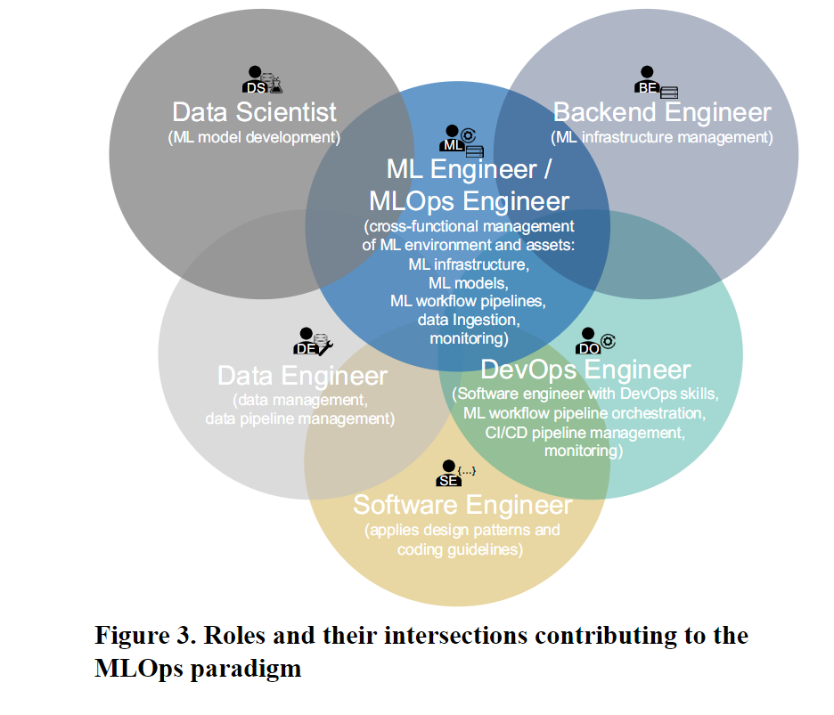
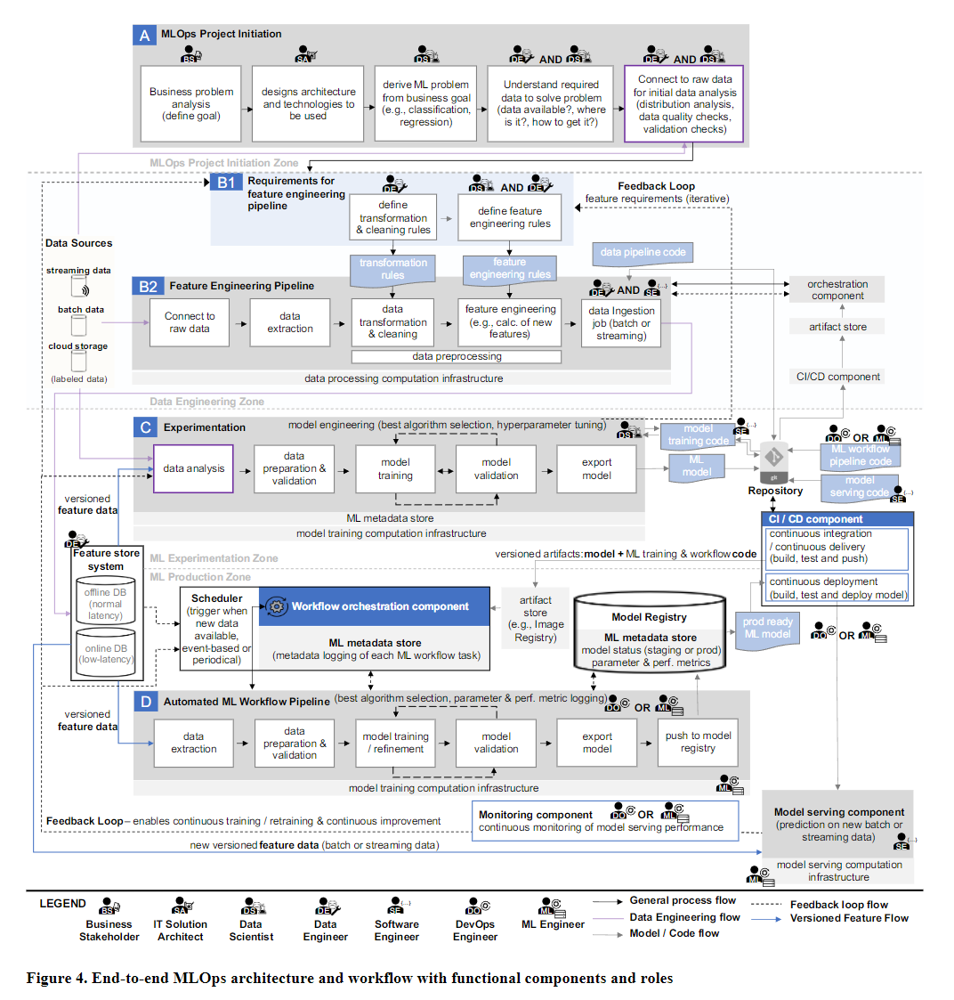

# Machine Learning Operations(MLOps) : Overview, Definition, and Architecture

- Dominik Kreuzberger
- Niklas Kuhl
- Sebastian Hirschl

- 카를스루에 공과대학교 (에드워드 텔러-수소폭탄, 카를 벤츠-자동차 벤츠) 에서 arxiv에 2022년에 게재한 논문

## abstact

> 초록은 직역

모든 산업계 ML 프로젝트의 목표는 ML 제품을 만들어서, 빠르게 런칭하는 것이다. 그러나 ML 제품을 자동화하고, Operationalize 하는 것은 대단히 어려운 일이기에, 많은 노력과 노고가 기대에 못 미치고 끝나는 경우가 많다. Maching Learning Operations (이하 MLOps)의 패러다임은 이 문제를 다룬다.

MLOps에는 여러 측면이 있는데, 최선의 실무(실천)들, 개념 집합들, 개발 문화들이 바로 그들이다.
그러나, 여전히 모호한 용어가 많고, 연구자들과 전문가들의 용어에 대한 결론(Consequences) 마저 다르다. 이 gap을 줄이기 위해 우리는 mixed-method 리서치를 수행했는데, 여기에는 문헌 리뷰, 툴(tool) 리뷰, 전문가 인터뷰가 포함된다.

이 연구의 결과로, 우리는 필수 원칙들, 구성요소와 역할들에 대해서 통합된 개요를 여러분께 제공한다. 이에 더해서 MLOps 의 정의를 다듬어서 필드에서 벌어지고 있는 무한한 도전들을 강조하려 한다.

결론적으로, 이 작업은 ML 연구자들과 ML 제품을 자동화하고 운영하고자 하는 실무자들에게 명확한 기술들이 포함된 가이드라인을 제공할 것이다.

`CI/CD`, `DevOps`, `Machine Learning`, `MLOps`, `Operations`, `Workflow Orchestration`

## 본문

### Introduction

> MLOps 란 무엇인가?

위 질문에 대한 답을 찾기 위해

1. MLOps의 중요한 원칙들을 찾고,
2. 그 핵심 구성요소들을 발라낸 다음,
3. 필요한 역할들을 강조하며,
4. 보편적인 MLOps의 시스템 디자인을 얻어낸다.

이후의 내용들은 다음과 같이 구성된다.

1. 필요한 기초 요소들, 관련된 연구들에 대해 상세히 살펴본다.
2. 이용가능한 방법론에 대한 개요를 제공한다. (문헌, tool, 인터뷰)
3. 이 방법론의 적용으로 얻을 수 있는 통찰에 대해 제시하고, 정의한다.
4. 요약, 제약사항, 제언하고 마친다.

### Foundations of DevOps

전통적인 waterfall, agile 방법론들은 결국 비슷한 목적을 가지고 있는데, **즉각 제공가능한 소프트웨어 제품을 만들자** 는 것이다. 2008~2009 년에는 "**DevOps**" 개념이 생겨났고, 소프트웨어 개발의 문제들을 경험적으로 많이 해결해줬다.

DevOps는 단순한 방법론을 넘어 사회 / 기술적 문제들을 다루는 패러다임을 의미한다.

개발과 운영사이의 gap을 없애고 협업, 소통, 지식의 공유를 강조한다. 자동화와 지속통합/배포로 빠르고, 잦지만 신뢰도 높은 배포를 보장하는데 더해 지속 테스팅, 품질 관리, 지속적 모니터링, 로깅(로그를 남기는 것), 피드백 루프이 이루어진다.

DevOps Tool 들은 크게 다음의 6종류로 구분된다.

1. 협업과 지식 공유

   - (Slack, Trello, GitLab wiki)

2. 코드 관리

   - (GitHub, GitLab)

3. 빌드

   - (Maven)

4. CI

   - (Jenkins, GitLab CI)

5. 배포 자동화

   - (Docker, Kubernetes)

6. 모니터링, 로깅
   - (Prometheus, Logstash)

이런 DevOps 방식이 많은 성공을 거뒀고, 이제 ML 에도 적용하려 한다.

### 방법론

학술계의 인사이트, 실무진의 전문성을 모두 놓치지 않기 위해 문헌, Tool, Interview의 3가지 방법론을 모두 사용해 MLOps의 개념을 정립하고, 이후 결과 파트에서 그 내용에 대해 설명한다.

#### Literature Review

- Webster and Watson 의 논문 리뷰 방법론을 참고해 수행됨.
- Barbara Kitchenham의 [Systematic literature reviews in software engineering – A systematic literature review](https://www.sciencedirect.com/science/article/abs/pii/S0950584908001390?via%3Dihub) 도 참고함.

몇번의 검색 끝에 다음과 같이 검색어를 정의했다.

- DevOps
- CICD
- Continuous Integration
- Continuous Delivery
- Continuous Deployment
- Machine Learning
- MLOps
- CD4ML

구글 스칼라를 비롯한 여러 사이트들을 검색했는데, 사실 DevOps를 ML에 적용하는 것은 학술계에는 아직 생소한 일이다. 그래서 본 연구가 진행될 때에는 리뷰된 연구들이 몇개 되지 않았다.

그래서 non-peer-reviewed 연구들까지 모두 검색했고, 1864개의 논문을 얻었다. 특정 기준을 갖고 27개의 논문을 추려낸 결과, 그들은 모두 peer-reviewed 논문들이었다.

#### Tool Review

27개의 논문과 8개의 인터뷰를 거치고 난 후, 다양한 Open Source tools, 프레임워크, 상업적 ML 클라우드 서비스들을 리뷰했다. 어떤 기술적 구성요소들이 있는지 이해하기 위한 작업이었다.

리뷰한 tool들은 다음과 같다.

#### Interview Study

- Myers and Newman 방식을 참고함 [The qualitative interview in IS research: Examining the craft](https://www.sciencedirect.com/science/article/abs/pii/S1471772706000352?via%3Dihub)

- 몇명을 인터뷰할 것인지도 결정해야 해서 이론적인 표본 접근방식을 적용했다. [The discovery of grounded theory: strategies for qualitative research]

LinkedIn을 통해서 여러 다른 기업, 배경, 성별의 MLOps 전문가들 8명을 찾아 스크립트를 작성한 후 인터뷰를 진행했다.
이때 더 이상 새로운 범주나 개념이 등장하지 않을 때까지 진행되었다.

> 인터뷰이들 목록인데, 궁금하다..!

## 결과

위의 방법론들을 사용해 중요 원리, 구성요소로의 객체화, 필수 역할등의 결과를 얻었고, MLOps의 개념과 정의를 이끌어냈다.

### Principles

보편적인 사실이나 가치, 가이드를 제공한다는 의미의 priniciple은 MLOps의 "최선의 방법"과 밀접하게 연관되어 있다. 9개의 원칙(Principle)을 얻을 수 있었다.

#### `CI/CD automation` - P1

- 지속적 통합
- 지속적 전달 (실제 product에 반영되기 위해 버튼 하나만 누르면 되는 순간까지)
- 지속적 배포 (실제 product에 자동으로 반영)

빌드, 테스트, delivery, 배포를 수행한다. 개발자에게 특정 단계의 진행이 성공인지 실패인지를 빠르게 알려줘서 전반적인 생산성이 개선된다.

#### `Workflow Orchestration` - P2

유향 비순환 그래프 (DAGs)로 ML workflow 파이프라인을 조직한다. 관계와 의존성을 고려해 일의 **순서**를 정한다.

#### `Reproducibility` - P3

ML을 실행해서 정확히 똑같은 결과를 얻는 능력을 말한다.

#### `Versioning` - P4

모델의 버전 뿐만 아니라, 데이터, 코드의 버전까지 단순히 재생산(Reproducibility)을 보장하는 것을 넘어 흐름을 짚을 수 있게 한다.(traceabiltiy)

#### `Collaboration` - P5

데이터, 모델, 코드에 대해 협업이 가능하게 한다. 기술적인 면만 말하는 것이 아니다. 협업과 소통을 통해 서로 다른 일을 하는 사람들 간의 거리를 좁혀 준다.

#### `Continuous ML training & evaluation` - P6

지속적 ML 학습이란, 주기적으로 새로운 feature 데이터에 대해 재학습시키는 것을 말한다. 이것은 `Monitoring` 컴포넌트, 피드백 루프, 자동 ML workflow 파이프라인의 지원들이 있어야 한다.  
이때 모델의 바뀐 성능을 평가하기 위해 항상 evaluation이 포함된다.

#### `ML metadata tracking/logging` - P7

metadata는 각각의 ML workflow에 대해 트랙킹되고, 로깅된다. 매 학습이 이루어질 때마다 어떤 코드, 어떤 데이터, 어떤 결과, 어떤 파라미터를 썼는지 완벽히 기록되어야 한다.

#### `Continuous monitoring` - P8

주기적으로 데이터, 모델, 코드를 평가하는 것을 의미한다. 잠재적인 에러와 변경사항들이 있는지 관찰한다.

#### `Feedback Loops` - P9

여러 개의 피드백 루프가 필요하다. 예를 들어, 모델의 실험에서 이전의 feature 엔지니어링 단계로의 루프나 `Monitoring` component에서 재학습을 위해 스케줄러로의 루프가 있겠다.

### Technical Components

Principle을 알아낸 후, 정확한 component들과 구현에 대해 설명하겠다. 각각의 component들에 대해 필수적인 **기능**을 열거한다. 괄호안에는 각각의 기능 component가 어느 Principle component를 구현할 수 있는지를 적었다.

#### `CI/CD Component` - C1 [P1, P6, P9]

- Jenkins
- GitHub actions

#### `Source Code Repository` - C2 [P4, P5]

코드 저장과 버전관리 가능

- Bitbucket
- GitLab
- GitHub
- Gitea

#### `Workflow Orchestration Component` - C3 [P2, P3, P6]

- Apache Airflow
- Kubeflow Pipelines
- Luigi
- AWS SageMaker Pipelines
- Azure Pipelines

#### `Feature Store System` - C4 [P3, P4]

자주 쓰는 것들을 모아 놓을 수 있는 중앙 저장소이다.
두 데이터베이스가 확인됐다. : 하나는, 오프라인 feature 저장소로 실험을 위해 평범한 latency로 feature를 제공한다. 다른 하나는, 온라인에서 낮은 latency로 feature를 제공해서 실제 상품단계에서 예측을 하기 위한 저장소이다.

- Google Feast
- Amazon AWS Feature Store
- Tecton.ai
- Hopswork.ai

대부분의 ML 모델 학습을 위한 데이터는 여기서 오지만, 데이터는 어디서나 올 수 있는 것이기도 하다.

#### `Model Training Infrastructure` - C5 [P6, ]

계산 자원을 제공한다. (CPUs, RAM, GPUs) 분산 시스템일 수도 있고, 비분산 시스템일수도 있다. 보편적으로는, 확장 가능한 분산 시스템을 추천한다. 로컬 머신을 쓸 수도, 클라우드를 쓸 수도 있다.

- Kubernetes
- Red Hat OpenShift

#### `Model Registry` - C6 [P3, P4]

훈련된 ML 모델과 그 메타데이터를 중앙에 저장한다.

- MLflow
- AWS SageMaker Model Registry
- Microsoft Azure ML Model Registry
- Neptune.ai

간단한 저장소로는,

- Microsoft Azure Storage
- Google Cloud Storage
- Amazon AWS S3

가 있다.

#### `ML Metadata Stores` - C7 [P4, P7]

각각의 ML workflow 파이프라인 작업을 위한 다양한 종류의 메타데이터를 저장한다. 각 학습 작업 (학습 날짜, 시간, 학습에 걸린 시간 등)에 대한 데이터, 모델 특정 데이터 (파라미터, 결과 메트릭, 모델 lineage : 사용된 데이터와 코드) 등을 저장하는 저장소도 있을 수 있다. orchestrator 와 메타데이터 저장소를 동시에 제공하는 것들을 예시로 들 수 있겠다.

- Kubeflow Pipelines
- AWS SageMaker Pipelines
- Azure ML
- IBM Watson Studio
- MLflow : advanced 메타데이터 저장소와 모델 registry를 제공

#### `Model Serving Component` - C8 [P1, ]

여러가지로 정의할 수 있겠다. 예를 들자면, 매우 큰 사이즈의 input을 실시간 혹은 배치 형태로 모델에 제공하고, 결과를 받는 온라인 inference를 들 수 있겠고, 이는 REST API 형태일 수 있다. 기반 시설 계층으로서, 확장 가능하고 분산된 모델 제공 infra가 추천된다.

- Kubernetes 와 Docker의 ML 모델 컨테이너화 기술
- Python 웹 어플리케이션 Flask 와 API
- Kserving of Kubeflow
- TensorFlow Serving
- Seldion.io serving

이외에도,

- Apache Spark for batch predictions

클라우드 서비스로는,

- Microsoft Azure ML REST API
- AWS SageMaker Endpoints
- IBM Watson Studio
- Google Vertex AI prediction service

가 있을 수 잇겠다.

#### `Monitoring Component` - C9 [P8, P9]

모델 성능에 대한 지속적인 모니터링 을 다룬다. 추가적으로 ML 인프라, CI/CD, Orchestration 에 대한 모니터링도 있을 수 있다.

- Prometheus with Grafana
- ELK stack (Elasticsearch, Logstash, Kibana)
- TensorBoard

모니터링 컴포넌트가 내장된 툴로는,

- Kubeflow
- MLflow
- AWS SageMaker 모델 모니터 혹은 클라우드 watch

### Roles

MLOps는 여러 그룹들이 서로 겹쳐있는 프로세스이기 때문에, 서로 다른 역할(Role)들의 상호작용도 production 단계에서 ML 시스템을 디자인, 관리, 자동화, 운영하는 데에 중요해진다.

필수적인 역할들에 대해 그 목적과 관련된 작업들을 간략히 소개한다.

#### `Business Stakeholder` - R1

Product Owner, Project Manager 와 유사하다. 사업의 커뮤니케이션 영역과 ML로 이루고자 하는 비즈니스 목표를 정의한다. 예를 들어, ROI (Return On Investment) 를 계산하는 것을 들 수 있다.

#### `Solution Architect` - R2

IT Architect 와 유사하다. 평가에 기반해서 아키텍처를 디자인하고 기술을 정의한다.

#### `Data Scientist` - R3

ML specialist, ML Developer 와 유사하다.
비즈니스적 문제를 ML 문제로 보고, 모델 엔지니어링, 알고리즘과 하이퍼 파라미터 선택등을 다룬다.

#### `Data Engineer` - R4

DataOps 엔지니어 와 유사하다.
데이터를 빌드업하고, feature 엔지니어링 파이프라인을 관리한다. feature store system의 데이터베이스들에 적절한 data를 주입해야한다.

#### `Software Engineer` - R5

소프트웨어 디자인 패턴과, 널리 알려져있는 코딩 가이드라인을 적용해 ML 문제가 잘 만든 product가 될 수 있도록 돕는다.

#### `DevOps Engineer` - R6

개발, 운영, 적절한 CI/CD 자동화, ML workflow orchestration, 모델 배포와 모니터링 사이의 갭을 연결한다.

#### `ML Engineer / MLOps Engineer` - R7

이 모두를 연결하는 역할을 하기 때문에, cross-domain 지식이 필수적이다. 각종 기술들을 통합시키고, ML 인프라를 만들고 운영한다. ML workflow를 자동화하고, 모델을 배포한다. 모델과 ML 인프라를 동시에 모니터링 한다.

## Architecture and Workflow

MLOps의 시작: 프로젝트 초기화 에서부터 끝: 모델 serving 까지 연구자들, 실무진들이 가장 적절한 기술들과 프레임워크들을 고를 수 있게 디자인 된 아키텍쳐를 제시한다.

1. MLOps 프로젝트의 시작
2. feature 저장소로의 데이터 주입을 포함한 feature 엔지니어링 파이프라인
3. 실험
4. 모델 serving까지의 자동화된 ML workflow 파이프라인

### MLOps 프로젝트의 시작 - A

1. 비즈니스 이해관계자들(R1)이 사업을 분석하고 ML로 해결할 수 있는 잠재 문제를 확인한다.

2. Solution 아키텍트(R2)가 전반적인 ML 시스템을 디자인하고 전반적인 평가 과정에서 사용할 기술들을 결정한다.

3. 데이터 싸이언티스트(R3)가 비즈니스 목표로부터 어떤 ML 문제를 풀지 정한다. (분류, 회귀 등)

4. 데이터 엔지니어(R4)와 데이터 싸이언티스트(R3)가 문제를 위해 어떤 데이터가 필요한지 정한다.

5. 데이터 엔지니어(R4)와 데이터 싸이언티스트(R3)가 raw 데이터 소스를 찾는다. 데이터의 분포와 질을 확인하고 검증한다.

만약에 지도학습을 사용한다면, 데이터의 라벨링 여부를 확인한다. 즉, 목표한 특성이 밝혀져 있다는 뜻이다.

### Feature Engineering pipeline의 Requirements

Feature는 모델 학습에 필요한 attribute을 말한다.

원시 데이터에 대한 초반 이해와 분석이 끝나면, feature engineering pipeline의 기본 필요 요소들이 다음과 같이 정의된다.

6. 데이터 엔지니어(R4)가 데이터 transformation 규칙을 정의한다. (정규화와 통합) 데이터를 정제하는 과정까지 포함된다.

7. 데이터 엔지니어(R4)와 데이터 싸이언티스트(R3)가 feature engineering rule을 정의한다. 다른 feature들을 기반으로 새롭고 더 진화된 feature를 얻는다. 이 rule들은 계속해서 데이터 싸이언티스트(R3)에 의해 조정된다. 실험의 결과 피드백을 바탕으로, 혹은 모니터링 컴포넌트의 모델 성능 검사를 바탕으로 한다.

### Feature Engineering pipeline

데이터 엔지니어(R4)와 소프트웨어 엔지니어(R5) 가 위의 requirements를 feature engineering pipeline의 시작점으로 삼는다.

근본적인 요구사항인 CI/CD(C1) 와 Orchestration component(C3)이 데이터 엔지니어 (R4)에 의해 정의된다. 인프라 자원역시 정의된다.

8. 먼저 feature engineering pipeline이 원시 데이터에 연결된다. 원시 데이터는 streaming 데이터, 정적 배치형 데이터, 혹은 어떤 클라우드 저장소로부터의 데이터도 될 수 있다.

9. 데이터들이 데이터 소스에서 추출된다.

10. 데이터 전처리 과정이 시작된다. 데이터 변형 rule (앞에서 정의했던) artifact가 이 작업의 input으로 전달된다. 이 과정의 목적은 결국 데이터를 사용가능한 형태로 만드는 것이다. 역시 피드백을 받으면서 지속적으로 개선된다.

11. feature enginnering 작업은 새롭고 더 진보된 feature 들을 다른 feature에 기반해 만들어간다. 역시 지속적으로 개선된다.

12. 마지막으로, feature store system (C4)에 배치 혹은 streaming 데이터의 형태로 데이터가 주입된다. 온라인 혹은 오프라인 형태의 데이터 저장소 모두 가능하다.
