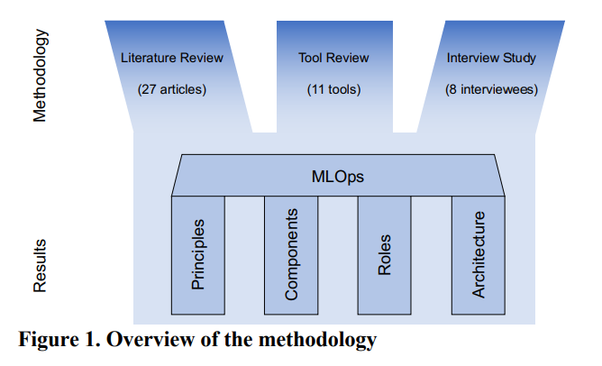
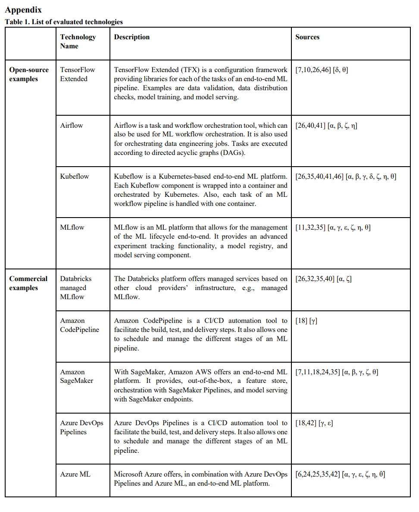
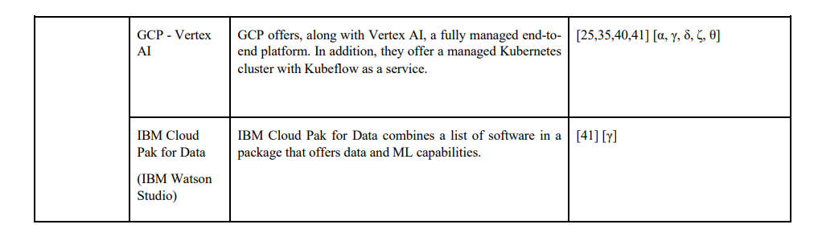
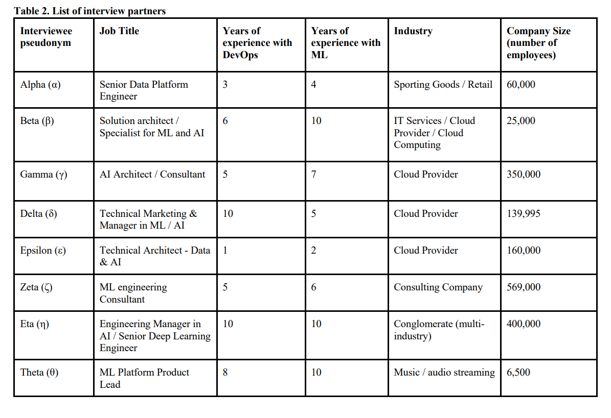

# Machine Learning Operations(MLOps) : Overview, Definition, and Architecture

- Dominik Kreuzberger
- Niklas Kuhl
- Sebastian Hirschl

- 카를스루에 공과대학교 (에드워드 텔러-수소폭탄, 카를 벤츠-자동차 벤츠) 에서 arxiv에 2022년에 게재한 논문

## abstact

> 초록은 직역

모든 산업계 ML 프로젝트의 목표는 ML 제품을 만들어서, 빠르게 런칭하는 것이다. 그러나 ML 제품을 자동화하고, Operationalize 하는 것은 대단히 어려운 일이기에, 많은 노력과 노고가 기대에 못 미치고 끝나는 경우가 많다. Maching Learning Operations (이하 MLOps)의 패러다임은 이 문제를 다룬다.

MLOps에는 여러 측면이 있는데, 최선의 실무(실천)들, 개념 집합들, 개발 문화들이 바로 그들이다.
그러나, 여전히 모호한 용어가 많고, 연구자들과 전문가들의 용어에 대한 결론(Consequences) 마저 다르다. 이 gap을 줄이기 위해 우리는 mixed-method 리서치를 수행했는데, 여기에는 문헌 리뷰, 툴(tool) 리뷰, 전문가 인터뷰가 포함된다.

이 연구의 결과로, 우리는 필수 원칙들, 구성요소와 역할들에 대해서 통합된 개요를 여러분께 제공한다. 이에 더해서 MLOps 의 정의를 다듬어서 필드에서 벌어지고 있는 무한한 도전들을 강조하려 한다.

결론적으로, 이 작업은 ML 연구자들과 ML 제품을 자동화하고 운영하고자 하는 실무자들에게 명확한 기술들이 포함된 가이드라인을 제공할 것이다.

`CI/CD`, `DevOps`, `Machine Learning`, `MLOps`, `Operations`, `Workflow Orchestration`

## 본문

### Introduction

> MLOps 란 무엇인가?

위 질문에 대한 답을 찾기 위해

1. MLOps의 중요한 원칙들을 찾고,
2. 그 핵심 구성요소들을 발라낸 다음,
3. 필요한 역할들을 강조하며,
4. 보편적인 MLOps의 시스템 디자인을 얻어낸다.

이후의 내용들은 다음과 같이 구성된다.

1. 필요한 기초 요소들, 관련된 연구들에 대해 상세히 살펴본다.
2. 이용가능한 방법론에 대한 개요를 제공한다. (문헌, tool, 인터뷰)
3. 이 방법론의 적용으로 얻을 수 있는 통찰에 대해 제시하고, 정의한다.
4. 요약, 제약사항, 제언하고 마친다.

### Foundations of DevOps

전통적인 waterfall, agile 방법론들은 결국 비슷한 목적을 가지고 있는데, **즉각 제공가능한 소프트웨어 제품을 만들자** 는 것이다. 2008~2009 년에는 "**DevOps**" 개념이 생겨났고, 소프트웨어 개발의 문제들을 경험적으로 많이 해결해줬다.

DevOps는 단순한 방법론을 넘어 사회 / 기술적 문제들을 다루는 패러다임을 의미한다.

개발과 운영사이의 gap을 없애고 협업, 소통, 지식의 공유를 강조한다. 자동화와 지속통합/배포로 빠르고, 잦지만 신뢰도 높은 배포를 보장하는데 더해 지속 테스팅, 품질 관리, 지속적 모니터링, 로깅(로그를 남기는 것), 피드백 순환이 이루어진다.

DevOps Tool 들은 크게 다음의 6종류로 구분된다.

1. 협업과 지식 공유

   - (Slack, Trello, GitLab wiki)

2. 코드 관리

   - (GitHub, GitLab)

3. 빌드

   - (Maven)

4. CI

   - (Jenkins, GitLab CI)

5. 배포 자동화

   - (Docker, Kubernetes)

6. 모니터링, 로깅
   - (Prometheus, Logstash)

이런 DevOps 방식이 많은 성공을 거뒀고, 이제 ML 에도 적용하려 한다.

### 방법론

학술계의 인사이트, 실무진의 전문성을 모두 놓치지 않기 위해 문헌, Tool, Interview의 3가지 방법론을 모두 사용해 MLOps의 개념을 정립하고, 이후 결과 파트에서 그 내용에 대해 설명한다.

#### Literature Review

- Webster and Watson 의 논문 리뷰 방법론을 참고해 수행됨.
- Barbara Kitchenham의 [Systematic literature reviews in software engineering – A systematic literature review](https://www.sciencedirect.com/science/article/abs/pii/S0950584908001390?via%3Dihub) 도 참고함.

몇번의 검색 끝에 다음과 같이 검색어를 정의했다.

- DevOps
- CICD
- Continuous Integration
- Continuous Delivery
- Continuous Deployment
- Machine Learning
- MLOps
- CD4ML

구글 스칼라를 비롯한 여러 사이트들을 검색했는데, 사실 DevOps를 ML에 적용하는 것은 학술계에는 아직 생소한 일이다. 그래서 본 연구가 진행될 때에는 리뷰된 연구들이 몇개 되지 않았다.

그래서 non-peer-reviewed 연구들까지 모두 검색했고, 1864개의 논문을 얻었다. 특정 기준을 갖고 27개의 논문을 추려낸 결과, 그들은 모두 peer-reviewed 논문들이었다.

#### Tool Review

27개의 논문과 8개의 인터뷰를 거치고 난 후, 다양한 Open Source tools, 프레임워크, 상업적 ML 클라우드 서비스들을 리뷰했다. 어떤 기술적 구성요소들이 있는지 이해하기 위한 작업이었다.

리뷰한 tool들은 다음과 같다.

#### Interview Study

- Myers and Newman 방식을 참고함 [The qualitative interview in IS research: Examining the craft](https://www.sciencedirect.com/science/article/abs/pii/S1471772706000352?via%3Dihub)

- 몇명을 인터뷰할 것인지도 결정해야 해서 이론적인 표본 접근방식을 적용했다. [The discovery of grounded theory: strategies for qualitative research]

LinkedIn을 통해서 여러 다른 기업, 배경, 성별의 MLOps 전문가들 8명을 찾아 스크립트를 작성한 후 인터뷰를 진행했다.
이때 더 이상 새로운 범주나 개념이 등장하지 않을 때까지 진행되었다.

> 인터뷰이들 목록인데, 궁금하다..!
