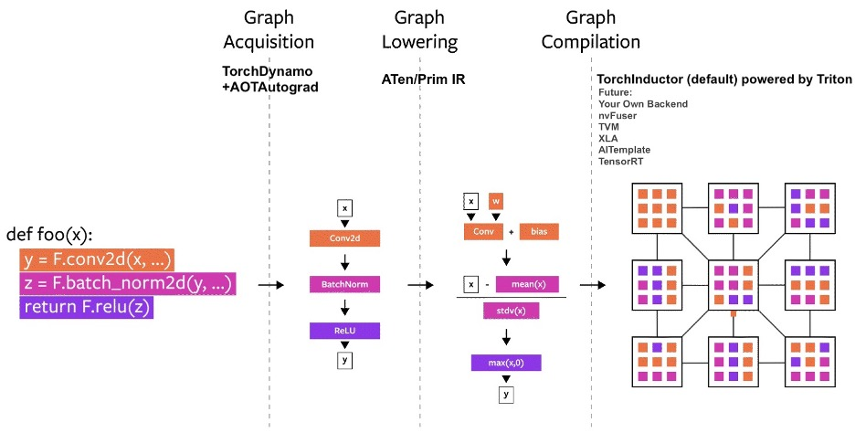
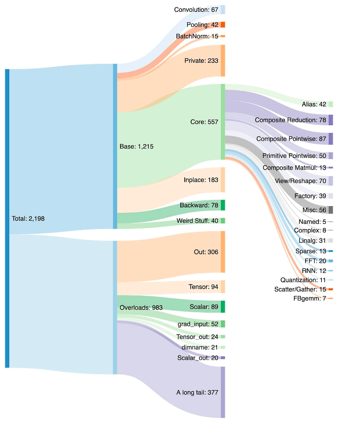

# PyTorch 2.0


- 1.13 버전에서 2.0 으로 버전 업
- 이전 버전 코드들 그대로 사용 가능
- 추가된 주요 기능으로 다음의 4가지 기능으로 뒷받침되는 `torch.compile` 을 강조
  - TorchDynamo(프로그램 안정성), AOTAutograd(autograd 엔진에 기능 추가), PrimTorch(2000개 연산자 -> 근원적, 안정적인 250개로 작동), TorchInductor(딥러닝 컴파일러)
  - TIMM, TorchBench, Huggingface 에 있는 모델들 가지고 테스트 한 결과 속도 향상됨
> **Accelerator (가속기)**  
> 
> Accelerator에 대한 언급이 많이 나와 조사해보니, 모델 학습을 더 효율적으로 할 수 있도록 해주는 하드웨어나 시스템 클래스를 의미한다.
> GPU가 DL에 효율적이라는 말이랑 일맥상통하는 듯하다.
> 최근에는 ASIC (Application-Specific Integrated Circuit)이라는 새로운 가속기가 각광이다.
- 어쩔 수 없이 가속기의 등장과 성능에 대한 욕심 때문에 Python으로 개발하고 싶은데 C++ 로 작업해야 하는 일이 생겼나 보다.
- 이런게 접근성을 떨어뜨리는게 상당히 마음에 안드시는 듯.

## Pytorch Compiler

- Computational Graph (계산 그래프)
  - backprop에는 여러가지 방법이 있는데, 컴파일러가 딥러닝 모델을 컴파일 해서 Computational Graph로 만들고 나면, 그 모든 방법들이 결국 하나의 알고리즘 (Computational Graph에서의 backprop) 으로 환원된다.
  - 노드가 연산을 의미하는 유향 그래프를 Computational Graph라고 한다.

- Graph Acquisition (TorchDynamo , AOTAutograd 관여)
- Graph Lowering (ATen / Prim IR)
- Graph Compilation (TorchInductor 관여)



### 2000+ Pytorch operators



## UX

다음의 간단한 코드 한줄로 컴파일 모델을 컴파일 시켜 사용할 수 있다.
```python
compiled_model = torch.compile(model)
```
```python
def torch.compile(model: Callable,
  *,
  mode: Optional[str] = "default",
  dynamic: bool = False,
  fullgraph:bool = False,
  backend: Union[str, Callable] = "inductor",
  # advanced backend options go here as kwargs
  **kwargs
) -> torch._dynamo.NNOptimizedModule
```

- mode : 
  - `reduce-overhead` : 메모리 조금 더 써서 Overhead 줄이기
  - `max-autotune` : 컴파일 오래하는 대신 가장 빠른 코드를 생성
- backend :
  - TorchInductor 가 default


## Q&A
- PT2.0을 쓰니까 오히려 더 느려졌는데요?
  - graph break이 너무 많아서 그럴 겁니다. [여기](https://pytorch.org/docs/stable/torch.compiler_faq.html#why-am-i-not-seeing-speedups) 가보세요


참고 링크:   
[PyTorch](https://pytorch.org/get-started/pytorch-2.0/)  
[JunYoung's blog](https://junia3.github.io/blog/pytorch2)   
[Tobig's 1415 Textseminar](https://velog.io/@tobigs-text1415/Lecture-4-Backpropagation-and-Computation-Graphs)  
