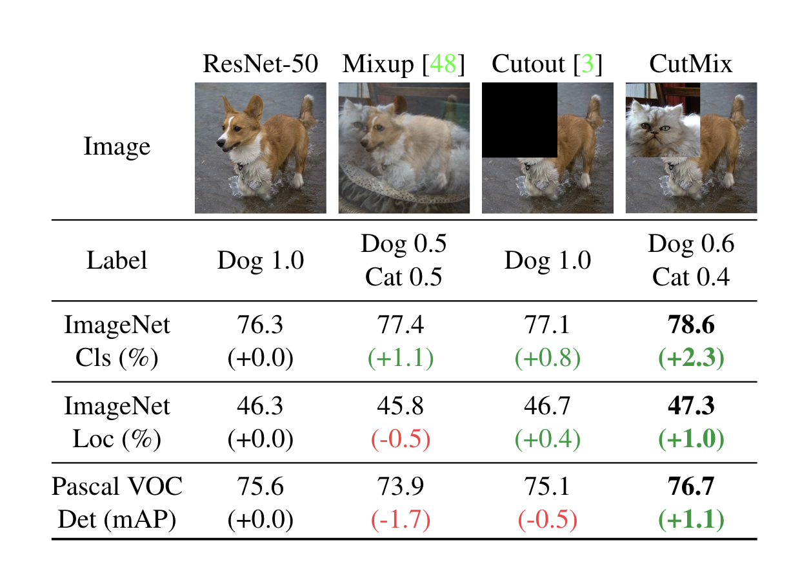
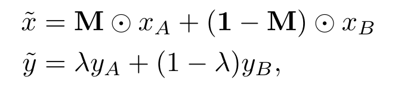
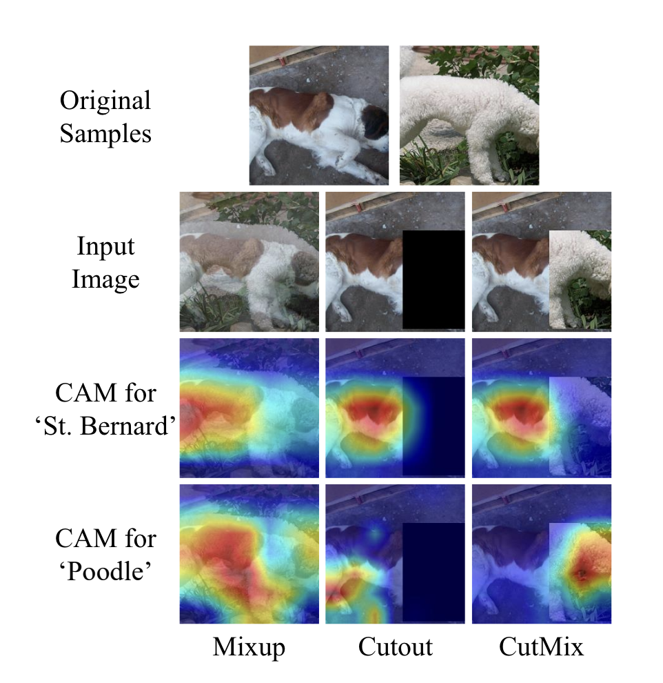

# Transform-Advanced-CutMix-MixUp

1. Tensor  
2. Dataset,DataLoader  
   1. `torch.utils.data`
3. Transform
   1. `torchvision.transforms.v2`
      1. **`v2.CutMix`**
      2. **`v2.MixUp`**
   2. `torchvision.transforms`
4. nn-model  
5. Automatic-Differentiation  
6. Parameter-Optimization  
7. model-save-load  
---

[CutMix: Regularization Strategy to Train Strong Classifiers with Localizable Features](https://arxiv.org/pdf/1905.04899) 을 참고해 작성됨

[How to use CutMix and MixUp](https://pytorch.org/vision/stable/auto_examples/transforms/plot_cutmix_mixup.html#sphx-glr-auto-examples-transforms-plot-cutmix-mixup-py)


## CutMix

### CutMix란?
Image Classification task 에서 데이터에 가할 수 있는 augmentation (증강, 추가) 중에 하나로, 단순히 데이터를 겹치는 것 (MixUp), 특정 부분을 제거하는 것(CutOut)을 넘어 서로 다른 **Image에서 가져온 부분을 합치는 것을 의미**한다.

### 왜 필요한가?
최초에는, 부분적으로 이미지를 제거하거나, 노이즈를 덮어버리는 것이 제안됐었다. CNN (Convolutional Neural Networks)이 구분이 잘 되는 곳은 잘 하지만, 그렇지 안되는 곳은 어려워하기 때문이었다. 이는, CNN이 중간 신경망의 작은 부분에서 활성이 일어난 것에 지나치게 집중한다거나, 원본 이미지 자체에서도 중요하지 않은 작은 디테일한 부분들에 집중하는 등의 이유로 설명되어 왔다.  
(예를 들어, 사람의 얼굴은 구분을 잘 하지만, 다리는 그렇지 않다.)

#### CutOut
그래서 제안된 것이 첫번째로 `CutOut`이고, 아무런 의미 없는 검은색 박스로 특정부분을 덮어버리는 것을 의미한다.

그러나 이는 Data-Hungry 한 CNN의 특성에 악영향을 주고 (아래의 논문이 인용되었다. 다음에 읽어볼 만 한 듯), 박스의 경계부분에서 학습에 비효율을 초래한다.

> (Dhruv Mahajan, Ross Girshick, Vignesh Ramanathan,
Kaiming He, Manohar Paluri, Yixuan Li, Ashwin Bharambe,
and Laurens van der Maaten. Exploring the limits of weakly
supervised pretraining. In Proceedings of the European Conference on Computer Vision (ECCV), pages 181–196, 2018.)

#### MixUp
다음으로, 이미지를 겹쳐 보이게 하는 `MixUp`이 제안되었다.

그러나, 이 역시 그 모델의 학습에는 성공적이었지만, (이미지 대상을 비율로 구분해내는 Performance 지표적인 측면) 실제 연구자가 보았을 때 너무나도 비현실적인 Image를 모델이 학습하고 있는 것처럼 보였다.

---

그래서 모델이

- 대상의 부분을 부분으로서 더 잘 이해하면서
- 구분이 잘 안되는 곳에는 더 집중하며
- 학습에 전혀 쓸모 없는 데이터는 들어가지 않는

것을 연구자들은 바랐고, CutMix를 제안하기에 이르렀다.


<p align="center">

</p>

왼쪽부터 원본, `MixUp`, `CutOut`, `CutMix` 의 예를 보면 한눈에 이해하기 쉬울 것이다.
뒤에서 실험 결과에서 설명하는 바에 의하면, 몇몇 테스트 영역에서 MixUp과 CutOut은 그 성능이 떨어지는 것에 비해 CutMix는 비교적 일관적으로 성능이 향상됐다고 한다.


## Algorithm
<p align="center">

</p>

- x_tilda는 합쳐진 데이터
- matrix M은 어떤 부분이 합쳐질지를 결정하는 0과 1만으로 구성된 행렬
- x_A, x_B는 원본 데이터
- 연산은 element-wise 곱 연산
> 즉, 이미지의 특정 부분들 만큼을 A를 넣을지 B를 넣을지 선택하겠다는 뜻이다.

- y_tilda는 결과 label
- y_A와 y_B는 원본 label
- lambda는 [0, 1]의 Uniform 분포에서 뽑은 random 변수
> 즉, y_A와 y_B 사이의 어느 중간으로 정답 label을 정하겠다는 뜻이다.

```python
for each iteration {
# input is N×C×W×H size tensor, target is N×K size tensor.
input, target = get minibatch(dataset) 

   if mode == training {
      # CutMix starts here.
      input s, target s = shuffle minibatch(input, target) . 
      lambda = Unif(0,1)
      r x = Unif(0,W)
      r y = Unif(0,H)
      r w = Sqrt(1 - lambda)
      r h = Sqrt(1 - lambda)
      x1 = Round(Clip(r x - r w / 2, min=0))
      x2 = Round(Clip(r x + r w / 2, max=W))
      y1 = Round(Clip(r y - r h / 2, min=0))
      y2 = Round(Clip(r y + r h / 2, min=H))
      input[:, :, x1:x2, y1:y2] = input s[:, :, x1:x2, y1:y2]
      lambda = 1 - (x2-x1)*(y2-y1)/(W*H) # Adjust lambda to the exact area ratio.
      target = lambda * target + (1 - lambda) * target s 
      # CutMix ends.
   }

 output = model forward(input)
 loss = compute loss(output, target)
 model update()
}
```
> pseudo 코드가 이렇게 간단해도 되나 싶을 정도로 계산에 overhead가 거의 없다.

> 사진에서는 되게 이쁘게 잘 붙인 것처럼 보였는데, 실제 구현은 완전 random인 것 같다. 당황스럽다.

## Regional Recognition

다시 원래 이 알고리즘이 제안되었던 순간으로 돌아와서, 실제로 Image 의 부분 부분을 잘 인식하는지 실험하기 위해 `CAM(Class Activation Mapping)`을 측정한 결과를 보여준다.

<p align="center">

</p>

> `MixUp`의 경우 이미지가 겹쳐진 것을 그대로 반영해서 전체 부분에 두 class가 고르게 퍼져 있는 것을 볼 수 있다.

> `CutOut`의 경우 지워지지 않은 영역에 대해서는 여전히 잘 찾지만, 잘 구분이 안되는 다리 같은 부분에서 틀린 class를 가리키는 것을 볼 수 있다. 본 연구의 연구자 분들이 주목한 부분이 이 부분이지 않을까 싶다.

> `CutMix`의 경우 `CutOut`에서 Poodle로 다소 억지스럽게 내놓은 결과물들이 모두 사라지고 명확히 원래 label대로 class 를 잘 구분해 낸 것을 볼 수 있다.


---

## How to USE?

### DataLoader 바로 다음에
```python
dataloader = DataLoader(dataset, batch_size=4, shuffle=True)

cutmix = v2.CutMix(num_classes=NUM_CLASSES) 
# NUM_CLASSES : 100으로 설정했다. one-hot-encoding 을 위해서 batch에 존재하는 class들의 개수가 몇개인지를 적어준다.

mixup = v2.MixUp(num_classes=NUM_CLASSES)
cutmix_or_mixup = v2.RandomChoice([cutmix, mixup])

for images, labels in dataloader:
    print(f"Before CutMix/MixUp: {images.shape = }, {labels.shape = }")
    images, labels = cutmix_or_mixup(images, labels)
    print(f"After CutMix/MixUp: {images.shape = }, {labels.shape = }")

    # <rest of the training loop here>
    break 
```
```
Before CutMix/MixUp: images.shape = torch.Size([4, 3, 224, 224]), labels.shape = torch.Size([4])
After CutMix/MixUp: images.shape = torch.Size([4, 3, 224, 224]), labels.shape = torch.Size([4, 100])
```

> labels도 변형되었다!

> 이걸 그대로 loss function에 대입해 줄 수 있다. (`torch.nn.functional.cross_entropy()`같은.)


### collation function 의 일부분으로

DataLoader 바로 다음에 위치시키는 것도 물론 좋지만, DataLoader의 Multi-processing 능력이 아깝지 않은가!?

```python
from torch.utils.data import default_collate


def collate_fn(batch):
    return cutmix_or_mixup(*default_collate(batch))

# collate_fn 을 함수로 만들어서 DataLoader 생성할 때 넣어주자.
dataloader = DataLoader(dataset, batch_size=4, shuffle=True, num_workers=2, collate_fn=collate_fn)

for images, labels in dataloader:
    print(f"{images.shape = }, {labels.shape = }")
    # No need to call cutmix_or_mixup, it's already been called as part of the DataLoader!
    # <rest of the training loop here>
    break
```

> `cutmix_or_mixup(*default_collate(batch))` 부분에 `*`를 처음봐서 당황스러웠다.
>
> python 에서 함수에 파라미터를 정의할 때, 키워드 없이 그 개수가 불명확할 때 `*`를, 키워드를 갖되 그 개수가 불명확할 때 `**`를 쓴다.
>
> JavaScript의 `...` 같은 건가 보다.. 큰일이다.

### Non-Standard input format

`MixUp` 과 `CutMix` 모두 마법같이(?) 대부분의 일반적인 sample structure를 지원한다. 두번째 파라미터가 tensor label인 tuples 라거나, "label[s]"를 key 로 가진 dictionary 등을 말한다!

`labels_getter` parameter에 어디서 label을 가져올지 알려주는 함수를 작성해 전달하면 알아서 label로 읽어준다.

```python
batch = {
    "imgs": torch.rand(4, 3, 224, 224),
    "target": {
      # 0, 100 사이에 아무거나 채워준다. batch_size는 지금 4이다.
        "classes": torch.randint(0, NUM_CLASSES, size=(4,)),
        "some_other_key": "this is going to be passed-through"
    }
}


def labels_getter(batch):
    return batch["target"]["classes"]


out = v2.CutMix(num_classes=NUM_CLASSES, labels_getter=labels_getter)(batch)
print(f"{out['imgs'].shape = }, {out['target']['classes'].shape = }")
```

```
out['imgs'].shape = torch.Size([4, 3, 224, 224]), out['target']['classes'].shape = torch.Size([4, 100])
// onehotencoding 돼서 나온다.
```