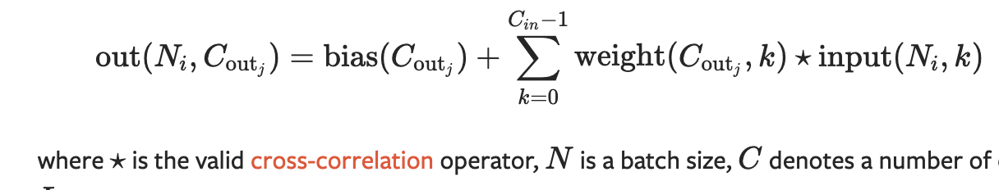
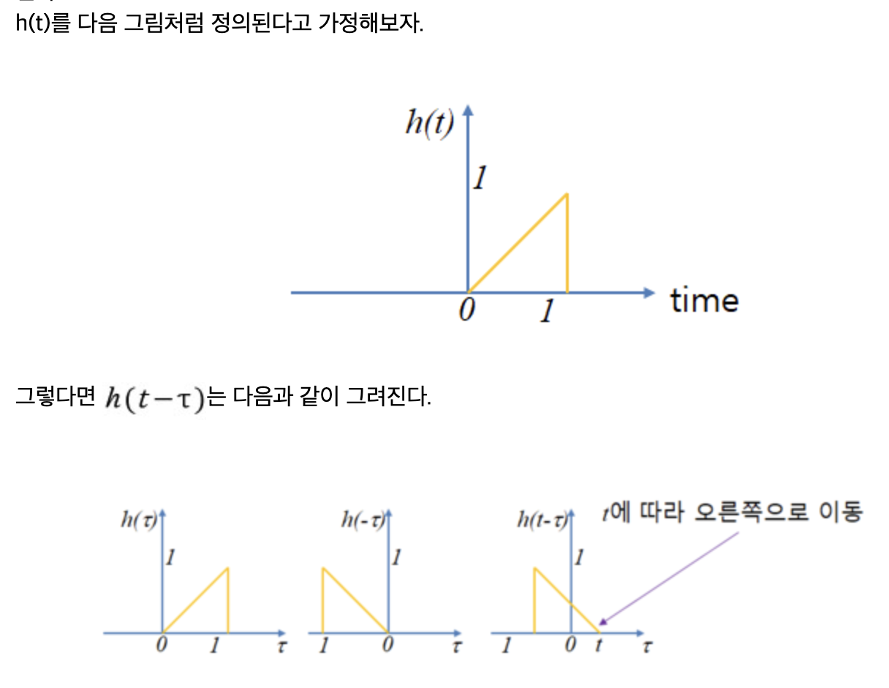
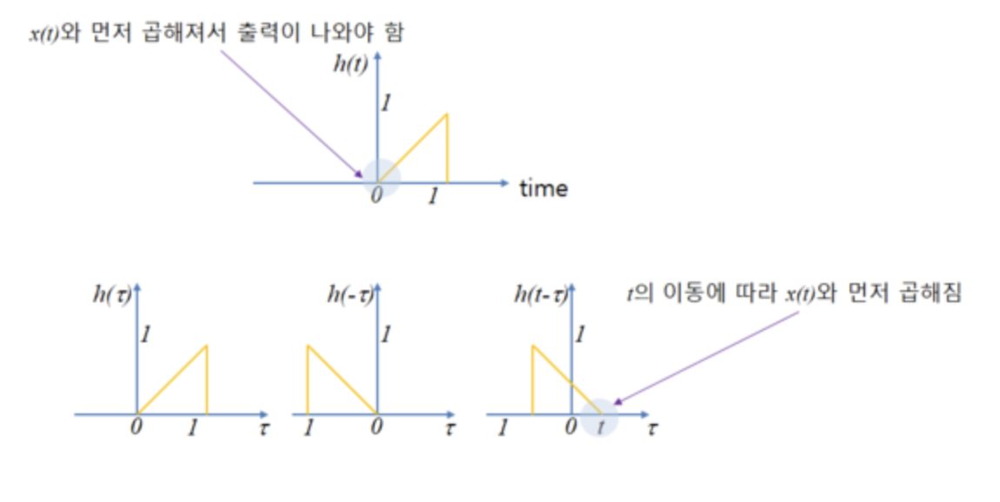

# Convolution

1. Tensor  
2. Dataset,DataLoader  
   1. `torch.utils.data`
3. Transform
   1. `torchvision.transforms.v2`
      1. `v2.CutMix`
      2. `v2.MixUp`
   2. `torchvision.transforms`
4. nn-model  
   1. `torch.nn`
        1. Convolution Layers
            1. **Convolution**
5. Automatic-Differentiation  
6. Parameter-Optimization  
7. model-save-load  
---

## Convolution

함수와 함수의 함성곱부터 시작한다.

$$
f(t) * g(t) := \int_{-\infty}^{\infty}f(\tau)g(t-\tau)d\tau = (f*g)(t)
$$

그대로 해석하면, 모든 정의역에서 $g$함수를 **뒤집어**(i.e. y축에 대해) f 함수와 **곱해 적분**한다는 뜻이다.

하지만, 우리는 이 연산을 행렬에 대해서 수행할 것이기 때문에, 이산 (시간) 합성곱 (Discrete Time Convolution)을 계산하는 방식을 굳이 알아둘 필요가 있다.

$$
x[n]*h[n] = \sum_{k=-\infty}^{\infty} x[k] \cdot h[n-k]
$$

다음의 안 성립하면 안 될 것 같은 것들이 다행히 성립한다.
- 교환법칙
- 결합법칙
- 분배법칙

### 예시

$$
[1,2,3]*[4,5,6]
$$

```python
# 뒤집는다.
[1,2,3]
[6,5,4]

왼쪽에서 오른쪽으로 쭉 옮긴다. (index를 옮기는 것이 결국 배열을 이동시키는 것과 같다.)

[1,2,3]
4]
= 4

[1,2,3]
5,4]
= 5 + 8 = 13

[1,2,3]
[6,5,4]
= 6 + 10 + 12 = 28

[1,2,3]
  [6, 5
= 12 + 15 = 27

[1,2,3]
    [6
= 18


# 정답
[4, 13, 28, 27, 18]
```

### cross-correlation

CNN api 문서를 보면, 
<p align="center">

<p>

이렇게, cross-correlation으로 정의해놓은 것을 볼 수 있는데,

cross-correlation의 정의는 convolution 과 '**반전**'을 안한다는 것을 제외하고 완전히 똑같다.

$$
f(t) \star g(t) := \int_{-\infty}^{\infty}f(\tau)g(t+\tau)d\tau = (f\star g)(t)
$$

결국 kernel을 학습시키는 것이기 때문에, 내가 입력을 뒤집어 하나 계산을 뒤집어 하나 똑같다. 그래서 실제 구현에서는 convolution 식 대신 cross-correlation을 쓴다.


## Convolution을 생각하는 다양한 관점

### 1. 주사위

[3Blue1Brown의 '그' 영상](https://youtu.be/KuXjwB4LzSA?si=0kUqds15VAXIIFIi)을 참고해 작성됨

> 확률론의 관점에서 보자

**"1부터 6의 숫자가 써진 주사위를 2개 던져서 두 숫자의 합 ($x+y$)이 나오는 경우의 수를 구하고 싶다."**

||1|2|3|4|5|6|
|-|-|-|-|-|-|-|
|1|$\cdot$|$\star$|$\cdot$|$\star$|$\cdot$|$\star$|
|2|$\star$|$\cdot$|$\star$|$\cdot$|$\star$|$\cdot$|
|3|$\cdot$|$\star$|$\cdot$|$\star$|$\cdot$|$\star$|
|4|$\star$|$\cdot$|$\star$|$\cdot$|$\star$|$\cdot$|
|5|$\cdot$|$\star$|$\cdot$|$\star$|$\cdot$|$\star$|
|6|$\star$|$\cdot$|$\star$|$\cdot$|$\star$|$\cdot$|

위의 문제를 풀기위해 이와 같이 대각선끼리 더하는 방식을 상상할 수 있는데, 이는 각각의 주사위를 x축, y축으로 두고 $x+y=k$의 등고선을 그려보는 것과 같다.

#### 만약 각 면의 확률이 $\frac{1}{6}$ 로 동일하지 않았다면?

그 때 우리는 각각의 확률 정보를 받아 "**곱**"한 다음 "**더하는**" 방식을 떠올릴 것이다. 이떄 위의 등고선의 $k$값을 고정시켜 놓고 한 번에 구하고 싶다면, 앞에서 배운 **합성곱**의 정의대로 

> 한 주사위를 반전시켜 놓고 한칸씩 전진해 나가면서 곱하고 더하는 계산방식을 반복하면 되는 것

이다.


### 2. 다항식의 곱

주사위의 마지막 논의에서 더 나아가 각 면의 확률을 다항식의 계수로 볼 수 있다.

$$
(1+2x+3x^2)(4+5x+6x^2) = \\
4 + 5x + 6x^2 + 8x + 10x^2 + 12x^3 + 12x^2 + 15x^3 + 18x^4 =\\
4 + 13x + 28x^2 + 27x^3 + 18x^4
$$

마법같이 (아님 말구) convolution의 결과와 똑같다.


### 2. Signal

Convolution이 시작된 곳을 거슬러 올라가다 보면 좀 더 순수 수학에 가까워지는데, 1920년 Stieltjes–Volterra products를 연구하던 Percy John Daniell가 그래도 정설인 것 같다.

미분함수, 적분함수, 뒤집혀 곱해짐과 같은 특징이 식에 나타나 있다.

시간의 흐름에 따른 함수의 변화를 이용하기에 유용해서 'Digital signal Processing' 분야에서 주로 사용했었다고 한다.

[류영권님의 블로그](https://m.blog.naver.com/ykryu7/221230919078)를 참고해 작성됨

왜 convolution에서 함수를 뒤집는가?에 대해 생각해 본 적이.. 없었다!

신호이론 분야에서는 신호가 오고, 내가 특정한 필터(kernel)을 가지고 그 신호를 변형시키는 느낌으로 convolution을 이해하는데, 그 필터를 $h(t)$라 하자.

<p align="center">

<p>

저 $h(t)$를 y축에 대해 뒤집어 time을 따라 이동시켜가면서 0초부터 도착하는 외부 신호에 대해 곱해야지만, 그 변형의 시간이 일치하게 된다. (어렵게 생각할 것 없이 그냥 연속해서 들어오는 신호에 대해 내가 조작을 가하려고 만든 함수를 어느 점에서부터 적용시킬 것인지 생각해보자.)

<p align="center">

<p>


## Convolution의 시간 복잡도

2d matrix를 모든 i, j 에 대해 순회하며 곱하고 있으니 시간복잡도는 $O(N^2)$ 이 될 것이다. `numpy` 패키지의 `convolve`함수 같은 경우 실제로 이렇게 구현되어 있다.

### Fast Fourier Transform

알고리즘을 공부하면서 시간복잡도가 한 단계 한 단계 줄어들 때마다 그게 얼마나 큰 시간단축을 주는지, 반면에 또 그 방법을 생각해내는 게 얼마나 어려운지를 느끼는데, 이 Convolution의 시간 복잡도를 $O(Nlog(N))$ 까지 줄일 수 있는 방법이 있다.

그게 바로 Fast Fourier Trnsform 이고, 앞에서 언급한 `convolve`함수의 api에 가도 해당 내용을 언급하고 있다.

> `scipy.signal.fftconvolve`함수로 똑같은 작업을 더 빠른 시간에 할 수 있다.

복잡한 신호(혹은 음성)를 특정 주파수의 신호들 여러 개로 분해할 때 사용할 수도 있다.

DFT를 이용해 각 함수(혹은 신호)를 변환하고

> 정확히는 DFT는 써봤자 똑같이 $O(N^2)$이기 때문에 홀수와 짝수항으로 재귀적으로 나누는 **FFT알고리즘** (쿨리 튜키 알고리즘이 대표적이다.)을 사용해서! : 이게 $O(Nlog(N))$

그 결과를 단순 곱(Pointwise) : $O(N)$으로 얻어낸 후에
이를 다시 역 푸리에 변환으로 최초에 원하던 결과를 얻는 방식이다.

~~CNN을 공부하기 위한 기초 단계이기 때문에 자세한 수식을 이용한 증명이나 시현은 생략하였다~~

## Convolution 1D/ 2D / 3D

앞에서 사실 convolution에 대한 이해는 끝났다.

이제, 데이터가 어떻게 생겼느냐에 따라 CNN의 Layer가 그에 맞추어 작동하기만 하면 된다.

Convolution #D 에 적혀있는 dimension(차원)은 Filter 가 진행할 방향의 개수를 의미한다.

> input의 형태와는 무관하다! convolution 3D를 적용할 수 없는 input shape이 주어지면, 그냥 에러 날 뿐이다.

- Convolution 1D
  - 시계열, Sequential, 문자열과 같은 데이터에 대해 주로 사용한다.
- Convolution 2D
  - Image 데이터에 대해 정말 많이 사용한다.
  - Channel (3)은 별개이다! 그냥 동 데이터의 RGB에 대해 Convolution을 각각. 총 3번 실행한다. (데이터가 그냥 3개 층으로 이루어진 것이니까!)
- Convolution 3D
  - Video 등의 데이터에 대해 사용한다.