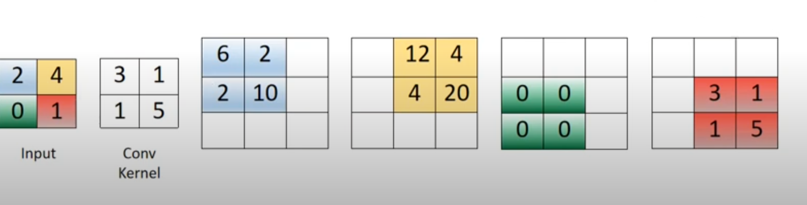
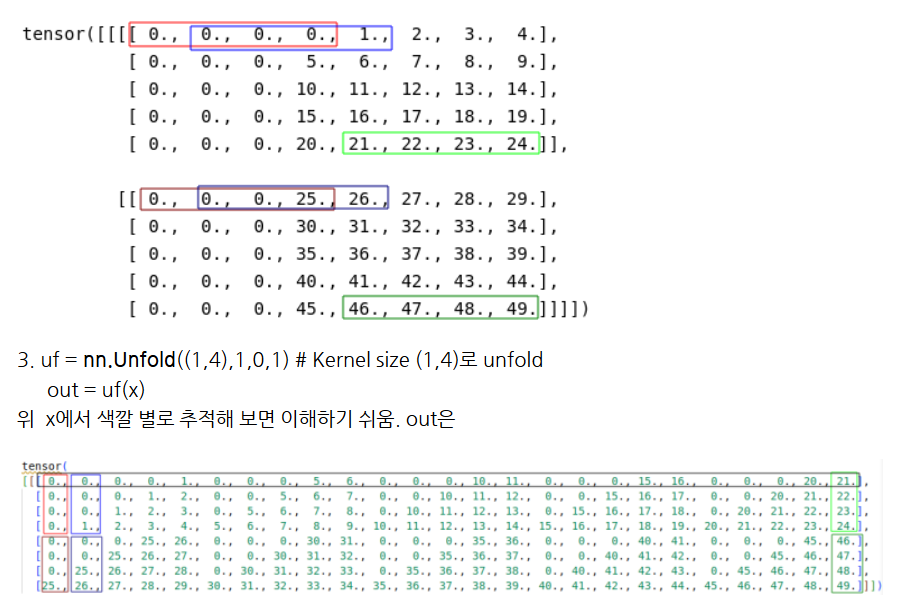
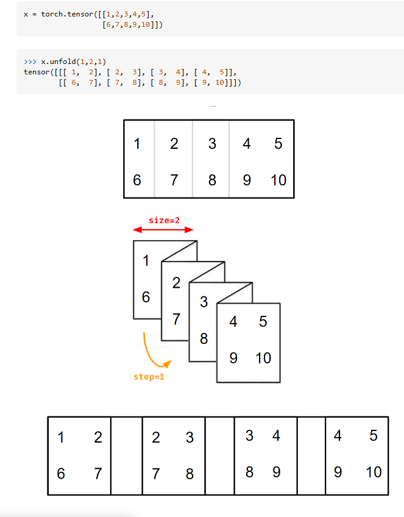

# Deconvolution

1. Tensor  
2. Dataset,DataLoader  
   1. `torch.utils.data`
3. Transform
   1. `torchvision.transforms.v2`
      1. `v2.CutMix`
      2. `v2.MixUp`
   2. `torchvision.transforms`
4. nn-model  
   1. `torch.nn`
        1. Convolution Layers
            1. Convolution
               1. `nn.Conv#d`
               2. `nn.ConvTranspose#d`
5. Automatic-Differentiation  
6. Parameter-Optimization  
7. model-save-load  
---
[Deconvolution](https://analysisbugs.tistory.com/104),  
[Deconvolution이란 무엇인가?](https://3months.tistory.com/209),  
[Understanding the PyTorch implementation of Conv2DTranspose](https://stackoverflow.com/questions/69782823/understanding-the-pytorch-implementation-of-conv2dtranspose),  
[`nn.ConvTranspose#d`](https://pytorch.org/docs/stable/generated/torch.nn.ConvTranspose1d.html#torch.nn.ConvTranspose1d) 를 참고해 작성됨

## Deconvolution
일반적으로 Convolution을 취하면 그 결과는 원본 배열보다 **작아진다.**
그리고 이 Convolution NN의 의미는, 그림(Image)을 바라보는 여러 관점을 kernel을 이용해 분리해내고, (대표적으로 horizontal, vertical gradient kernel) 그 결과를 내가 원하는 목적에 맞게 학습시키는 것이다. 이 때 학습해야하는 주체는 kernel 이 되고, 따라서 목적을 수행하기 위해
어떤 kernel이 필요한지를 신경망이 **알아서** 학습한다. 바로 여기서 블랙박스적 성격이 비롯된다.

이 Convolution nn의 결과는 일반적으로 **"전체 그림 -> 하나의 클래스"** 의 형태를 띨 때가 많다.

### Image Segmentation
그런데, 많은 경우에 한 이미지, 혹은 데이터에 내가 원하는 결과 (ex. "고양이"라는 클래스 label)하나만 존재하지는 않는다.
가장 쉽게 생각해 볼 수 있는 noise, 배경, 환경, 중요하지 않은 물체가 데이터에 포함되어 있을 수 있다.
혹은, '고양이' 라는 물체를 '머리', '몸통', '앞발', '다리' 등 여러 구획으로 나누어 학습시킬 필요가 생길 수 도 있다.

즉, 전체 이미지의 구획 구획을 학습할 필요가 있는데, 이때 사용가능한 것이 **Deconvolution NN** 이다.

### Calculation
<p align="center">

</p>

대략적인 계산 (delation, padding 등에 대한 고려가 없는 가장 기본 형태)은 위와 같이 진행된다.
하나의 input 원소가 kernel을 통과하면서 그 의미가 **"확장"**된다.

많은 고민과 문제해결 (특히, computational overhead, memory 낭비 등) 끝에 나온 결과만을 보고 있는데, 그 과정이 다음 블로그에 잘 정리되어 있다.   
[Deconvolution](https://analysisbugs.tistory.com/104)

## `nn.ConvTranspose#d`

`arg`는 `Conv#d` 와 거의 동일하다.

`output_padding` : output의 한 방향에 덧붙여 크기를 키우고 싶을 때 사용. (output을 구한 다음에 0 padding을 덧붙인다는 의미가 아님!)

`nn.ConvTranspose#d`의 `padding` argument는 `dilation * (kernel_size -1) - padding` 만큼의 zero padding을 `input`에 실행시켜준다.

그 이유는, `Conv2d`와 `ConvTranspose2d`가 동일한 파라미터를 갖고 출발했을 때, input과 output의 shape 에 `inverse` 의 관계가 성립하도록 하기 위함이다.

> 어느 정도 `nn.Conv`의 역연산으로 설계된 듯 하다.

그런데, `stride` 가 1보다 커버리면, 하나의 output shape 에 대해 `Conv`가 여러 개의 input shape을 대응시키게 되므로, 이 1대 다의 대응관계를 해소하기 위해 `ConvTranspose#d`에 `output_padding`을 도입하게 되었다.


## `nn.LazyConv#d`

`Conv#d` 에서 `in_channels`가 없이 사용할 수 있다!!

`torch.nn.UninitializedParameter` 로서 해당 파라미터를 접근하지 못하게 해놓고 있다가, input이 들어오면, input의 shape을 통해 `in_channels`를 추론하여 쓴다.

실제로 해당 기능이 필요한 사람들이 좀 있었던 것 같다.  
[[Discussion] Are you using torch.nn.Lazy* modules?](https://www.reddit.com/r/MachineLearning/comments/p5gi1f/discussion_are_you_using_torchnnlazy_modules/)  
(TensorFlow에서 넘어온 사람들, 자기가 직접 해당 기능을 구현하여 사용하는 사람들,, 등)

> 뭐 엄청 힘이 많이 드는 일도 아니고, 오히려 명확하게 자기 모델에 대해 인지하고 있어야 한다는 점에서 안쓰는 것이 좋은 것 같다.

---
### 하기 두 함수는 3D / 4D (Image-like) input 만 가능하다.
---

## `nn.Unfold`


> 연산이 이해가 안돼서 한참 쳐다봤는데, 다음의 그림들이 가장 이해하기 쉬운 것 같다. [출처1](https://blog.naver.com/PostView.naver?blogId=bjkim3333&logNo=222879780914)  [출처2](https://stackoverflow.com/questions/53972159/how-does-pytorchs-fold-and-unfold-work)

<p align="center">

</p>
<p align="center">

</p>

```python
unfold = nn.Unfold(kernel_size=(2, 3))
input = torch.randn(2, 5, 3, 4)
output = unfold(input)
# each patch contains 30 values (2x3=6 vectors, each of 5 channels)
# kernel이 6칸이고, 채널이 5개니까 30개씩 들어간다.

# 4 blocks (2x3 kernels) in total in the 3x4 input
# |*|*|*| |
# |*|*|*| | 
# | | | | | 총 4개가 들어갈 수 있다는 뜻.


output.size()
# torch.Size([2, 30, 4])
```

## `nn.Fold`

> Unfold의 역연산이 아닐 수 있음!

`Fold` 는 가능한 block의 값들을 모두 합해 주는데, 따라서 겹치는 블록의 값들은 더해진다.

## 도대체 이 2 모듈은 뭘 위한 것?

모든 input에 대해 다음이 성립한다. (같은 파라미터로 `Fold`와 `Unfold`를 만들었다는 가정하에)

> fold(unfold(input)) == divisor $\star$ input
> $\star$ 는 cross-correlation

`divisor`는 `input`의 shape과 dtype에만 영향을 받는 tensor

```python
input_ones = torch.ones(input.shape, dtype=input.dtype)
divisor = fold(unfold(input_ones))
```
`divisor`에 0이 없으면, `fold`와 `unfold`는 역연산


### 직접 Convolution을 정의하여 사용하기에 용이하다.

**"Convolution = Unfold + matmul + Fold"**

```python
# Convolution = Unfold + matmul + Fold

input = torch.randn(1, 3, 10, 12)
w = torch.randn(2, 3, 4, 5)
inp_unf = torch.nn.functional.unfold(input, (4, 5))
out_unf = inp_unf.transpose(1, 2).matmul(w.view(w.size(0), -1).t()).transpose(1, 2)
out = torch.nn.functional.fold(out_unf, (7, 8), (1, 1))
# or equivalently (and avoiding a copy),
# out = out_unf.view(1, 2, 7, 8)
(torch.nn.functional.conv2d(input, w) - out).abs().max()
tensor(1.9073e-06)
```