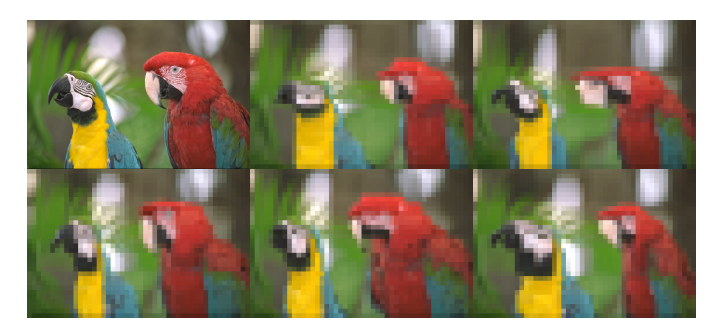
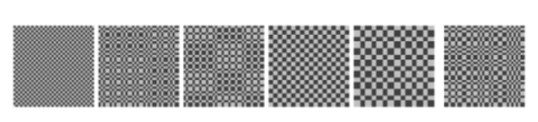

# Pooling Layers

1. Tensor  
2. Dataset,DataLoader  
   1. `torch.utils.data`
3. Transform
   1. `torchvision.transforms.v2`
      1. `v2.CutMix`
      2. `v2.MixUp`
   2. `torchvision.transforms`
4. nn-model  
   1. `torch.nn`
        1. Convolution Layers
            1. Convolution
               1. `nn.Conv#d`
               2. `nn.ConvTranspose#d`
        2. **Pooling Layers**
5. Automatic-Differentiation  
6. Parameter-Optimization  
7. model-save-load  
---

## Pooling Layers
- `nn.MaxPool#d` : Applies a 1D max pooling over an input signal composed of several input planes.

- `nn.MaxUnpool#d` : Computes a partial inverse of MaxPool1d.

- `nn.AvgPool#d` : Applies a 1D average pooling over an input signal composed of several input planes.

- `nn.FractionalMaxPool2d` : Applies a 2D fractional max pooling over an input signal composed of several input planes.

- `nn.FractionalMaxPool3d` : Applies a 3D fractional max pooling over an input signal composed of several input planes.

- `nn.LPPool#d` : Applies a 1D power-average pooling over an input signal composed of several input planes.

- `nn.AdaptiveMaxPool#d` : Applies a 1D adaptive max pooling over an input signal composed of several input planes.

- `nn.AdaptiveAvgPool#d` : Applies a 1D adaptive average pooling over an input signal composed of several input planes.


## Pooling

> `Conv` -> `Pool` -> `Conv` -> `Pool` ... 의 형태를 띠는 것이 일반적이다.

- Overfitting을 방지하기 위해
- Feature map 의 Feature map
- input의 사이즈를 줄이기 위해
- 이미지를 추상화(단순화) 시키기 위해
- layer의 개수를 줄여 과하게 복잡한 이미지의 특징을 Conv에게 요구하지 않기 위해
- 과하게 작은 부분까지 집중하지 않기 위해

**"다 좀 비슷한 말이다."**


### Operation
|1|2|3|4|
|-|-|-|-|
|5|6|7|8|
|9|10|11|12|
|13|14|15|16|


->

|6|8|
|-|-|
|14|16|

각 영역에 대해 `MaxPooling`한다면 위와 같이 가장 큰 값을, `MeanPooling`한다면 평균값을 구한다. Pooling layer에는 학습할 weight이나 bias가 없으며, 그렇기 때문에 **저렴하다.**

## `nn.MaxPool#d`

max pooling 수행

### `args`
- `kernel_size` : pool window의 크기
- `stride` : pool window가 전진하는 보폭.   
default = `kernel_size`

- `padding=0` : 양쪽에 $-\infty$ padding
- `dilation=1` : pool window 내부 원소들 사이의 보폭
- `return_indices=False` : 어느 원소가 max 였는지를 return 해줌.   
`torch.nn.MaxUnpool2d`에서 유용함
- `ceil_mode=False` : output shape을 결정할 때에, 버림이 기본값인데, 올림해줌. 결과적으로 column/row 가 한 줄 차이남


## `nn.MaxUnpool#d`

`nn.MaxPool#d`의 inverse 역할을 하지만, 많은 제약이 따를 수 밖에 없다.

- `nn.MaxPool#d`는 최댓값이 아닌 값들을 없애버린다.
- `nn.MaxPool#d`는 하나의 output 에 대해 여러 개의 input을 mapping한다.

이와 같은 제약을 해결하기 위해서, `nn.MaxUnpool#d`는 `MaxPool#d`의 maximal value 들의 index를 input으로 받으면서, maximal이 아닌 값들은 `0`으로 채운다.

### `inputs`
- `input` : tensor
- `indices` : `MaxPool#d`의 indices
- `output_size(optional)` : 원하는 output_size

```python
pool = nn.MaxPool2d(2, stride=2, return_indices=True) # unpool 할 것이기 때문에, return_indices=True로 설정해준다.

unpool = nn.MaxUnpool2d(2, stride=2)

input = torch.tensor([[[[ 1.,  2.,  3.,  4.],
                            [ 5.,  6.,  7.,  8.],
                            [ 9., 10., 11., 12.],
                            [13., 14., 15., 16.]]]])

output, indices = pool(input) # pool 의 결과 indices 가 output과 함께 반환된다.
unpool(output, indices)
# tensor([[[[  0.,   0.,   0.,   0.],
#           [  0.,   6.,   0.,   8.],
#           [  0.,   0.,   0.,   0.],
#           [  0.,  14.,   0.,  16.]]]])
# Now using output_size to resolve an ambiguous size for the inverse
input = torch.torch.tensor([[[[ 1.,  2.,  3., 4., 5.],
                                  [ 6.,  7.,  8., 9., 10.],
                                  [11., 12., 13., 14., 15.],
                                  [16., 17., 18., 19., 20.]]]])
output, indices = pool(input)

# This call will not work without specifying output_size
unpool(output, indices, output_size=input.size())

# tensor([[[[ 0.,  0.,  0.,  0.,  0.],
#           [ 0.,  7.,  0.,  9.,  0.],
#           [ 0.,  0.,  0.,  0.,  0.],
#           [ 0., 17.,  0., 19.,  0.]]]])
```

## `nn.AvgPool#d`

Average pooling 수행

### `args`

- `count_include_pad=True` : zero-padding한 것을 평균을 구할 때 포함시킨다.
- `divisor_override=None` : 평균을 구할 때 분모를 지정해줄 수 있다. 없으면 pooling window의 size(원소수)


## `nn.FractionalMaxPool#d`

`nn.FractionalMaxPool2d` 와 `nn.FractionalMaxPool3d` 만 존재한다.

크기를 $\alpha$만큼의. 즉, 비율로 줄여주는 pooling 이라 해서 "Fractional" pooling 이라는 이름이 붙었다.
역시 앞선 pooling 방법들의 아쉬운 점을 보완하기 위해 제안되었으며, 앞선 방법들이란,

- 3의 kernel_size 를 2 의 stride를 주면서 pooling 한다.
- 각각의 pooling region 마다 size-biased 샘플링을 통해 값을 결정

을 의미한다.

FMP (Fractional Max-Pooling) 에서는, pooling region을 확률적으로 선택하되, 그 내부 로직은 단순한 max 값으로 선택하는 방법을 제안한다.

각각의 pooling region을 겹칠지, 안 겹칠지, pooling region을 *random* 하게 만들지, *pseudorandom* 하게 만들지 등을 고민했다고 한다.
> 겹치는게, **Random** 하게 생성하는 것이 performance가 좋았다고 한다.

<p align="center">

</p>

<p align="center">

</p>

### `args`

- `output_size` : 원하는 output size

- `output_ratio` : 원하는 output size가 input size의 비율로서 결정하고 싶을 때 0과 1사이의 값을 입력함

두 argument 중 하나는 입력해야 한다.

## `nn.LPPool#d` 

power-average pooling 수행
~~(norm pooling 이라고 부르고 싶다.)~~

### Operation

$$
f(X) = \sqrt[p]{\sum_{x \in X}x^p}
$$

- p = $\infty$ 이면 Max Pooling
- p = 1 이면 Sum Pooling

## `nn.AdaptiveMaxPool#d` , `nn.AdaptiveAvgPool#d`

input에 상관없이 정해진 output shape을 나오게 해주는 maxpool 과 avgpool 수행

### `args`
- `output_size` : tuple 일 수도 있고, 정사각행렬을 원한다면 int 로 줄 수도 있다.
tuple = (None, *) 으로 넣는다면, None 은 원본 input의 해당 부분의 shape을 그대로 유지한다는 뜻이다.

## 어떤 Pooling 을 선택해야 할까?
[How do you choose the appropriate pooling method for a CNN in deep learning?](https://www.linkedin.com/advice/1/how-do-you-choose-appropriate-pooling-method-2uvmc)

### Mariette Awad

- Max Pooling : feature의 정확한 위치보다는, 그 **존재** 자체가 중요한 정보일 때 사용
- Average Pooling : **이상치가** max pooling을 망가뜨릴 때 사용
- Global Pooling : 분류 layer (최종 layer) 직전에 결과를 요약하기 위해 사용

### Venugopal Adep
- 여러가지를 실험해보시라
- 비슷한 맥락의 다른 논문들에서 어떤 Pooling을 사용했는지 보아라


### Dheiver Santos, PhD
- Max Pooling : 공간의 계층적 특징, **feature detection의** task에서 쓰기 좋다
- Average Pooling : **맥락적**인 정보를 무시해선 안될 때 사용

### Jamie Culican
- Max Pooling : 눈에 띄는 특징을 잡아내고 싶을 때, **Image Classification**, **Object Detection**에 사용하기 좋다.  
다만, 많은 정보를 유실하므로, 세부적인 공간 정보보다 feature 추상화가 더 중요할 때 사용하기 좋다.

- Average Pooling : Smooth out 해주고, noise를 제거해준다. **Image segmentation**에 사용하기 좋다. 고도로 세밀하게 Feature를 분리해내는 작업보다는 불연속적인 것들을 부드럽게 완화해주고, 전체적으로 균등하게 Feature를 이해할 필요가 있을 때 사용하면 좋다.

- Adaptive Pooling : Input에 상관없이 Output을 제공하는 Adaptive Pooling은 일관된 output dimension이 필요한 **Image Captioning 과 얼굴 인식**과 같은 작업에서 사용하기 좋다.