# Non-linear Activations (weighted sum, nonlinearity)

1. Tensor  
2. Dataset,DataLoader  
   1. `torch.utils.data`
3. Transform
   1. `torchvision.transforms.v2`
      1. `v2.CutMix`
      2. `v2.MixUp`
   2. `torchvision.transforms`
4. nn-model  
   1. `torch.nn`
        1. Convolution Layers
            1. Convolution
               1. `nn.Conv#d`
               2. `nn.ConvTranspose#d`
        2. Pooling Layers
        3. **Non-Linear Activations**
5. Automatic-Differentiation  
6. Parameter-Optimization  
7. model-save-load  
---

## nn.Non-Linear Activations (weighted sum, nonlinearity)
- `nn.ELU` : Applies the Exponential Linear Unit (ELU) function, element-wise. *
- `nn.Hardshrink` : Applies the Hard Shrinkage (Hardshrink) function element-wise. *
- `nn.Hardsigmoid` : Applies the Hardsigmoid function element-wise. *
- `nn.Hardtanh` : Applies the HardTanh function element-wise. *
- `nn.Hardswish` : Applies the Hardswish function, element-wise. *
- `nn.LeakyReLU` : Applies the LeakyReLU function element-wise. *
- `nn.LogSigmoid` : Applies the Logsigmoid function element-wise. *
- `nn.MultiheadAttention` : Allows the model to jointly attend to information from different representation subspaces.
- `nn.PReLU` : Applies the element-wise PReLU function. *
- `nn.ReLU` : Applies the rectified linear unit function element-wise. *
- `nn.ReLU6` : Applies the ReLU6 function element-wise. *
- `nn.RReLU` : Applies the randomized leaky rectified linear unit function, element-wise. *
- `nn.SELU` : Applies the SELU function element-wise.*
- `nn.CELU` : Applies the CELU function element-wise.*
- `nn.GELU` : Applies the Gaussian Error Linear Units function.
- `nn.Sigmoid` : Applies the Sigmoid function element-wise.*
- `nn.SiLU` : Applies the Sigmoid Linear Unit (SiLU) function, element-wise.
- `nn.Mish` : Applies the Mish function, element-wise.
   - https://hongl.tistory.com/213 참고할 것
- `nn.Softplus` : Applies the Softplus function element-wise.
- `nn.Softshrink` : Applies the soft shrinkage function element-wise. *
- `nn.Softsign` : Applies the element-wise Softsign function.
- `nn.Tanh` : Applies the Hyperbolic Tangent (Tanh) function element-wise. *
- `nn.Tanhshrink` : Applies the element-wise Tanhshrink function. *
- `nn.Threshold` : Thresholds each element of the input Tensor.
- `nn.GLU` : Applies the gated linear unit function.

## Non-linear Activations (other)

- `nn.Softmin` : Applies the Softmin function to an n-dimensional input Tensor.
- `nn.Softmax` : Applies the Softmax function to an n-dimensional input Tensor.
- `nn.Softmax2d` : Applies SoftMax over features to each spatial location.
- `nn.LogSoftmax` : Applies the log(Softmax(𝑥)) function to an n-dimensional input Tensor.
- `nn.AdaptiveLogSoftmaxWithLoss` : Efficient softmax approximation.

[Survey of Activation Functions](https://neverabandon.tistory.com/8)

[wikidocs.net](https://wikidocs.net/60683)

[기울기 소실(Vanishing Gradient)의 의미와 해결방법](https://heytech.tistory.com/388)

[Gradient of ReLu at 0](https://discuss.pytorch.org/t/gradient-of-relu-at-0/64345/4)  

[Gradients for non-differentiable functions](https://pytorch.org/docs/stable/notes/autograd.html#gradients-for-non-differentiable-functions)

[Natural Gradient를 위해 보면 좋을 글](https://rlwithme.tistory.com/5)

## 왜 Non-linear Activations 를 사용하는가?

Linear Activation의 경우 단순한 행렬 곱인데, 이는 단순히 괄호를 풀어 계산할 경우에 단 한 개의 Activation function으로 대체가 가능하다는 의미이다. 이는 많은 층을 추가해가면서 각 층별로 활성함수가 적용되어 node들 간의 촘촘한 관계를 구현하겠다는 신경망 구현 방식과 맞지 않다.

> 다만, 선형 활성함수를 사용한 층을 '은닉층'(비선형 활성함수를 사용하는) 과 구별해 '선형층'이라는 별개의 이름으로 부르기도 할 정도로 그 자체로 학습할 수 있는 weight이 생겨난다는 측면에서 의미가 아주 없지는 않다. [wikidocs.net](https://wikidocs.net/60683)

## 활성화 함수의 선택 tip (~~맹신금지~~)
[출처](https://hwk0702.github.io/ml/dl/deep%20learning/2020/07/09/activation_function/)
- 일반적으로 SELU > ELU > LeakyReLU(그리고 변종들) > ReLU > tanh > sigmoid 순
- 네트워크가 자기 정규화되지 못하는 구조라면 SELU 보단 ELU
- 실행 속도가 중요하다면 LeakyReLU(하이퍼파라미터를 더 추가하고 싶지 않다면 케라스에서 사용하는 기본값 α 사용)
- 시간과 컴퓨팅 파워가 충분하다면 교차 검증을 사용해 여러 활성화 함수를 평가
- 신경망이 과대적합되었다면 RReLU
- 훈련세트가 아주 크다면 PReLU
- ReLU가 가장 널리 사용되는 활성화 함수이므로 많은 라이브러리와 하드웨어 가속기들이 ReLU에 특화되어 최적화. 따라서 속도가 중요하다면 ReLU가 가장 좋은 선택

## Vanishing Gradient

[기울기 소실(Vanishing Gradient)의 의미와 해결방법](https://heytech.tistory.com/388)

기울기 소실이란 역전파를 이용한 weight 조정 과정에서 Chain Rule에 따라 계속해서 gradient를 곱하게 되는데, 이 gradient 값이 계속해서 작아져 입력층에 가까워졌을 때 쯤엔 0에 근사해지는 것을 의미한다.

### Sigmoid 함수

$$
S(x) = \frac{1}{1+e^{-x}} = \frac{e^x}{e^x + 1}
$$

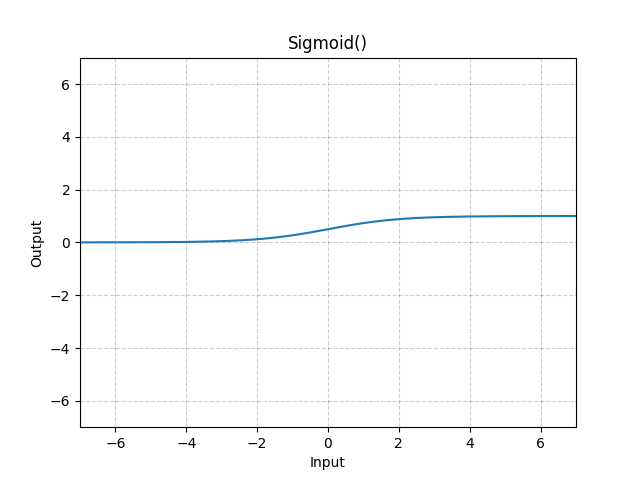

$$
S'(x) = S(x)(1-S(x))
$$

미분 계산의 편의성과 뉴런의 신경신호 전달 방식을 매우 가깝게 구현한다는 점에서 널리 사용됐던 Sigmoid 함수.
그 미분은 $S(x) = 0.5$ 에서 최댓값 0.25를 가진다. 따라서, 모든 $x$의 범위 내에서 최대 0.25 , 최소 0의 값을 가지므로, 이 미분값(gradient)를 계속해서 곱하다 보면, 그 gradient는 극히 작아질 수 밖에 없다.

> 이에 더해, exp(x)의 계산을 근사치로 수행해야 하는 컴퓨터의 계산오차도 역시 계속해서 가산된다.

#### Bias Shift(편향 이동)
Sigmoid 함수의 Vanishing gradient를 가속시키는 이유가 하나 더 있는데, 바로 **Bias Shift** (편향 이동) 이다.
Sigmoid 함수의 평균은 0이 아닌 0.25인데, 이는 즉 입력값의 합보다 출력층의 합이 더 커질 확률이 높다는 의미이다. 이것은 다시, gradient의 분포가 gradient의 최댓값인 0.25를 가지는 중간부보다는 양 극단에서 관찰될 확률이 점점 커진다는 뜻이다.

### $\tanh$ 함수

$$
f(x) = \frac{e^x - e^{-x}}{e^x + e^{-x}}
$$

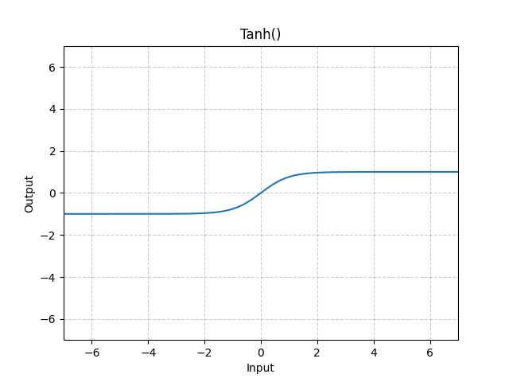

$$
f'(x) = 1-f(x)^2
$$

쌍곡 탄젠트 함수는 그 형태가 sigmoid와 매우 유사하지만, 최댓값 1을 가져 sigmoid보다 훨씬 넉넉한 gradient범위를 가졌다. 그러나, 여전히 곱할 수록 작아지는 특성을 벗어나지는 못했다. 다만, Bias Shift 현상은 평균이 0이기 때문에 나타나지 않는다.

> 자연어 처리, 음성인식 을 위한 **recurrent neural networks에서 대부분 사용됨**

### ReLU (Rectified Linear Unit) 함수

$$
f(x) = max(0, x)
$$

0보다 큰 범위에서 기울기 1, 작은 범위에서 0의 기울기를 가진다. 

> 0에서는 0을 대입하는 것이 일반적인 듯 하다.   
[Gradient of ReLu at 0](https://discuss.pytorch.org/t/gradient-of-relu-at-0/64345/4)  
[Gradients for non-differentiable functions](https://pytorch.org/docs/stable/notes/autograd.html#gradients-for-non-differentiable-functions)

따라서, vanishing gradient 문제는 해결되었지만, 활성함수를 통과하지 못한 노드는 0이 곱해져 다시는 활성화 되지 못한다는 (Dying ReLU) 단점이 있습니다.

### Leaky ReLU 함수

$$
LeakyReLU(x) = max(0,x) + negative\_slope * min(0,x)
$$

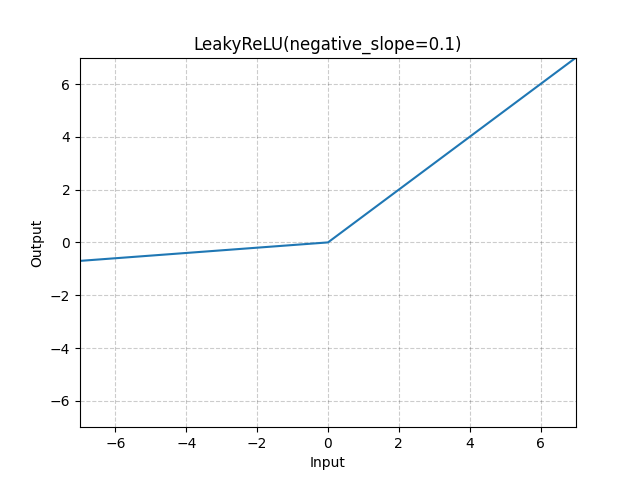

ReLU 함수의 단점을 보완하기 위해 음의 입력이 들어왔을 떄, 0이 아닌 매우 작은 기울기를 곱한다. 이로써, 뉴런이 죽는 것을 예방한다.

---

[Survey of Activation Functions](https://neverabandon.tistory.com/8) : 각종 활성함수들에 대해 잘 정리해 놓은 글

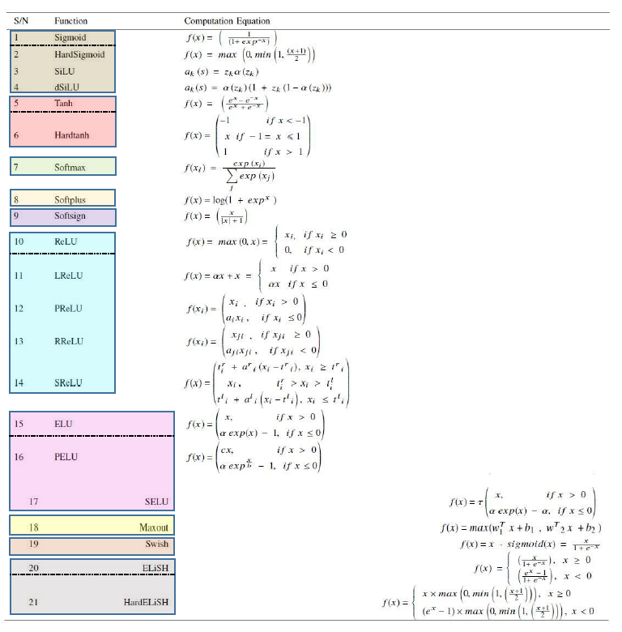

## Exponential Linear Unit (ELU) function, element-wise.

[FAST AND ACCURATE DEEP NETWORK LEARNING BY
EXPONENTIAL LINEAR UNITS (ELUS)](./assets/0701ELU.pdf)

### definition

$$
ELU(x) = \begin{cases}
   x &\text{if } x\gt0 \\
   \alpha * (exp(x)-1) &\text{if } x \leq 0
\end{cases}
$$

$$
ELU'(x) = \begin{cases}
1 &\text{if } x \gt0 \\
f(x) + \alpha &\text{if } x\leq 0
\end{cases}
$$

> ReLU 함수를 부드럽게 깎은 함수, $\alpha$는 대체로 1

### ELU, LReLU, ReLU, SReLU 비교

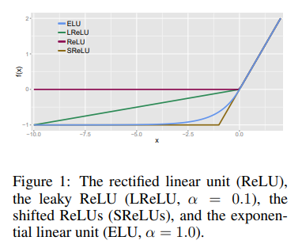

### 특징
- ReLU와 LReLU가 그랬던 것처럼, 양수 input을 받았을 때 기울기가 1이어서 vanishing gradinet를 예방한다.
- ReLU가 음수 input에 대해서 단순히 0의 값을 취하는 것에 반해 ELU는 음수의 값을 취한다. 이는 Mean activations을 0으로 (일종의 편향이동 관점) 밀어줌으로써 gradient가 natural gradient(분포의 관점에서의 gradient) 에 더 가까워 지게 해 더 빠른 학습이 가능하도록 한다.
> - negative 체제(regime)에서 분명한 saturation 고원(plateau)을 가지고 있기 때문에, 보다 강건한 표현(representations)을 학습할 수 있음. 특히 5개 layer 이상의 특정한 network 구조를 가진 ReLU 및 LReLU에 비해 좀 더 빠른 학습 속도와 좀 더 나은 일반화(generalization)를 제공함. 또한, ReLU의 변종들에 비해 state-of-the-art 결과를 보장함.(??????) [출처](https://neverabandon.tistory.com/8)

[Natural Gradient를 위해 보면 좋을 글](https://rlwithme.tistory.com/5)

> ++ GELU를 공부하다가 위의 말이 좀 이해가 가기 시작해서 추가로 적음 (0711)  

> ReLU의 dying neuron 현상을 해결하기 위해서 Leaky ReLU 같은 것이 고안되었는데, 그 음수의 기울기는 모든 범위에서 일정하고, 한계가 없다. 이는 뉴런을 **죽이지는** 않지만, 결국 큰 음수값으로 귀결돼어 최종 출력층에서는 뉴런이 활성화 되지 않게 해서 학습에 악영향을 미칠 수 있다.  
> 따라서, negative regime (음수 영역) 에서 그 미분과 값 자체에 나름의 제한을 주었으면 좋겠다는 생각을 하게 됨. 이에 ELU, GELU 등이 탄생한게 아닌가 생각해본다.

## SELU (Scaled ELU)

### definition

$$
SELU(x) = scale*(max(0,x) + min(0,\alpha*(exp(x)-1)))
$$

with $\alpha = 1.6732632423543772848170429916717$ and  
$scale = 1.0507009873554804934193349852946$

$$
selu(x) = \lambda\begin{cases}
x &\text{if } x\gt 0 \\
\alpha e^x - \alpha &\text{if } x\leq 0
\end{cases}
$$

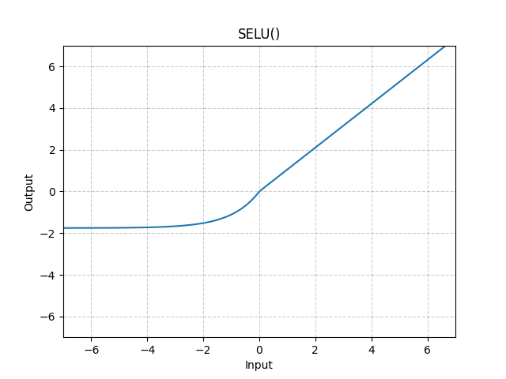

### 특징
[Self-Normalizing Neural Networks](https://arxiv.org/pdf/1706.02515)

Self-Normalizing NN 을 만들기 위해 고안된 활성함수로, 각각의 활성함수 $y$에 대해 이전 층에서의 평균과 분산에 함수 $g$ 를 적용해 다음 층의 평균과 분산을 구할 수 있다면, 이 NN을 Self-normalizing 하다고 정의했다.

(scaled) ReLU로는 할 수 없어서 (scaled) ELU 를 사용했다는데, 원하는 활성함수의 특징은,

1. 평균을 조절하는 음과 양의 값들
2. saturation regions (0에 근접하는 derivative) : 낮은 층에서 분산이 너무 크면 이를 완화시켜주기 위해서
3. 1보다 큰 기울기 : 낮은 층에서 분산이 너무 작으면 이를 키워주기 위해서
4. 연속

이라고 주장

> 완전 연결층만 쌓아서 신경망을 만들고 모든 은닉층을 SELU 를 쓰면 신경망이 self-normalized 된다고 주장  
> 훈련하는 동안 출력이 평균 0, 표준편차 1을 유지  
> 종종 다른 활성 함수보다 뛰어나지만, 조건이 까다로움  
> 1. input이 표준화 되어 있어야 한다.
> 2. 모든 은닉층의 가중치는 르쿤 정규분포로 초기화
> 3. 네트워크는 일렬로 쌓여야 함. RNN 같이 순차적이지 않으면 self-normalized 보장이 안됨  
> [출처](https://hwk0702.github.io/ml/dl/deep%20learning/2020/07/09/activation_function/)

## CELU (Continuously Differentiable ELU)

### definition
$$
CELU(x) = max(0,x) + min(0,\alpha * (exp(x/\alpha)-1))
$$

$$
CELU(x,\alpha) = \begin{cases}
x &\text{if }x\geq 0 \\
\alpha(exp(\frac{x}{\alpha}-1)) &\text{otherwise}
\end{cases}
$$

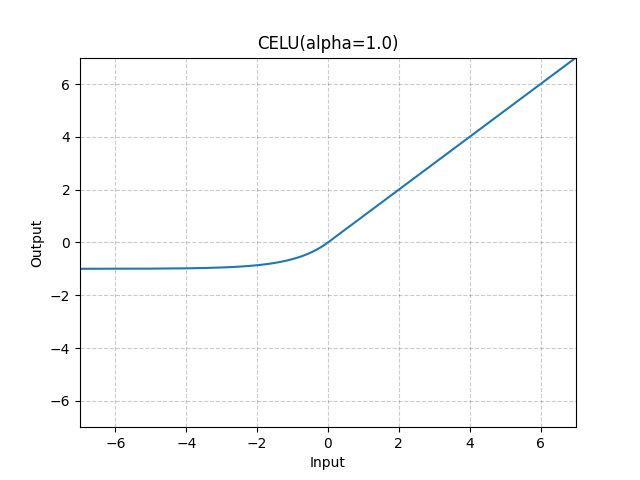

$\alpha$ 의 기본값은 1이고, 이때 ELU 와 CELU는 같다.

$$
\forall_x ELU(x,1) = CELU(x,1)
$$

미분을 해보자

$$
\frac{d}{dx}CELU(x,\alpha) = \begin{cases}
1 &\text{if } x\geq0\\
exp(\frac{x}{\alpha}) &\text{otherwise}
\end{cases}
$$

$$
\frac{d}{d\alpha}CELU(x,\alpha) = \begin{cases}
0 &\text{if } x\geq0\\
exp(\frac{x}{\alpha})(1-\frac{x}{\alpha})-1 &\text{otherwise}
\end{cases}
$$

$exp(\frac{x}{\alpha})$ 를 미리 계산해 놓은 다음에 forward와 backward에서 모두 사용할 수 있음을 알 수 있다.

ELU와 다르게, CELU는 scale-similar하다. 이는 곧,

$$
CELU(x,\alpha) = \frac{1}{c}CELU(cx,c\alpha)
$$

를 의미한다.

또한, $\alpha$ 가 0에서 우극한을 취할 떄 CELU는 ReLU로 수렴하고, $\alpha$ 가 $\infty$ 로 발산할 떄는 아무 작업도 하지 않는 기울기 1인 선형함수가 된다.

> 이런 점이, CELU로 하여금 ReLU와 선형함수가 서로 간섭한 활성함수로 이해되게끔 한다.

[Continuously Differentiable Exponential Linear Units](https://arxiv.org/pdf/1704.07483)에서는 ELU의 좋은 특징인 vanishing gradient 문제가 없고, 평균값이 0에 근접하는 점에 더해 다음과 같은 장점이 있다고 밝혔다.

1. 그 미분이 x에 대해 닫혀있고(bounded)
2. 단순한 선형함수와 ReLU가 특별한 케이스로 포함가능하며
3. $\alpha$에 대해 scale-similar 하다.

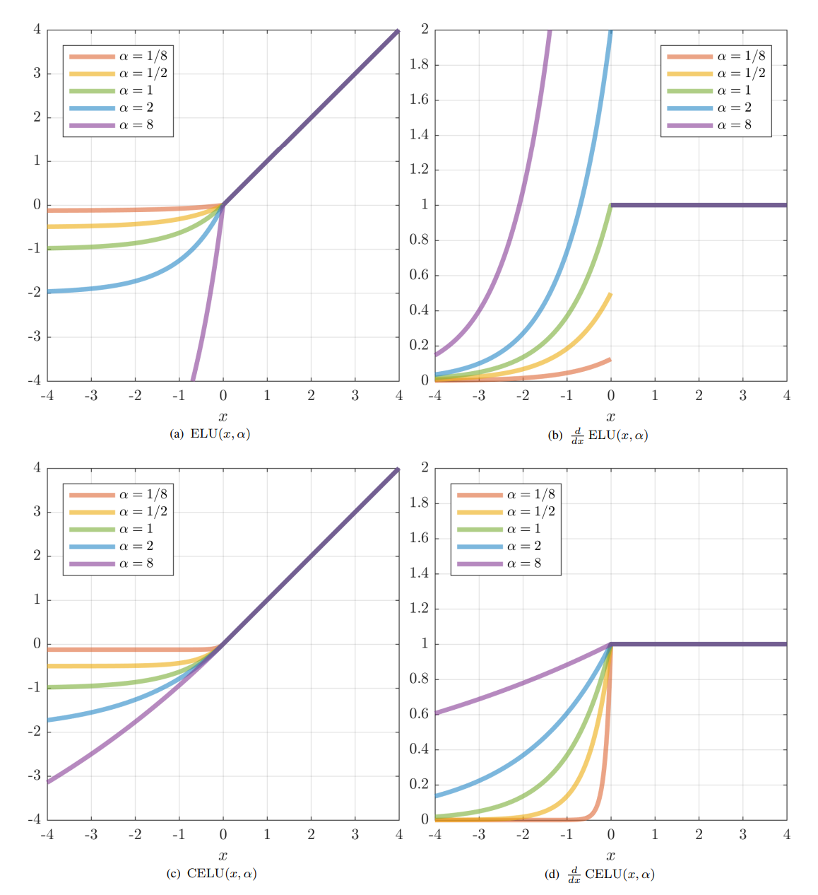

> 위 그래프에서 함수의 연속성, 미분의 닫힌계, ReLU와 선형함수의 간섭을 중점적으로 살펴보자.

## GELU (Gaussian Error Linear Units function)

[GELU](./assets/0711GaussianErrorLinearUnits(GELUs).pdf) 논문 그리 길지도 않고 매우 읽어볼만 하다.

[위 논문을 정리한 블로그](https://hongl.tistory.com/236)

### definition

$$
GELU(x) = x *\Phi(x)
$$

$\Phi(x)$ 는 Cumulative Function for Gaussian Distribution.

`arg` 로 `approximate='none'`을 지정할 수 있는데, 이를 만약 `'tanh'`로 지정하면, Gelu는 다음과 같이 근사된다. (그러나, 근사하지 않고 원본 함수를 쓰는 것이 충분히 빨라서 쓰일 일이 별로 없다.)

$$
GELU(x) = 0.5 * x * (1+Tanh(\sqrt{\frac{2}{\pi}})) * (x+0.044715 * {x^3})
$$

[A Simple Approximation to the Area Under Standard Normal Curve](./assets/0711ASimpleApproximationtotheAreaUnderStandard.pdf)에서 나온 아래 식을 썼다.

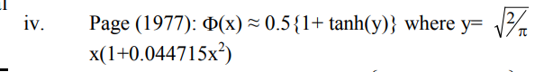

혹은

$$
x\sigma(1.702x)
$$

로 근사할 수도 있다.

마지막 근사는 sigmoid 함수를 사용하기 때문에 SiLU함수라고도 부른다.

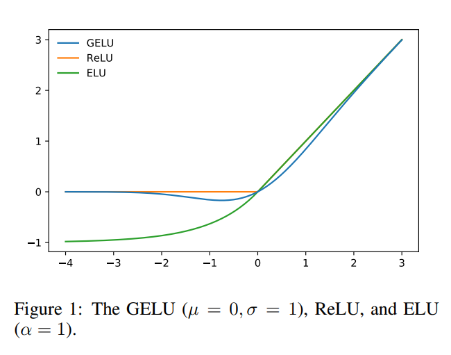

Computer Vision, NLP, Speech Recognition 에서 최고 성능을 내는 모델들에(SOTA) 사용되고 있다.

dropout, zoneout 및 ReLU의 속성을 결합한 함수를 만들자는 생각에서 고안되었다.

핵심 아이디어는 다음의 두가지이다.
- Deterministic이 아닌(ReLU) 확률적으로(=dropout) 0 / 1 masking을 곱해주자
- 단, 확률을 결정하는 것은 x의 부호가 아닌(ReLU) 값이 었으면 한다.

결과적으로는 x 에 $m \sim Bernoulli(\Phi(x))$ 를 곱해준다.
이때, $\Phi(x)$ 를 쓰는 이유는, [배치 정규화](https://velog.io/@js03210/Deep-Learning-Batch-Normalization-%EB%B0%B0%EC%B9%98-%EC%A0%95%EA%B7%9C%ED%99%94) 과정에서 x 가 일반적으로 정규분포 양상을 띄기 때문이다. 결국, x가 작을 수록 dropout 될 확률이 증가한다.

ReLU 가 단순히 부호에 의해 masking 하는 것에 비해, GELU는 다른 input에 대해 해당 input이 얼마나 크냐에 따라 masking 한다.

### 특징
- bounded below
- non-monotonic
- unbounded above
- smooth

특징을 모두 갖는 함수가 GELU이다..
$\mu = 0$ 이고, $\sigma \rightarrow 0$ 이면 GELU는 ReLU가 되기 떄문에, ReLU의 Smooth 버전이라 볼 수 있고,
재밌는 건 GELU 에서 $\Phi$ 를 $Cauchy(0,1)$ 로 정의하면 ELU가 나온다고 한다.

## Hard Shrink function

### definition

$$
HardShrink(x) = \begin{cases}
   x &\text{if } x\gt\lambda \\
   x &\text{if } x\lt-\lambda \\
   0 &\text{otherwise}
\end{cases}
$$

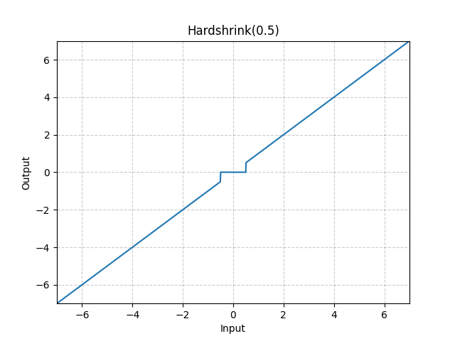

## Soft Shrink function

### definition

$$
SoftShrinkage(x) = \begin{cases}
   x-\lambda &\text{if } x\gt\lambda \\
   x+\lambda &\text{if } x\lt-\lambda \\
   0 &\text{otherwise}
\end{cases}
$$

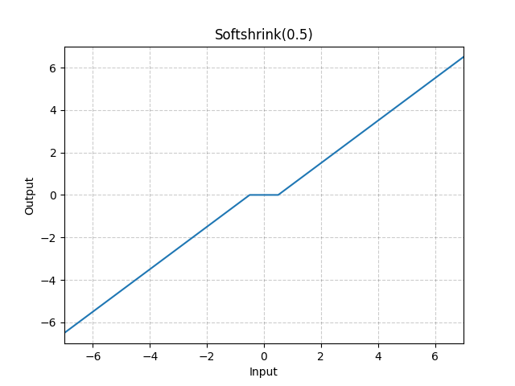

## Tanhshrink function

### definition

$$
Tanhshrink(x) = x - tanh(x)
$$

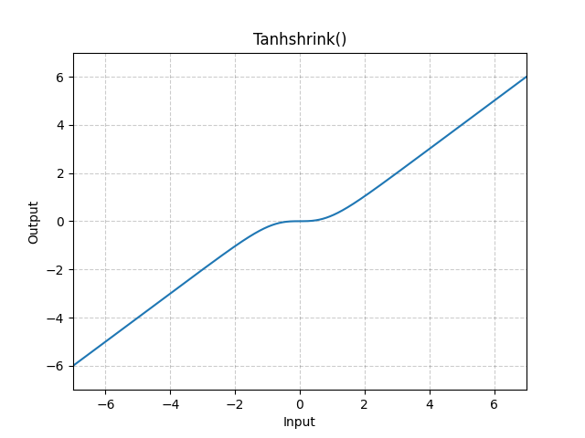

---

> TanhShrink와 HardShrink는 잠재변수 값을 계산하기 위한 희소코딩외에는 거의 사용되지 않는다.  
[Shrink activation function Usage](https://deeesp.github.io/deep%20learning/DL-Activation-Functions/#hardshrink---nnhardshrink)
>> **잠재변수(Latent Variable)** : 신호를 이루는 기저 신호들, 직접 측정할 수 없어 통계적 방법론으로 추정함.
>> **희소코딩** : 잠재변수를 알아내기 위해 알고리즘을 돌리는 것(?) 그 결과가 희소 행렬 형태로 나온다(?)  
[희소코딩?](https://wordbe.tistory.com/134)
>> $$x=Da \\ \text{ where } D = (d_1d_2...d_m)$$
>> x : 영상(신호)  
>> $D$ : 사전(dictionary) (희소행렬)  
>> $a$ : 희소코드 (계수집합)  
>> $d_i$ : 사전요소

## Hard Sigmoid fuction

### definition

$$
Hardsigmoid(x) = \begin{cases}
0 &\text{if } x\leq -3,\\
1 &\text{if } x \geq 3,\\
x/6 + 1/2 &\text{otherwise}
\end{cases}
$$

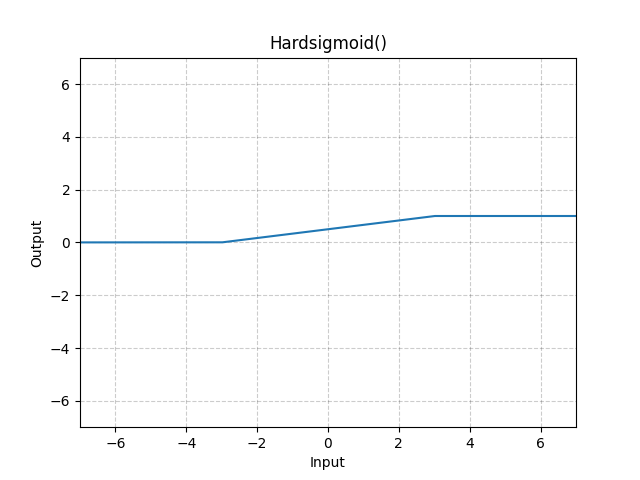

[BinaryConnect Training Deep Neural Networks with binary weights during propagations](./assets/0703BinaryConnect_Training%20Deep%20Neural%20Networks%20with.pdf) 에서 처음 도입됨

- binary weights(-1, 1) 만으로 빠르고 저렴하게 심층 신경망을 만들고 싶을 떄 사용하면 아주 좋다.
- software 적으로도 그렇고, 어떤 hardware 가속기를 사용하든지 상관 없이 좋은 성능을 보였다고 한다.

## Hard Tanh function

### definition

$$
HardTanh(x) = \begin{cases}
max\_val &\text{if } x\gt max\_val,\\
min\_val &\text{if } x \lt min\_val,\\
x &\text{otherwise}
\end{cases}
$$

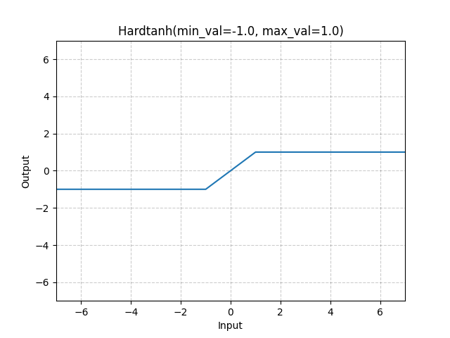

> Tanh function의 계산적인 효율성을 고려한 버전임.   
> 자연어 처리에서 성공적으로 적용 되었음 [출처](http://www.jmlr.org/papers/volume12/collobert11a/collobert11a.pdf)

## Hard Swish function

### definition

$$
Hardswish(x) = \begin{cases}
0 &\text{if } x\leq -3,\\
x &\text{if } x \geq 3,\\
x \cdot (x+3)/6 &\text{otherwise}
\end{cases}
$$

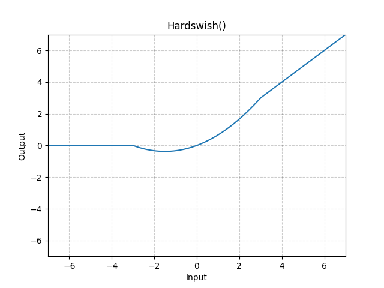

> 신경망에서 더 깊게 진행함에 따라 nonlinearity 를 적용하는 비용은 점점 줄어든다. 해상도(픽셀수)가 다음 층으로 넘어갈 떄마다 대부분 절반으로 떨어지기 떄문이다. `swish` 모델 역시 망의 깊은 부분에서 효과적이라는 것을 알고 있기 때문에, 우리 모델에서 `hard-swish` 도 모델의 후반부에서만 사용했다. [출처](0703SearchingforMobileNetV3)

## Rectified Linear Unit(ReLU) Function

### definition

$$
f(x) = max(0, x)
$$

0보다 큰 범위에서 기울기 1, 작은 범위에서 0의 기울기를 가진다. 

### 장점
- 빠른 학습
- Sigmoid, Tanh actiation function에 비해서 보다 우수한 성능 및 일반화
- linear model 의 장점인 gradient-descent 를 최적화에 적극적으로 사용할 수 있다는 장점을 계승함
- 빠른 계산 (지수, 나눗셈 없음)
> 0에서 최대 사이의 범위를 가지는 값들을 뭉개버림(squishes)으로써 hidden units에 희소성(sparcity)을 도입할 수 있음 (?)

### 단점
- Sigmoid 에 비해 쉽게 Overfitting되는 경향이 있고, 이를 줄이기 위해 dropout 기법이 적용됨.
- dead neuron이 학습에 방해를 야기함

## Leaky ReLu (LReLU)

### definition

$$
LeakyReLU(x) = max(0,x) + negative\_slope * min(0,x)
$$

- 죽은 뉴런이 안 생긴다는 점을 제외하고는 ReLU와 동일함
- 희소성과 분산을 가진다는 점을 빼면 상당한 개선은 없음

## LogSigmoid

### definition

$$
LogSigmoid(x) = log(\frac{1}{1+exp(-x)})
$$

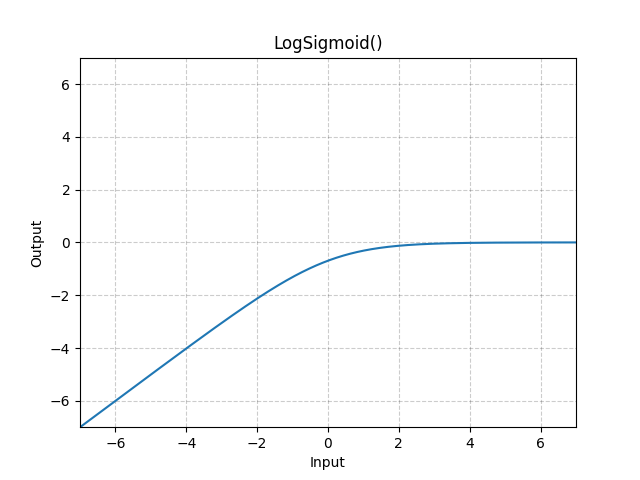

[log sigmoid 근사](https://bab2min.tistory.com/626)

위 링크에서는,
- word2vec을 확장한 모형에서 LogSigmoid를 사용한 코드를 구현했는데
- 그 계산 비용에 지수와 로그가 포함되어 전체적인 성능향상이 필요했다.
- 근사를 계산하는 방식으로 성능을 개선했는데, 구체적인 방법은 이렇다.
- x<0 에서
   1. S(x) = logsigmoid(x)
   2. S(x) ~ $-log(e^(-x))$ = x
   3. S(x) - x = 오차 = $log(1+e^x)$ = S(-x)
- 인데 x>0 에서 함수는 0에 매우 빨리 근접하므로, 0에 아직 충분히 가깝지 않은 부분까지만(대략 x=32) 테이블로 구해놓고, 그 이상은 0으로 퉁치는 방법을 썼다.
> 손실함수로 더 많이 쓰인다는 것을 제외하고는 나오는 게 별로 없다.

## Multi-Head Attention

Transformer 문서에 별도 작성

## PReLU

### definition

$$
PReLU(x) = max(0,x) + a*min(0,x) \\ or
\\  
PReLU(x) = \begin{cases}
x &\text{if } x\geq0\\
ax &\text{otherwise}
\end{cases}
$$

$a$는 학습 파라미터로, `num_parameters=1`에 아무것도 넘겨 주지 않을 경우 (즉, default 인 1의 값을 줄 경우) a는 단일 파라미터로, 모든 input channel들에 동일하게 적용된다.
만약 `nn.PReLU(nChannels)`와 같은 형식으로 정해준다면, 각 input channel마다 다른 $a$가 적용된다.
(nChannels는 input의 2nd 차원을 가리키는데, input의 차원이 2 미만이라면, 1로 간주한다.)

`init=0.25`에 $a$의 초기값을 적용해 줄 수 있다.

> weight decay는 성능을 위해서는 사용되지 않아야 한다.

### 특징
$a$는 음수 부분의 기울기를 결정하는 변수인데, back-prop 과정에서 학습이 가능하다. $a=0$인 경우 PReLU는 ReLU와 같아진다.

> Large scale Image Recognition에서 ReLU보다 성능이 우수하다. Visual Recognition Challenge에서 사람 수준의 성능을 처음으로 넘었다고 한다. [출처](https://neverabandon.tistory.com/8)

### Optimization

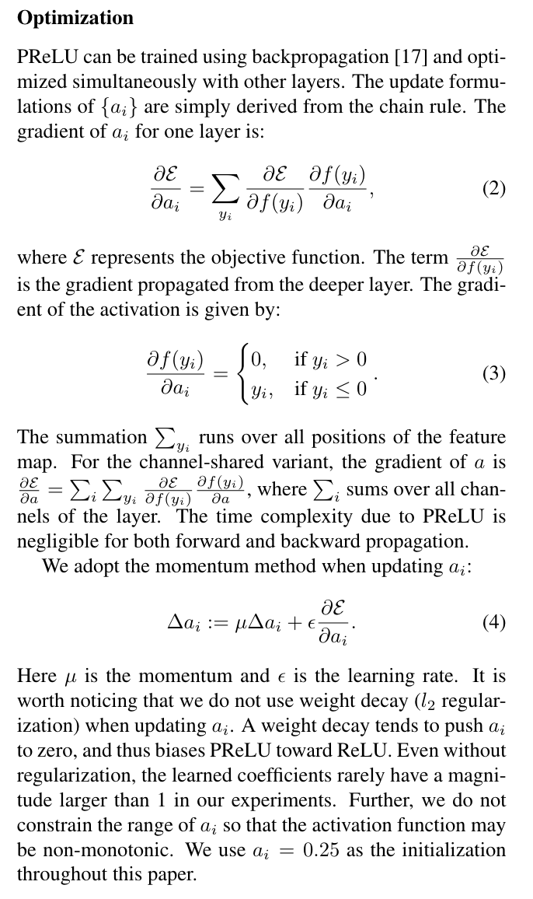

출처:
[Delving Deep into Rectifiers: Surpassing Human-Level Performance on ImageNet Classification](https://arxiv.org/abs/1502.01852)

최적화 과정이 궁금해 찾아보았다. 실제로는 momentum(4번 식에서 $\mu$)을 적용하며, 수식은 위에 써져 있는 것과 같다. 그 과정에서 weight decay (= l2 정규화) 를 사용하게 되면 $a$의 절댓값이 계속해서 줄어들면서 0이 되어 ReLU와 같아지기 때문에, 사용하지 않았다고 한다. 정규화 없이도 최댓값이 1을 넘지 않았고, 활성함수가 단조 증가하지 않도록 $a$의 범위를 제한하지도 않았다고 한다. 목적함수에 대한 $a$의 gradient를 계산할 때 layer의 모든 채널에 대해 더해주어야 하는데, 이 정도의 시간복잡도는 forward, backprop 모두에서 무시가능한 수준이라고 한다.

## ReLU6

[AlexNet - Alex Krizhevsky](http://www.cs.utoronto.ca/~kriz/conv-cifar10-aug2010.pdf)

[Jinsol Kim's Blog](https://gaussian37.github.io/dl-concept-relu6/)

### definition

$$
ReLU6(x) = min(max(0,x), 6)
$$

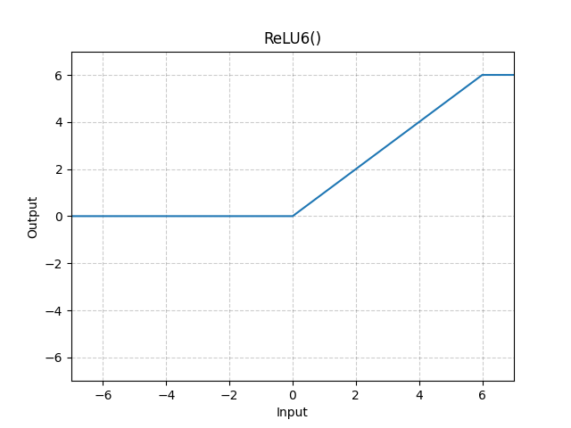

**상한선을 6으로 둔 ReLU** 함수라고 생각하면 된다. 여기서 

**상한선을 두는 이유**는

- (embedded 영역에서 특히) 표현하는데 필요한 bit를 절약하기 위해서,
- sparse한 feature를 더 일찍 학습할 수 있게 되기 때문에, 이며

**그 숫자가 6인 이유**는  

- 단순히 성능이 좋았기 때문이라고 한다.

### 분포 측면
bias만큼 평행이동한 6개의 베르누이 분포로 구성된 ReLU 유닛

 vs 무한개의 베르누이 분포 로 일반적인 ReLU와의 차이를 설명했다.

이에 따라 Noise Model 의 표준편차도 변형된 것을 사용했는데,
원래는 $\frac{1}{1+e^{-x}}$ 의 표준편차를 지닌 정규분포를 사용하지만 Alex Krizhevsky는

$$
\begin{cases}
0 &\text{if } y= 0 \text{ or } y=6 \\
1 &\text{if } 0 \lt y \lt 6
\end{cases}
$$

를 사용했다.

이를 요약하면, $y$ 가 6에 근접했을 때는 두 모델이 거의 같아지지만, 0부근에서는 0을 조금이라도 초과하면 갑자기 매우 큰 편차의 noise 페널티를 주는 것이다. 

이는 자연이미지를 대상으로 하는 비지도 학습이 널리 채용하는 sparseness-inducing tricks에 기인한 것이다.

Alex Krizhevsky의 모델의 filter들은 weights 는 공유하지만, bias는 공유하지 않는데, 이는 또한 "이미지의 굳이 모든 부분에서 좋은 성능을 발휘하지 않아도 되는" 필터를 학습할 수 있게 하는 효과가 있다.(~~직역하니 어려운데, 그냥 중요한 부분에 집중해 학습한다는 뜻인 것 같다.~~)

> CNN 을 확률 분포 적인 측면으로 바라보는 것이라 굉장히 낯설고 모르는 개념이 많이 나오는데, (mean-field $y$,, energy,, sparse feature) 좀 더 공부해 봐야 겠다. Alex Krizhevsky가 자기 모델의 원류로서 참고한 논문은 [ReLU improve Restricted Boltzmann Machines](https://www.cs.toronto.edu/~fritz/absps/reluICML.pdf)이다.

## RReLU (randomized leaky ReLU)

### definition

$$
RReLU(x) = \begin{cases}
x &\text{if } x\geq 0 \\
ax &\text{otherwise}
\end{cases}
$$

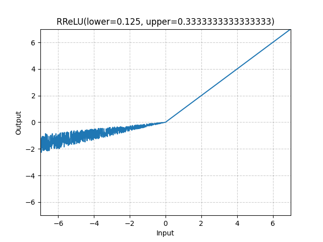

training 중에는 $a$는 uniform 분포 $\mu(lower,upper)$에서 랜덤 샘플링 된 값이다. 반면 evaluation/test 과정에서 $a$는 중간값($\frac{lower+upper}{2}$)으로 고정된다.

Kaggle NDSB 대회에서 처음 사용되었으며, 해당 대회 우승자는 $\mu(3,8)$ 을 사용했다.

[Empirical Evaluation of Rectified Activations in Convolution Network](https://arxiv.org/pdf/1505.00853) 에 따르면, ReLU 보다 Leaky ReLU, PReLU(Parametric ReLU), RReLU가 더 성능이 좋았으나, 그 이유에 대해서는 아직 논의가 더 필요하다고 밝혔다. 특히 데이터셋의 크기에 따라(그중에서도, 더 거대한 데이터셋 에서.) 활성함수들이 어떻게 작용하는지에 대해 더 연구가 필요하다고 결론지었다.

