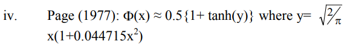

# Non-linear Activations (weighted sum, nonlinearity)

1. Tensor
2. Dataset,DataLoader
   1. `torch.utils.data`
3. Transform
   1. `torchvision.transforms.v2`
      1. `v2.CutMix`
      2. `v2.MixUp`
   2. `torchvision.transforms`
4. nn-model
   1. `torch.nn`
      1. Convolution Layers
         1. Convolution
            1. `nn.Conv#d`
            2. `nn.ConvTranspose#d`
      2. Pooling Layers
      3. **Non-Linear Activations**
5. Automatic-Differentiation
6. Parameter-Optimization
7. model-save-load

---

## nn.Non-Linear Activations (weighted sum, nonlinearity)

- `nn.ELU` : Applies the Exponential Linear Unit (ELU) function, element-wise. \*
- `nn.Hardshrink` : Applies the Hard Shrinkage (Hardshrink) function element-wise. \*
- `nn.Hardsigmoid` : Applies the Hardsigmoid function element-wise. \*
- `nn.Hardtanh` : Applies the HardTanh function element-wise. \*
- `nn.Hardswish` : Applies the Hardswish function, element-wise. \*
- `nn.LeakyReLU` : Applies the LeakyReLU function element-wise. \*
- `nn.LogSigmoid` : Applies the Logsigmoid function element-wise. \*
- `nn.MultiheadAttention` : Allows the model to jointly attend to information from different representation subspaces.
- `nn.PReLU` : Applies the element-wise PReLU function. \*
- `nn.ReLU` : Applies the rectified linear unit function element-wise. \*
- `nn.ReLU6` : Applies the ReLU6 function element-wise. \*
- `nn.RReLU` : Applies the randomized leaky rectified linear unit function, element-wise. \*
- `nn.SELU` : Applies the SELU function element-wise.\*
- `nn.CELU` : Applies the CELU function element-wise.\*
- `nn.GELU` : Applies the Gaussian Error Linear Units function. \*
- `nn.Sigmoid` : Applies the Sigmoid function element-wise.\*
- `nn.SiLU` : Applies the Sigmoid Linear Unit (SiLU) function, element-wise.\*
- `nn.Mish` : Applies the Mish function, element-wise.\*
- `nn.Softplus` : Applies the Softplus function element-wise.\*
- `nn.Softshrink` : Applies the soft shrinkage function element-wise. \*
- `nn.Softsign` : Applies the element-wise Softsign function.\*
- `nn.Tanh` : Applies the Hyperbolic Tangent (Tanh) function element-wise. \*
- `nn.Tanhshrink` : Applies the element-wise Tanhshrink function. \*
- `nn.Threshold` : Thresholds each element of the input Tensor.\*
- `nn.GLU` : Applies the gated linear unit function.\*

## Non-linear Activations (other)

- `nn.Softmin` : Applies the Softmin function to an n-dimensional input Tensor.\*
- `nn.Softmax` : Applies the Softmax function to an n-dimensional input Tensor.\*
- `nn.Softmax2d` : Applies SoftMax over features to each spatial location.\*
- `nn.LogSoftmax` : Applies the log(Softmax(𝑥)) function to an n-dimensional input Tensor.\*
- `nn.AdaptiveLogSoftmaxWithLoss` : Efficient softmax approximation.

[Survey of Activation Functions](https://neverabandon.tistory.com/8)

[wikidocs.net](https://wikidocs.net/60683)

[기울기 소실(Vanishing Gradient)의 의미와 해결방법](https://heytech.tistory.com/388)

[Gradient of ReLu at 0](https://discuss.pytorch.org/t/gradient-of-relu-at-0/64345/4)

[Gradients for non-differentiable functions](https://pytorch.org/docs/stable/notes/autograd.html#gradients-for-non-differentiable-functions)

[Natural Gradient를 위해 보면 좋을 글](https://rlwithme.tistory.com/5)

## 왜 Non-linear Activations 를 사용하는가?

Linear Activation의 경우 단순한 행렬 곱인데, 이는 단순히 괄호를 풀어 계산할 경우에 단 한 개의 Activation function으로 대체가 가능하다는 의미이다. 이는 많은 층을 추가해가면서 각 층별로 활성함수가 적용되어 node들 간의 촘촘한 관계를 구현하겠다는 신경망 구현 방식과 맞지 않다.

> 다만, 선형 활성함수를 사용한 층을 '은닉층'(비선형 활성함수를 사용하는) 과 구별해 '선형층'이라는 별개의 이름으로 부르기도 할 정도로 그 자체로 학습할 수 있는 weight이 생겨난다는 측면에서 의미가 아주 없지는 않다. [wikidocs.net](https://wikidocs.net/60683)

## 활성화 함수의 선택 tip (~~맹신금지~~)

[출처](https://hwk0702.github.io/ml/dl/deep%20learning/2020/07/09/activation_function/)

- 일반적으로 SELU > ELU > LeakyReLU(그리고 변종들) > ReLU > tanh > sigmoid 순
- 네트워크가 자기 정규화되지 못하는 구조라면 SELU 보단 ELU
- 실행 속도가 중요하다면 LeakyReLU(하이퍼파라미터를 더 추가하고 싶지 않다면 케라스에서 사용하는 기본값 α 사용)
- 시간과 컴퓨팅 파워가 충분하다면 교차 검증을 사용해 여러 활성화 함수를 평가
- 신경망이 과대적합되었다면 RReLU
- 훈련세트가 아주 크다면 PReLU
- ReLU가 가장 널리 사용되는 활성화 함수이므로 많은 라이브러리와 하드웨어 가속기들이 ReLU에 특화되어 최적화. 따라서 속도가 중요하다면 ReLU가 가장 좋은 선택

## Vanishing Gradient

[기울기 소실(Vanishing Gradient)의 의미와 해결방법](https://heytech.tistory.com/388)

기울기 소실이란 역전파를 이용한 weight 조정 과정에서 Chain Rule에 따라 계속해서 gradient를 곱하게 되는데, 이 gradient 값이 계속해서 작아져 입력층에 가까워졌을 때 쯤엔 0에 근사해지는 것을 의미한다.

### Sigmoid 함수

$$
S(x) = \frac{1}{1+e^{-x}} = \frac{e^x}{e^x + 1}
$$

<p align="center">

</p>

$$
S'(x) = S(x)(1-S(x))
$$

미분 계산의 편의성과 뉴런의 신경신호 전달 방식을 매우 가깝게 구현한다는 점에서 널리 사용됐던 Sigmoid 함수.
그 미분은 $S(x) = 0.5$ 에서 최댓값 0.25를 가진다. 따라서, 모든 $x$의 범위 내에서 최대 0.25 , 최소 0의 값을 가지므로, 이 미분값(gradient)를 계속해서 곱하다 보면, 그 gradient는 극히 작아질 수 밖에 없다.

> 이에 더해, exp(x)의 계산을 근사치로 수행해야 하는 컴퓨터의 계산오차도 역시 계속해서 가산된다.

#### Bias Shift(편향 이동)

Sigmoid 함수의 Vanishing gradient를 가속시키는 이유가 하나 더 있는데, 바로 **Bias Shift** (편향 이동) 이다.
Sigmoid 함수의 평균은 0이 아닌 0.25인데, 이는 즉 입력값의 합보다 출력층의 합이 더 커질 확률이 높다는 의미이다. 이것은 다시, gradient의 분포가 gradient의 최댓값인 0.25를 가지는 중간부보다는 양 극단에서 관찰될 확률이 점점 커진다는 뜻이다.

### $\tanh$ 함수

$$
f(x) = \frac{e^x - e^{-x}}{e^x + e^{-x}}
$$

<p align="center">

</p>

$$
f'(x) = 1-f(x)^2
$$

쌍곡 탄젠트 함수는 그 형태가 sigmoid와 매우 유사하지만, 최댓값 1을 가져 sigmoid보다 훨씬 넉넉한 gradient범위를 가졌다. 그러나, 여전히 곱할 수록 작아지는 특성을 벗어나지는 못했다. 다만, Bias Shift 현상은 평균이 0이기 때문에 나타나지 않는다.

> 자연어 처리, 음성인식 을 위한 **recurrent neural networks에서 대부분 사용됨**

### ReLU (Rectified Linear Unit) 함수

$$
f(x) = max(0, x)
$$

<p align="center">

</p>

0보다 큰 범위에서 기울기 1, 작은 범위에서 0의 기울기를 가진다.

> 0에서는 0을 대입하는 것이 일반적인 듯 하다.  
> [Gradient of ReLu at 0](https://discuss.pytorch.org/t/gradient-of-relu-at-0/64345/4)  
> [Gradients for non-differentiable functions](https://pytorch.org/docs/stable/notes/autograd.html#gradients-for-non-differentiable-functions)

따라서, vanishing gradient 문제는 해결되었지만, 활성함수를 통과하지 못한 노드는 0이 곱해져 다시는 활성화 되지 못한다는 (Dying ReLU) 단점이 있습니다.

### Leaky ReLU 함수

$$
LeakyReLU(x) = max(0,x) + negative\_slope * min(0,x)
$$

<p align="center">

</p>

ReLU 함수의 단점을 보완하기 위해 음의 입력이 들어왔을 떄, 0이 아닌 매우 작은 기울기를 곱한다. 이로써, 뉴런이 죽는 것을 예방한다.

---

[Survey of Activation Functions](https://neverabandon.tistory.com/8) : 각종 활성함수들에 대해 잘 정리해 놓은 글

<p align="center">

</p>

## Exponential Linear Unit (ELU) function, element-wise.

[FAST AND ACCURATE DEEP NETWORK LEARNING BY
EXPONENTIAL LINEAR UNITS (ELUS)](./assets/0701ELU.pdf)

### definition

$$
ELU(x) = \begin{cases}
   x &\text{if } x\gt0 \\
   \alpha * (exp(x)-1) &\text{if } x \leq 0
\end{cases}
$$

$$
ELU'(x) = \begin{cases}
1 &\text{if } x \gt0 \\
f(x) + \alpha &\text{if } x\leq 0
\end{cases}
$$

> ReLU 함수를 부드럽게 깎은 함수, $\alpha$는 대체로 1

### ELU, LReLU, ReLU, SReLU 비교

<p align="center">

</p>

### 특징

- ReLU와 LReLU가 그랬던 것처럼, 양수 input을 받았을 때 기울기가 1이어서 vanishing gradinet를 예방한다.
- ReLU가 음수 input에 대해서 단순히 0의 값을 취하는 것에 반해 ELU는 음수의 값을 취한다. 이는 Mean activations을 0으로 (일종의 편향이동 관점) 밀어줌으로써 gradient가 natural gradient(분포의 관점에서의 gradient) 에 더 가까워 지게 해 더 빠른 학습이 가능하도록 한다.
  > - negative 체제(regime)에서 분명한 saturation 고원(plateau)을 가지고 있기 때문에, 보다 강건한 표현(representations)을 학습할 수 있음. 특히 5개 layer 이상의 특정한 network 구조를 가진 ReLU 및 LReLU에 비해 좀 더 빠른 학습 속도와 좀 더 나은 일반화(generalization)를 제공함. 또한, ReLU의 변종들에 비해 state-of-the-art 결과를 보장함.(??????) [출처](https://neverabandon.tistory.com/8)

[Natural Gradient를 위해 보면 좋을 글](https://rlwithme.tistory.com/5)

> ++ GELU를 공부하다가 위의 말이 좀 이해가 가기 시작해서 추가로 적음 (0711)

> ReLU의 dying neuron 현상을 해결하기 위해서 Leaky ReLU 같은 것이 고안되었는데, 그 음수의 기울기는 모든 범위에서 일정하고, 한계가 없다. 이는 뉴런을 **죽이지는** 않지만, 결국 큰 음수값으로 귀결돼어 최종 출력층에서는 뉴런이 활성화 되지 않게 해서 학습에 악영향을 미칠 수 있다.  
> 따라서, negative regime (음수 영역) 에서 그 미분과 값 자체에 나름의 제한을 주었으면 좋겠다는 생각을 하게 됨. 이에 ELU, GELU 등이 탄생한게 아닌가 생각해본다.

## SELU (Scaled ELU)

### definition

$$
SELU(x) = scale*(max(0,x) + min(0,\alpha*(exp(x)-1)))
$$

with $\alpha = 1.6732632423543772848170429916717$ and  
$scale = 1.0507009873554804934193349852946$

$$
selu(x) = \lambda\begin{cases}
x &\text{if } x\gt 0 \\
\alpha e^x - \alpha &\text{if } x\leq 0
\end{cases}
$$

<p align="center">

</p>

### 특징

[Self-Normalizing Neural Networks](https://arxiv.org/pdf/1706.02515)

Self-Normalizing NN 을 만들기 위해 고안된 활성함수로, 각각의 활성함수 $y$에 대해 이전 층에서의 평균과 분산에 함수 $g$ 를 적용해 다음 층의 평균과 분산을 구할 수 있다면, 이 NN을 Self-normalizing 하다고 정의했다.

(scaled) ReLU로는 할 수 없어서 (scaled) ELU 를 사용했다는데, 원하는 활성함수의 특징은,

1. 평균을 조절하는 음과 양의 값들
2. saturation regions (0에 근접하는 derivative) : 낮은 층에서 분산이 너무 크면 이를 완화시켜주기 위해서
3. 1보다 큰 기울기 : 낮은 층에서 분산이 너무 작으면 이를 키워주기 위해서
4. 연속

이라고 주장

> 완전 연결층만 쌓아서 신경망을 만들고 모든 은닉층을 SELU 를 쓰면 신경망이 self-normalized 된다고 주장  
> 훈련하는 동안 출력이 평균 0, 표준편차 1을 유지  
> 종종 다른 활성 함수보다 뛰어나지만, 조건이 까다로움
>
> 1. input이 표준화 되어 있어야 한다.
> 2. 모든 은닉층의 가중치는 르쿤 정규분포로 초기화
> 3. 네트워크는 일렬로 쌓여야 함. RNN 같이 순차적이지 않으면 self-normalized 보장이 안됨  
>    [출처](https://hwk0702.github.io/ml/dl/deep%20learning/2020/07/09/activation_function/)

## CELU (Continuously Differentiable ELU)

### definition

$$
CELU(x) = max(0,x) + min(0,\alpha * (exp(x/\alpha)-1))
$$

$$
CELU(x,\alpha) = \begin{cases}
x &\text{if }x\geq 0 \\
\alpha(exp(\frac{x}{\alpha}-1)) &\text{otherwise}
\end{cases}
$$

<p align="center">

</p>

$\alpha$ 의 기본값은 1이고, 이때 ELU 와 CELU는 같다.

$$
\forall_x ELU(x,1) = CELU(x,1)
$$

미분을 해보자

$$
\frac{d}{dx}CELU(x,\alpha) = \begin{cases}
1 &\text{if } x\geq0\\
exp(\frac{x}{\alpha}) &\text{otherwise}
\end{cases}
$$

$$
\frac{d}{d\alpha}CELU(x,\alpha) = \begin{cases}
0 &\text{if } x\geq0\\
exp(\frac{x}{\alpha})(1-\frac{x}{\alpha})-1 &\text{otherwise}
\end{cases}
$$

$exp(\frac{x}{\alpha})$ 를 미리 계산해 놓은 다음에 forward와 backward에서 모두 사용할 수 있음을 알 수 있다.

ELU와 다르게, CELU는 scale-similar하다. 이는 곧,

$$
CELU(x,\alpha) = \frac{1}{c}CELU(cx,c\alpha)
$$

를 의미한다.

또한, $\alpha$ 가 0에서 우극한을 취할 떄 CELU는 ReLU로 수렴하고, $\alpha$ 가 $\infty$ 로 발산할 떄는 아무 작업도 하지 않는 기울기 1인 선형함수가 된다.

> 이런 점이, CELU로 하여금 ReLU와 선형함수가 서로 간섭한 활성함수로 이해되게끔 한다.

[Continuously Differentiable Exponential Linear Units](https://arxiv.org/pdf/1704.07483)에서는 ELU의 좋은 특징인 vanishing gradient 문제가 없고, 평균값이 0에 근접하는 점에 더해 다음과 같은 장점이 있다고 밝혔다.

1. 그 미분이 x에 대해 닫혀있고(bounded)
2. 단순한 선형함수와 ReLU가 특별한 케이스로 포함가능하며
3. $\alpha$에 대해 scale-similar 하다.

<p align="center">

</p>

> 위 그래프에서 함수의 연속성, 미분의 닫힌계, ReLU와 선형함수의 간섭을 중점적으로 살펴보자.

## GELU (Gaussian Error Linear Units function)

[GELU](<./assets/0711GaussianErrorLinearUnits(GELUs).pdf>) 논문 그리 길지도 않고 매우 읽어볼만 하다.

[위 논문을 정리한 블로그](https://hongl.tistory.com/236)

### definition

$$
GELU(x) = x *\Phi(x)
$$

$\Phi(x)$ 는 Cumulative Function for Gaussian Distribution.

`arg` 로 `approximate='none'`을 지정할 수 있는데, 이를 만약 `'tanh'`로 지정하면, Gelu는 다음과 같이 근사된다. (그러나, 근사하지 않고 원본 함수를 쓰는 것이 충분히 빨라서 쓰일 일이 별로 없다.)

$$
GELU(x) = 0.5 * x * (1+Tanh( (\sqrt{\frac{2}{\pi}}) * (x+0.044715 * {x^3}) ))
$$

[A Simple Approximation to the Area Under Standard Normal Curve](./assets/0711ASimpleApproximationtotheAreaUnderStandard.pdf)에서 나온 아래 식을 썼다.

<p align="center">

</p>

혹은

$$
x\sigma(1.702x)
$$

로 근사할 수도 있다.

마지막 근사는 sigmoid 함수를 사용하기 때문에 SiLU함수라고도 부른다.

<p align="center">

</p>

Computer Vision, NLP, Speech Recognition 에서 최고 성능을 내는 모델들에(SOTA) 사용되고 있다.

dropout, zoneout 및 ReLU의 속성을 결합한 함수를 만들자는 생각에서 고안되었다.

핵심 아이디어는 다음의 두가지이다.

- Deterministic이 아닌(ReLU) 확률적으로(=dropout) 0 / 1 masking을 곱해주자
- 단, 확률을 결정하는 것은 x의 부호가 아닌(ReLU) 값이 었으면 한다.

결과적으로는 x 에 $m \sim Bernoulli(\Phi(x))$ 를 곱해준다.
이때, $\Phi(x)$ 를 쓰는 이유는, [배치 정규화](https://velog.io/@js03210/Deep-Learning-Batch-Normalization-%EB%B0%B0%EC%B9%98-%EC%A0%95%EA%B7%9C%ED%99%94) 과정에서 x 가 일반적으로 정규분포 양상을 띄기 때문이다. 결국, x가 작을 수록 dropout 될 확률이 증가한다.

ReLU 가 단순히 부호에 의해 masking 하는 것에 비해, GELU는 다른 input에 대해 해당 input이 얼마나 크냐에 따라 masking 한다.

### 특징

- bounded below
- non-monotonic
- unbounded above
- smooth

특징을 모두 갖는 함수가 GELU이다..
$\mu = 0$ 이고, $\sigma \rightarrow 0$ 이면 GELU는 ReLU가 되기 떄문에, ReLU의 Smooth 버전이라 볼 수 있고,
재밌는 건 GELU 에서 $\Phi$ 를 $Cauchy(0,1)$ 로 정의하면 ELU가 나온다고 한다.

## SiLU (Sigmoid Linear Unit)

### definition

#### **swish function**이라고도 부른다.

$$
silu(x) = x*\sigma(x)
$$

$\sigma(x)$ 는 logistic sigmoid 이다.

최초에 GELU 에서 기원했다. 그 이후에 다음의 두 논문에서 실험을 거치며 그 존재가 드러났다.

[Sigmoid-Weighted Linear Units for Neural Network Function Approximation in Reinforcement Learning](https://arxiv.org/pdf/1702.03118)

[SWISH: A SELF-GATED ACTIVATION FUNCTION](https://arxiv.org/pdf/1710.05941v1)에서 Swish의 특징과 그 특징으로 야기되는 장점들을 정리했다.

### 특징

ReLU 처럼, unbounded-above, bounded-below 이다. 그러나 ReLU와 다르게 smooth하며, non-monotonic 하다. 이 비단조증가 특성이 특히 다른 활성함수들과 다른 점을 만든다.

미분은 다음과 같다.

$$
f'(x) = f(x) + \sigma(x)(1-f(x))
$$

<p align="center">

</p>

input이 1.25보다 작으면 derivative는 1보다 작은 절댓값을 갖는다. Swish 함수의 성공적인 도입은 곧 ReLU의 gradient 보존 특성 (양수 범위에서 항상 기울기 1)이 더 이상 현대 딥러닝 구조에서는 특별한 이점이 아니라는 것을 뜻한다고 밝혔다.

### boundedness

saturation을 피할 수 있기에 Unboundedness는 바람직하다. gradient가 0에 가까워질 수록 학습이 느리기 때문이다. *sigmoid*나 *tanh*의 경우 위와 아래에서 모두 bounded 되어 있기 때문에 (멀리멀리 점프하기 힘들어서) 초기화가 중요해진다. 양수 영역에서 unbounded 된 것은 이 saturation을 피할 수 있다는 점에서 바람직하다.

반면에, 음수 영역에서는 bounded 되는 것이 바람직한데, 강력한 normalization 효과가 있기 때문이다. 덕분에 큰 음수 input은 잘 "잊혀진"다.

### non-monotonicity

비단조증가라는 점은 결과적으로, 작은 음의 input에 대해서도 음의 output들을 만들어낸다는 특징을 만든다.
이런 특징은 표현력(expressivity)와 gradient flow를 개선시키는데, 대부분의 Preactivations 들이 해당 범위에서 시작한다는 점에서 더 중요하다. 다음의 히스토그램으 보면, 대부분 0보다 약간 작은 값에 많이 떨어져 있는 것을 볼 수 있다.

<p align="center">

</p>

### Smoothness

<p align="center">

</p>

smoothness 또한 위의 그림과 같이 output landscape을 부드럽게 만들어준다는 점에서 (ReLU의 경우 별모양으로 날카로운 경계가 만들어진다.) 이점을 준다.

output이 부드러워진다는 것은 곧 loss landscape 또한 매끄러워짐을 의미하고, 이는 곧 초기화와 learning rate에 강건한 모델을 만들 수 있게 해줌을 뜻한다.

## Mish

[Mish : A Self Regularized Non-Monotonic Activation Function](https://arxiv.org/pdf/1908.08681)

[홍러닝](https://hongl.tistory.com/213)

### definition

$$
Mish(x) = x*Tanh(Softplus(x))
$$

단, $Softplus(x) = ln(1+e^x)$

<p align="center">

</p>

Swish (SiLU) 에서 영감을 받아 만들어진 비선형 함수. Swish의 특징들을 거의 고스란히 가지고 있다. (unbounded above, bounded below, non-monotonic(작은 음수 보존), smooth) $x$에 비선형함수를 적용한 후에, 그대로 x에 곱해주는 것을 "**Self-gating**"이라고 부르는데, Mish 역시 self-gating 함수이다.

역시 더 나중에 나온 함수답게 ReLU, LReLU, Swish보다 좋은 성능을 자랑한다.
Swish를 보고 그와 같은 특징을 갖는 여러 함수들을 테스트했는데, ($tanh(x)softplus(x)$ , $arctan(x)softplus(x)$ 등..) 대부분은 신경망이 깊어질 수록 학습이 불안정한 모습을 보였고, 비교 결과 Mish를 제안했다.

> 함수들 생긴 것을 보면 다 비슷해 보이는데, 성능 차이가 난다는 것이 꽤나 신기하다. 생긴게 중요한게 아니라 수학적인 내부 구조가 중요한 것일까.

미분해보자.

$$
f'(x) = sech^2(softplus(x))xsigmoid(x) + \frac{f(x)}{x}
$$

$$
= \Delta (x)swish(x) + \frac{f(x)}{x}
$$

$\Delta(x)$ 가 gradient를 완만하게 만들어 주는 것을 실험적으로 관찰했다고 한다. 이를 마치 preconditioner 같다고 표현하는데, 이는 경사하강법에서 대칭정치행렬의 역행렬을 곱해 수렴의 속도를 증가시키는 것을 의미한다(??).

어쨌거나, 강력한 regularization 효과와 함께 gradient를 완만하게 만들어 최적화가 쉽게 해주는 것이 Swish를 능가할 수 있었던 이유라고 저자는 판단했다.

### 특징

거의 Swish와 동일하다.

#### 작은 음수 보존

Dying ReLU 예방, 표현력과 정보 흐름에 좋은 영향을 줌.

#### Unbounded Above

Saturation(포화)를 피함. 즉, near-zero gradient(학습속도 저하현상) 문제 없음.

#### Continuously differentiable

특이값 문제 (gradient에 구멍이 뚫려서 경사하강법 같은 것을 못쓰는) 없음.

### loss landscape

Mish의 가장 놀라운 점이 아닐까 싶다. 어떻게 저렇게 부드러운 landscape을 만드는지 신기할 정도.
Swish도 꽤나 울퉁불퉁/뾰족뾰족한 loss를 보이는데 말이다. 위에서 언급한 $\Delta(x)$ 가 정말 좋은 영향을 미친 것 같다.

<p align="center">

</p>

> local min이 눈에 띄게 줄어든 점은 분명 좋은 점이지만, 최적화의 **속도** 면에서는 Swish가 더 빠르지 않을까 싶다.  
> 다른 얘기지만 computing 면에서 Mish가 Swish보다 느리다는 포스팅도 있었다.  
> 어찌보면 더 완만한 landscape을 만든다는건 반대로 분명히 구분해내야할 contour에서는 더 안 좋은 성능을 보이지 않을까 하는 개인적인 생각이 든다.

<p align="center">

</p>

[출처 : 꾸준희의 블로그](https://eehoeskrap.tistory.com/440)

## Hard Shrink function

### definition

$$
HardShrink(x) = \begin{cases}
   x &\text{if } x\gt\lambda \\
   x &\text{if } x\lt-\lambda \\
   0 &\text{otherwise}
\end{cases}
$$

<p align="center">

</p>

## Soft Shrink function

### definition

$$
SoftShrinkage(x) = \begin{cases}
   x-\lambda &\text{if } x\gt\lambda \\
   x+\lambda &\text{if } x\lt-\lambda \\
   0 &\text{otherwise}
\end{cases}
$$

<p align="center">

</p>

## Tanhshrink function

### definition

$$
Tanhshrink(x) = x - tanh(x)
$$

<p align="center">

</p>
---

> TanhShrink와 HardShrink는 잠재변수 값을 계산하기 위한 희소코딩외에는 거의 사용되지 않는다.  
> [Shrink activation function Usage](https://deeesp.github.io/deep%20learning/DL-Activation-Functions/#hardshrink---nnhardshrink)
>
> > **잠재변수(Latent Variable)** : 신호를 이루는 기저 신호들, 직접 측정할 수 없어 통계적 방법론으로 추정함.
> > **희소코딩** : 잠재변수를 알아내기 위해 알고리즘을 돌리는 것(?) 그 결과가 희소 행렬 형태로 나온다(?)  
> > [희소코딩?](https://wordbe.tistory.com/134) >> $$x=Da \\ \text{ where } D = (d_1d_2...d_m)$$
> > x : 영상(신호)  
> > $D$ : 사전(dictionary) (희소행렬)  
> > $a$ : 희소코드 (계수집합)  
> > $d_i$ : 사전요소

## Hard Sigmoid fuction

### definition

$$
Hardsigmoid(x) = \begin{cases}
0 &\text{if } x\leq -3,\\
1 &\text{if } x \geq 3,\\
x/6 + 1/2 &\text{otherwise}
\end{cases}
$$

<p align="center">

</p>

[BinaryConnect Training Deep Neural Networks with binary weights during propagations](./assets/0703BinaryConnect_Training%20Deep%20Neural%20Networks%20with.pdf) 에서 처음 도입됨

- binary weights(-1, 1) 만으로 빠르고 저렴하게 심층 신경망을 만들고 싶을 떄 사용하면 아주 좋다.
- software 적으로도 그렇고, 어떤 hardware 가속기를 사용하든지 상관 없이 좋은 성능을 보였다고 한다.

## Hard Tanh function

### definition

$$
HardTanh(x) = \begin{cases}
max\_val &\text{if } x\gt max\_val,\\
min\_val &\text{if } x \lt min\_val,\\
x &\text{otherwise}
\end{cases}
$$

<p align="center">

</p>

> Tanh function의 계산적인 효율성을 고려한 버전임.  
> 자연어 처리에서 성공적으로 적용 되었음 [출처](http://www.jmlr.org/papers/volume12/collobert11a/collobert11a.pdf)

## Hard Swish function

### definition

$$
Hardswish(x) = \begin{cases}
0 &\text{if } x\leq -3,\\
x &\text{if } x \geq 3,\\
x \cdot (x+3)/6 &\text{otherwise}
\end{cases}
$$

<p align="center">

</p>

> 신경망에서 더 깊게 진행함에 따라 nonlinearity 를 적용하는 비용은 점점 줄어든다. 해상도(픽셀수)가 다음 층으로 넘어갈 떄마다 대부분 절반으로 떨어지기 떄문이다. `swish` 모델 역시 망의 깊은 부분에서 효과적이라는 것을 알고 있기 때문에, 우리 모델에서 `hard-swish` 도 모델의 후반부에서만 사용했다. [출처](0703SearchingforMobileNetV3)

## Rectified Linear Unit(ReLU) Function

### definition

$$
f(x) = max(0, x)
$$

<p align="center">

</p>

0보다 큰 범위에서 기울기 1, 작은 범위에서 0의 기울기를 가진다.

### 장점

- 빠른 학습
- Sigmoid, Tanh actiation function에 비해서 보다 우수한 성능 및 일반화
- linear model 의 장점인 gradient-descent 를 최적화에 적극적으로 사용할 수 있다는 장점을 계승함
- 빠른 계산 (지수, 나눗셈 없음)
  > 0에서 최대 사이의 범위를 가지는 값들을 뭉개버림(squishes)으로써 hidden units에 희소성(sparcity)을 도입할 수 있음 (?)

### 단점

- Sigmoid 에 비해 쉽게 Overfitting되는 경향이 있고, 이를 줄이기 위해 dropout 기법이 적용됨.
- dead neuron이 학습에 방해를 야기함

## Leaky ReLu (LReLU)

### definition

$$
LeakyReLU(x) = max(0,x) + negative\_slope * min(0,x)
$$

<p align="center">

</p>

- 죽은 뉴런이 안 생긴다는 점을 제외하고는 ReLU와 동일함
- 희소성과 분산을 가진다는 점을 빼면 상당한 개선은 없음

## LogSigmoid

### definition

$$
LogSigmoid(x) = log(\frac{1}{1+exp(-x)})
$$

<p align="center">

</p>

[log sigmoid 근사](https://bab2min.tistory.com/626)

위 링크에서는,

- word2vec을 확장한 모형에서 LogSigmoid를 사용한 코드를 구현했는데
- 그 계산 비용에 지수와 로그가 포함되어 전체적인 성능향상이 필요했다.
- 근사를 계산하는 방식으로 성능을 개선했는데, 구체적인 방법은 이렇다.
- x<0 에서
  1.  S(x) = logsigmoid(x)
  2.  S(x) ~ $-log(e^(-x))$ = x
  3.  S(x) - x = 오차 = $log(1+e^x)$ = S(-x)
- 인데 x>0 에서 함수는 0에 매우 빨리 근접하므로, 0에 아직 충분히 가깝지 않은 부분까지만(대략 x=32) 테이블로 구해놓고, 그 이상은 0으로 퉁치는 방법을 썼다.
  > 손실함수로 더 많이 쓰인다는 것을 제외하고는 나오는 게 별로 없다.

## Multi-Head Attention

Transformer 문서에 별도 작성

## PReLU

### definition

$$
PReLU(x) = max(0,x) + a*min(0,x) \\ or
\\
PReLU(x) = \begin{cases}
x &\text{if } x\geq0\\
ax &\text{otherwise}
\end{cases}
$$

$a$는 학습 파라미터로, `num_parameters=1`에 아무것도 넘겨 주지 않을 경우 (즉, default 인 1의 값을 줄 경우) a는 단일 파라미터로, 모든 input channel들에 동일하게 적용된다.
만약 `nn.PReLU(nChannels)`와 같은 형식으로 정해준다면, 각 input channel마다 다른 $a$가 적용된다.
(nChannels는 input의 2nd 차원을 가리키는데, input의 차원이 2 미만이라면, 1로 간주한다.)

`init=0.25`에 $a$의 초기값을 적용해 줄 수 있다.

> weight decay는 성능을 위해서는 사용되지 않아야 한다.

### 특징

$a$는 음수 부분의 기울기를 결정하는 변수인데, back-prop 과정에서 학습이 가능하다. $a=0$인 경우 PReLU는 ReLU와 같아진다.

> Large scale Image Recognition에서 ReLU보다 성능이 우수하다. Visual Recognition Challenge에서 사람 수준의 성능을 처음으로 넘었다고 한다. [출처](https://neverabandon.tistory.com/8)

### Optimization

<p align="center">

</p>

출처:
[Delving Deep into Rectifiers: Surpassing Human-Level Performance on ImageNet Classification](https://arxiv.org/abs/1502.01852)

최적화 과정이 궁금해 찾아보았다. 실제로는 momentum(4번 식에서 $\mu$)을 적용하며, 수식은 위에 써져 있는 것과 같다. 그 과정에서 weight decay (= l2 정규화) 를 사용하게 되면 $a$의 절댓값이 계속해서 줄어들면서 0이 되어 ReLU와 같아지기 때문에, 사용하지 않았다고 한다. 정규화 없이도 최댓값이 1을 넘지 않았고, 활성함수가 단조 증가하지 않도록 $a$의 범위를 제한하지도 않았다고 한다. 목적함수에 대한 $a$의 gradient를 계산할 때 layer의 모든 채널에 대해 더해주어야 하는데, 이 정도의 시간복잡도는 forward, backprop 모두에서 무시가능한 수준이라고 한다.

## ReLU6

[AlexNet - Alex Krizhevsky](http://www.cs.utoronto.ca/~kriz/conv-cifar10-aug2010.pdf)

[Jinsol Kim's Blog](https://gaussian37.github.io/dl-concept-relu6/)

### definition

$$
ReLU6(x) = min(max(0,x), 6)
$$

<p align="center">

</p>

**상한선을 6으로 둔 ReLU** 함수라고 생각하면 된다. 여기서

**상한선을 두는 이유**는

- (embedded 영역에서 특히) 표현하는데 필요한 bit를 절약하기 위해서,
- sparse한 feature를 더 일찍 학습할 수 있게 되기 때문에, 이며

**그 숫자가 6인 이유**는

- 단순히 성능이 좋았기 때문이라고 한다.

### 분포 측면

bias만큼 평행이동한 6개의 베르누이 분포로 구성된 ReLU 유닛

vs 무한개의 베르누이 분포 로 일반적인 ReLU와의 차이를 설명했다.

이에 따라 Noise Model 의 표준편차도 변형된 것을 사용했는데,
원래는 $\frac{1}{1+e^{-x}}$ 의 표준편차를 지닌 정규분포를 사용하지만 Alex Krizhevsky는

$$
\begin{cases}
0 &\text{if } y= 0 \text{ or } y=6 \\
1 &\text{if } 0 \lt y \lt 6
\end{cases}
$$

를 사용했다.

이를 요약하면, $y$ 가 6에 근접했을 때는 두 모델이 거의 같아지지만, 0부근에서는 0을 조금이라도 초과하면 갑자기 매우 큰 편차의 noise 페널티를 주는 것이다.

이는 자연이미지를 대상으로 하는 비지도 학습이 널리 채용하는 sparseness-inducing tricks에 기인한 것이다.

Alex Krizhevsky의 모델의 filter들은 weights 는 공유하지만, bias는 공유하지 않는데, 이는 또한 "이미지의 굳이 모든 부분에서 좋은 성능을 발휘하지 않아도 되는" 필터를 학습할 수 있게 하는 효과가 있다.(~~직역하니 어려운데, 그냥 중요한 부분에 집중해 학습한다는 뜻인 것 같다.~~)

> CNN 을 확률 분포 적인 측면으로 바라보는 것이라 굉장히 낯설고 모르는 개념이 많이 나오는데, (mean-field $y$,, energy,, sparse feature) 좀 더 공부해 봐야 겠다. Alex Krizhevsky가 자기 모델의 원류로서 참고한 논문은 [ReLU improve Restricted Boltzmann Machines](https://www.cs.toronto.edu/~fritz/absps/reluICML.pdf)이다.

## RReLU (randomized leaky ReLU)

### definition

$$
RReLU(x) = \begin{cases}
x &\text{if } x\geq 0 \\
ax &\text{otherwise}
\end{cases}
$$

<p align="center">

</p>

training 중에는 $a$는 uniform 분포 $\mu(lower,upper)$에서 랜덤 샘플링 된 값이다. 반면 evaluation/test 과정에서 $a$는 중간값($\frac{lower+upper}{2}$)으로 고정된다.

Kaggle NDSB 대회에서 처음 사용되었으며, 해당 대회 우승자는 $\mu(3,8)$ 을 사용했다.

[Empirical Evaluation of Rectified Activations in Convolution Network](https://arxiv.org/pdf/1505.00853) 에 따르면, ReLU 보다 Leaky ReLU, PReLU(Parametric ReLU), RReLU가 더 성능이 좋았으나, 그 이유에 대해서는 아직 논의가 더 필요하다고 밝혔다. 특히 데이터셋의 크기에 따라(그중에서도, 더 거대한 데이터셋 에서.) 활성함수들이 어떻게 작용하는지에 대해 더 연구가 필요하다고 결론지었다.

## Softplus

### definition

$$
Softplus(x) = \frac{1}{\beta}*log(1+exp(\beta*x))
$$

<p align="center">

</p>

ReLU의 부드러운 버전이다. output이 양의 범위로 한정된다.
계산의 안정성을 위해서 $x(=input) \times \beta \gt threshold$ 이면 선형함수로 돌아간다.

### `args`

- `beta=1.0`
- `threshold=20.0`

### BCE loss

[Ethan의 블로그](https://velog.io/@nochesita/%EC%B5%9C%EC%A0%81%ED%99%94%EC%9D%B4%EB%A1%A0-Binary-Cross-Entropy%EC%99%80-Softplus)

Binary Classification, 0과 1로 분류하는 문제에서 loss function으로 주로 사용한다는 Binary Cross Entropy loss (BCE loss)는 코드를 뜯어보았을 때 `Softplus`를 쓰는 경우가 있다고 한다.

---

#### Sigmoid와 Softmax

[Sigmoid-Softmax 일반화](https://velog.io/@gwkoo/logit-sigmoid-softmax%EC%9D%98-%EA%B4%80%EA%B3%84)

[Sigmoid-Softmax의 차이점](https://insomnia.tistory.com/12)

[logit, sigmoid, softmax의 관계](https://velog.io/@gwkoo/logit-sigmoid-softmax%EC%9D%98-%EA%B4%80%EA%B3%84)

위 게시물들의 내용을 요약하자면,

1. logit 과 sigmoid 는 역함수 관계이다.
2. softmax 의 K개 클래스가 2개인 특수한 경우가 sigmoid 이다.
3. sigmoid를 다수의 클래스로 일반화 한 것이 softmax이다.

---

다시 BCE loss에 대한 논의로 돌아와서,
$\beta=1$ 일 때, `Softplus`를 미분해보자.

$$
\frac{\partial}{\partial x}Softplus(x) = \frac{\partial}{\partial x}log(1+exp(x)) = \frac{exp(x)}{1+exp(x)} = \frac{1}{1+exp(-x)}
$$

즉, `Softplus`를 미분하면, `Sigmoid`가 나온다.

추가로, `Sigmoid`에 log를 씌워보자.

$$
log(Sigmoid(x)) = log(\frac{1}{1+exp(-x)}) \\ = -log(1+exp(-x)) \\ = -Softplus(-x)
$$

즉, `log(Sigmoid(x)) = -Softplus(-x)` 임을 알 수 있다.

추가적으로 `Softplus`에 다음과 같은 성질들도 성립한다고 한다.

1. $Softplus(x) - Softplus(-x) = x$
2. $Softplus(x)^{-1}  = log(exp(-x)-1), \forall x \gt 0$

---

BCE는 일반적으로 다음과 같이 {0,1} binary class에 대한 log probability로 정의한다.

$$
BCE = \begin{cases}
-log\hat{y}, &\text{where } y=1 \\
-log(1-\hat{y}), &\text{where } y = -1
\end{cases}
$$

N 개로 일반화해 그 엔트로피 값 ( $-p_{x}log(x)$ ) 의 형태로 변형해 다 더하는 총 loss 는 다음과 같다.

$$
BCE = -\sum^N (p_{y=1}log\hat{y} + (1-p_{y=1})log(\hat{y}))
$$

(평균은 위식을 $N$ 으로 나누면 된다.)

<p align="center">

</p>

[출처: Ethan의 블로그](https://velog.io/@nochesita/%EC%B5%9C%EC%A0%81%ED%99%94%EC%9D%B4%EB%A1%A0-Binary-Cross-Entropy%EC%99%80-Softplus)

핵심은, p = {0,1} 둘중에 하나의 값을 갖고, y = {-1,1}의 값을 갖기 때문에, 클래스가 두개인 경우에만 이를 Softplus 식으로 변형해 사용할 수 있다는 것이다.

## Softsign

### definition

$$
SoftSign(x) = \frac{x}{1+\left\vert x \right\vert}
$$

<p align="center">

</p>

`tanh` 이 지수적으로 수렴하는 것에 반해 `SoftSign`은 다항시간내에 수렴한다는 이점이 있어 그 대체재로 사용될 수 있다. 그러나, 실제로는 그리 많이 사용되지 않는다.

$$
SoftSign'(x) = \frac{1}{1+{\left\vert x \right\vert}^2}
$$

## Threshold

### definition

$$
y = \begin{cases}
x & \text{if } x \gt threshold \\
value &\text{otherwise}
\end{cases}
$$

[미분가능해야한다.](https://stackoverflow.com/questions/71409752/training-with-threshold-in-pytorch)

## GLU (Gated Linear Unit)

### definition

$$
GLU(a,b) = a \otimes \sigma(b)
$$

$a$ 는 input 행렬의 첫 절반이고, $b$ 는 나머지 절반이다.

$\otimes$ 는 element-wise 행렬 곱이다.

### `args`

- `dim=-1` : input을 어느 차원에서 둘로 쪼갤 것인가?

Input : ($*_1, N, *_2$)
Output : ($*_1, N/2, *_2$)

### 특징

[PaperswithCode](https://paperswithcode.com/method/glu)

자연어 처리, 예를 들면 Gated CNN에서 쓰인다.

식을 좀 더 직관적으로 이해하자면, $b$ 가 $a$ 의 어느 정보가 다음 layer까지 전달될지를 결정하는 gate의 역할을 한다.

> 이를 자연어 처리에 접목해 앞에 나온 단어들 중에 어떤 단어들만 추려서 다음 단어를 추론할 것인가를 결정하는 gate로 사용한다.

#### Gated Convolutional network

[Language Modeling with Gated Convolutional Networks](https://arxiv.org/pdf/1612.08083v3)
에서 소개 되었다.

[Gated Linear Unit — Enabling stacked convolutions to out-perform RNNs](https://medium.com/@pragyansubedi/gated-linear-unit-enabling-stacked-convolutions-to-out-perform-rnns-ea08daa653b8) 의 요약을 보고 작성했다.

본 논문이 소개될 당시에는 Recurrent NN(RNN)이 자연어 처리 쪽을 꽉 잡고 있었는데, Non-Recurrent 한 모델로 RNN보다 좋은 지표를 보인 것을 강조하고 있다.

> 세부적으로는 LSTM의 형태를 많이 참고했다고 한다.

RNN이 좋은 성능을 보일 수 있었던 것은, 한계가 없이 넓은 범위의 context를 이해시킬 수 있었던 것이다.

GCN (Gated Convolutional Network)이 RNN 보다 좋은 점은 크게 다음의 두가지이다.

1. 맥락 정보를 $O(N)$ 이 아닌 $O(N/k)$ ($k$ 는 kernel size) 번의 layer stacking 으로 처리할 수 있다.

2. GPU를 필두로 한 동시 Computing의 이점을 누릴 수 있다.

결국 종합하면 RNN은 Sequential한 모델이기 때문에, 작업에 순서가 존재하고 이전의 작업이 끝나기 전에는 다음을 진행할 수가 없다. 따라서 동시 computing의 이점을 누릴 수가 없었는데, 마치 Transformer가 그렇듯 (~~Transformer가 더 나중인가?~~) 누릴 수 있게 되었다!

<p align="center">

</p>

> 위 그림에서 convolution 단계에서 보면 두 개의 서로 다른 weight ( $W$ , $V$ )를 통과한 $A$ 와 $B$ 가 하나는 그대로, 하나는 sigmoid 를 거쳐 연산되는 것을 볼 수 있다.  
> 결국 똑같이 $E$ 에서 시작한 값들이라는 점에 주목하자.

## Softmin

### definition

$$
Softmin(x_i) = \frac{exp(-x_i)}{\sum_j exp(-x_j)}
$$

Softmax 와 동일하게 총합이 1이고 각각이 [0,1] 사이에 떨어지도록 Rescale 해준다.

단, 음수로 변해서 지수에 전달되기 때문에 원래 input 값이 작을 수록 확률은 더 큰 값을 갖게 된다.

## Softmax

### definition

$$
Softmax(x_i) = \frac{exp(x_i)}{\sum_j exp(x_j)}
$$

[Why use softmax as opposed to standard normalization?](https://stackoverflow.com/questions/17187507/why-use-softmax-as-opposed-to-standard-normalization)

이름 그대로 max 값을 취하는 것의 soft 한 버전이라고 직관적으로 이해하는 것이 꽤나 들어맞는다.

이 단락의 중요 포인트는 그래서 왜 softmax를 전부 모델의 마지막에 사용하는가? 이다.

[로지스틱 회귀의 손실 함수](https://kh-kim.github.io/nlp_with_deep_learning_blog/docs/1-08-logistic_regression/03-bce_loss/#footnote_1)
에서는, 회귀분석이 logistic 회귀로 넘어오면서 회귀가 아닌 분류 문제로 생각하게 되고, Binary Category의 분류 문제에서 sigmoid의 출력을 0.5를 기준으로 분류할 수 있는 이유는,
**분류 문제를 확률 문제로 접근할 수 있기 때문이라고 설명한다.**

이제부터는 MSE(Mean Squared Error)를 최소화하는 old 한 최적화 방식에서 벗어나서 확률의 세계에서 문제를 바라보겠다는 뜻이다.

> 그러면서 나오는 개념들이 MLE(Most Likelihood Estimator). 딸려서 또 이재욱 교수님께 배웠던 개념이 BLUE 같은 것들이다.

분포와 확률의 세계로 넘어오면서, Cross-Entropy를 loss 함수로 쓰기 시작한다. 분포와 분포 사이의 거리를 재는 것인데, 결국 KL Divergence

$$
D_{KL}(p||q) = \sum_x{ p(x)log{\frac{p(x)}{q(x)}}}
$$

를 최소화하는 것이 목표가 된다.

제일 위에 있는 [stackoverflow](https://stackoverflow.com/questions/17187507/why-use-softmax-as-opposed-to-standard-normalization)링크에서는 그래서 softmax 함수의 $exp$ 함수가 cross-entropy의 $log$ 를 상쇄시켜주면서, gradient를 완만하게 만들어 모델이 잘못돼서 softmax가 saturated 돼도 벗어날 수 있게 해준다고 설명한다. (**Very short Explanation**)

모든 데이터의 likelihood는 결국 각각의 데이터에 대한 likehood를 합치는 것이므로,

log-likelihood를 구할 때 우리는 다음 식을 사용한다.

$$
argmax_{\theta}\sum_{k=1}^{m}log(P(y^{(k)}|x^{(k)};\theta))
$$

이때 softmax 함수를 사용한다는 것은,

$$
P(y^{(k)}|x^{(k)};\theta) = P(y^{(k)}|z) = softmax(z)_i
$$

와 같이 확률 부분을 " $k$ 번째 데이터의 정확한 클래스는 $i$ " 라고 정한 것이다.

이에 더해서 데이터의 log-likehood를 구하기 위해 log softmax를 구하면
분모, 분자가 갈라지면서

$$
logsoftmax(z)_i = z_i - log{\sum_j{exp(z_j)}}
$$

로 써지는데 원래 stackoverflow에 질문자가 올린 질문은 여기서 그냥

$$
z_i - \max_{j}{z_j}
$$

를 쓰면 안되냐는 것이다.

이렇게 보면 꽤나 다른 것이 느껴진다. max 함수의 행동은 그냥 모델이 부정확할 때, $z_i$ 를 증가시키고, 최댓값 $z_j$ 를 감소시키는 것이다. 이건 분명 우리가 원하는 것이 아니다.

정리하면,

모델이 잘못돼서 softmax 가 saturated되어 갈 때도, loss 함수는 saturated 되지 않고, 최댓값 $z_j$ 주변에서 선형-완만한 gradient ($log$ 와 $exp$ 의 상쇄)
를 만들어주어 계속 학습이 이어질 수 있도록 해준다.

이 내용은 MIT에서 2016년 출판한 [Deep Learning](https://www.deeplearningbook.org/) 에서 기반했다고 한다.

## Softmax2d

### definition

공간의 같은 점에 대해서 softmax를 수행한다.

이해가 잘 안 갈 수 있는데, 예를 들어,
Image 의 경우 (Channel, Height, Width)의 형태로 input이 들어오면, 같은 좌표 (Height, Width) 에서 각 Channel의 데이터를 모아 Softmax를 계산한다.

즉, R, G, B 값을 확률로 나타낸다고 생각하면 된다.

<p align="center">

</p>

## LogSoftmax

### definition

$$
LogSoftmax(x_i) = \log{\frac{exp(x_i)}{\sum_j exp(x_j)}}
$$

$$
= x_i - log{\sum_j{exp(x_j)}}
$$

### 왜 $log$를 씌우는가?

1. 산술적 이점

굳이 exp와 나눗셈 계산을 하는 것보다, log를 씌워 한 꺼풀 벗겨내면 computational 안정성을 얻을 수 있다.

2. vanishing gradient

[The Softmax function and its derivative](https://eli.thegreenplace.net/2016/the-softmax-function-and-its-derivative/)

softmax의 특징상 가장 큰 값에게 꽤나 많은 가중치를 준다. 때문에 그 값 자체가 지나치게 커지면 `float64`의 메모리로 표현할 수 없어 overflow가 생기는데, 이를 방지하기 위해

$$
D = -max(x_1,x_2, ... ,x_n)
$$

를 이용해 전처리 과정을 거칠 수 있다. 즉,

$$
S_j = \frac{e^{x_j+D}}{\sum_{k=1}^{N}e^{x_k+D}}
$$

로 식을 변형할 수 있다.

이에 따라 값이 모두 **음수로 변하게 되는데** 지수함수의 개형을 생각해보면 음수로 절댓값이 커지면 $\inf$ 가 아닌 0 으로 수렴하기 때문에 overflow를 피할 수 있게 된다.

단, 이때

```
In [150]: stablesoftmax([1000, 2000, 3000])
Out[150]: array([ 0.,  0.,  1.])
```

와 같이 다른 값이 극도로 작아져 해당 노드를 제외하고는 0으로 죽여서 vanishing gradient를 겪게 된다.

[Reinforcement learning](https://en.wikipedia.org/wiki/Softmax_function#Reinforcement_learning) 에서는 $\tau$ 를 사용해 temperature를 조절한다.

$$
P_t(a) = \frac{e^{x_j / \tau}}{\sum_{k=1}^{N}{e^{x_k / \tau}}}
$$

좀 더 정확히 요약하자면, 데이터의 분포를 특정 점에서 어느 정도 모아놓아야지, 그렇지 않고 max 값이 극명하게 튀게 되거나, 그 절대적인 값이 지나치게 커지면, softmax 자체가 vanishing gradient를 유발한다. 다음 논문은 Attention에서 해당 범위를 벗어나는 데이터가 거의 매번 존재해서 이론적으로는 문제가 없었지만 기울기 소실 문제를 겪었던 예이다.

[Escaping the Gradient Vanishing: Periodic Alternatives of Softmax in Attention Mechanism](https://ar5iv.labs.arxiv.org/html/2108.07153)

### Cross-entropy & NLL Loss

Cross-entropy 자체가 log-softmax + NLL Loss 이기 때문에,
Cross-entropy 의 input 이자 본 모델의 아웃풋은 log를 씌우지 않은 일반 softmax 여야 한다는 점에 주의하자.
